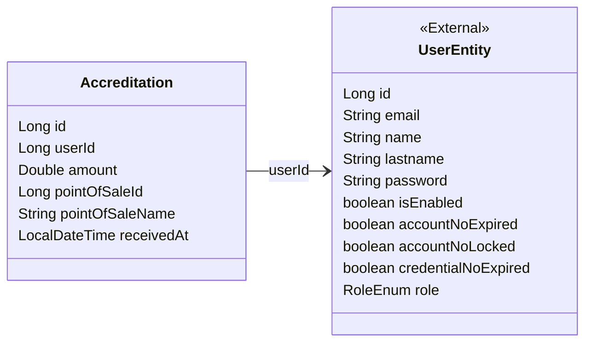

# 🧩 Proyecto de Microservicios con Spring Boot

Este proyecto es una implementación de una arquitectura de microservicios basada en Spring Boot. Utiliza tecnologías modernas como Redis, RabbitMQ y PostgreSQL para resolver problemas empresariales comunes de manera escalable, eficiente y modular.

## 🔧 Tecnologías Utilizadas

- Java 21
- Spring Boot 3.4.4
- Maven
- PostgreSQL
- Redis
- RabbitMQ
- Eureka Server (Service Discovery)
- Spring Cloud Gateway
- MapStruct
- Spring Data JPA
- Spring Validation
- Java Mail Sender
- ITextPDF
- Mailtrap
- Docker / Podman
- Postman / DBBeaver
- Open Api (Swagger)
- Junit / Mockito
- H2 Database (Testing)
- Jacoco + informe en HTML 
- SonarQube (Revisión de cobertura)

---

## 📌 Módulo: Acreditaciones (Accreditation)

Este módulo forma parte de una arquitectura de microservicios orientada a eventos. Está diseñado para gestionar solicitudes de acreditación, validando que el Punto de Venta esté activo antes de registrar la acreditación. Hace uso de Redis para cachear resultados y RabbitMQ para emitir eventos cuando se crea una nueva acreditación.

### ⚙️ Tecnologías Utilizadas

- **Spring Boot**: Framework principal.
- **Spring Data JPA**: Persistencia en base de datos relacional.
- **Spring Validation**: Validación de entradas.
- **DTOs + MapStruct**: Separación entre lógica interna y modelo expuesto.
- **Redis**: Cacheo de resultados (acreditaciones consultadas).
- **RabbitMQ**: Comunicación asincrónica a través de eventos (al crear acreditaciones).
- **RestTemplate**: Consulta remota al microservicio de Punto de Venta para validar que esté activo.
- **Custom Exception Handling**: Manejador centralizado de errores mediante `ApplicationException`.
- **Response Wrapper (ApiResponseDTO)**: Formato unificado para las respuestas de la API.

---

### 🧩 Funcionalidades del Controlador `AccreditationController`

#### POST `/api/accreditations/create`
➤ Registra una nueva acreditación:

- Recibe un DTO validado (`AccreditationRequestDTO`).
- Valida que el `pointOfSaleId` sea válido y que esté activo a través del `PointOfSaleRestTemplate`.
- Persiste la acreditación con nombre del punto de venta y fecha de recepción.
- Emite un evento al exchange de RabbitMQ (`AccreditationCreatedEvent`) para su procesamiento posterior.
- A traves de este evento asincrónico se comunica con emailRabbitMQ Microservice con el objetivo de enviar un PDF con las Acreditaciones guardadss al usuario.
- Retorna la acreditación guardada como `AccreditationResponseDTO`.

#### GET `/api/accreditations/getAll`
➤ Lista todas las acreditaciones:

- Intenta recuperar los datos desde Redis usando `AccreditationCache`.
- Si no hay datos en cache, consulta la base de datos y los transforma en DTOs.
- Cachea los resultados para futuras consultas.
- Retorna una lista de `AccreditationResponseDTO`.

---

### 🧠 Detalles Técnicos del Servicio `AccreditationServiceImpl`

Este servicio encapsula toda la lógica de negocio relacionada con las acreditaciones.

- **Validación de punto de venta**: Antes de guardar una acreditación, consulta el microservicio de puntos de venta utilizando un cliente REST. Solo se permite registrar acreditaciones si el punto de venta existe y está activo.
  
- **Eventos con RabbitMQ**: Después de guardar una acreditación válida, se lanza un evento asincrónico con RabbitMQ a emailRabbitMQ Microservice con el objetivo de enviar un PDF con las Acreditaciones guardadas al usuario.

- **Cacheo con Redis**: 
  - `getAllAccreditations()` verifica si hay datos cacheados con `AccreditationCache`.
  - Si no hay, consulta la base de datos y almacena los resultados en Redis para mejorar el rendimiento de futuras consultas.

- **Transformación con MapStruct**:
  - Convierte entre `Accreditation`, `AccreditationRequestDTO`, `AccreditationResponseDTO` y `AccreditationCreatedEvent` de forma limpia y automática.

- **Errores controlados**: Se lanza una `ApplicationException` en caso de validaciones fallidas o errores inesperados.

---

## 📨 Muestra del PDF que se le envia al email del usuario una vez creada la acreditación


---

## 🔄 Flujo General
```
Cliente HTTP
  ⬇
Controller (DTO Validado)
  ⬇
Service(Verifica POS)
  ⬇
RestTemplate → PointOfSale Service
  ⬇
Validación OK
  ⬇
Mapper: DTO → Entidad
  ⬇
Base de Datos (JPA)
  ⬇
Mapper: Entidad → Event DTO
  ⬇
RabbitTemplate → RabbitMQ Exchange
  ⬇
Respuesta al Cliente
```
---

## 🔎 Patrones de diseño utilizados:

- Arquitectura por Capas (Controller-Service-Repository)
- Inyección de Dependencias (Dependency Injection)
- Patrón Data Mapper
- Patrón DTO
- Patrón de Cacheo
- Arquitectura Orientada a Eventos (Event-Driven Architecture)
- Template Method
- Role-Based Access Control
- Manejo Centralizado de Excepciones (Exception Handling Pattern):
- Singleton
- Factory
- Strategy (Role Validator)

---

## 🚀 Levantar el Proyecto con Podman Compose

### 🔸 Pre-requisitos

- Tener instalado `Podman` y `Podman Compose`.
- Crear un archivo `.env` con las siguientes variables:
```.env
POSTGRES_USER=postgres
POSTGRES_PASSWORD=postgres
POSTGRES_DB=myappdb

SPRING_DATASOURCE_USERNAME=postgres
SPRING_DATASOURCE_PASSWORD=postgres

SECRET_KEY=B374A26A71421437AA024E4FADD5B478FDFF1A8EA6FF12F6FB65AF2720B59CCF
```

- docker-compose.yml:

```
version: '3.8'

services:
  postgres:
    image: postgres:16
    container_name: springboot_postgres
    restart: always
    ports:
      - "5432:5432"
    environment:
      POSTGRES_USER: ${POSTGRES_USER}
      POSTGRES_PASSWORD: ${POSTGRES_PASSWORD}
      POSTGRES_DB: ${POSTGRES_DB}
    volumes:
      - postgres_data:/var/lib/postgresql/data
    networks:
      - spring-network

  redis:
    image: redis:7.2
    container_name: redis_cache
    restart: always
    ports:
      - "6379:6379"
    networks:
      - spring-network

  rabbitmq:
    image: rabbitmq:3-management
    container_name: rabbitmq
    restart: always
    ports:
      - "5672:5672"   # Puerto de conexión para microservicios
      - "15672:15672" # Puerto de panel web de administración
    environment:
      RABBITMQ_DEFAULT_USER: guest
      RABBITMQ_DEFAULT_PASS: guest
    networks:
      - spring-network

  eureka:
    build: ./eureka_server
    container_name: eureka_server
    ports:
      - "8761:8761"
    networks:
      - spring-network

  gateway:
    build: ./cloud-gateway
    container_name: gateway_service
    ports:
      - "8080:8080"
    depends_on:
      - eureka
    environment:
      - SECRET_KEY=${SECRET_KEY}
    networks:
      - spring-network

  pointsalecost:
    build: ./Point_of_Sale_Cost-Microservice
    container_name: pointsalecost_service
    depends_on:
      - postgres
      - redis
      - eureka
    environment:
      - SPRING_DATASOURCE_USERNAME=${SPRING_DATASOURCE_USERNAME}
      - SPRING_DATASOURCE_PASSWORD=${SPRING_DATASOURCE_PASSWORD}
    networks:
      - spring-network

  accreditations:
    build: ./Accreditation-Microservice
    container_name: accreditations_service
    depends_on:
      - postgres
      - redis
      - eureka
      - rabbitmq
    environment:
      - SPRING_DATASOURCE_USERNAME=${SPRING_DATASOURCE_USERNAME}
      - SPRING_DATASOURCE_PASSWORD=${SPRING_DATASOURCE_PASSWORD}
    networks:
      - spring-network

  usermicroservice:
    build: ./Users-Microservice
    container_name: usermicroservice_service
    depends_on:
      - postgres
      - redis
      - eureka
      - rabbitmq
    environment:
      - SPRING_DATASOURCE_USERNAME=${SPRING_DATASOURCE_USERNAME}
      - SPRING_DATASOURCE_PASSWORD=${SPRING_DATASOURCE_PASSWORD}
      - SECRET_KEY=${SECRET_KEY}
    networks:
      - spring-network

  emailrabbitmq:
    build: ./emailRabbitMQ-Microservice
    container_name: email_rabbitmq_service
    depends_on:
      - rabbitmq
    environment:
      - SECRET_KEY=${SECRET_KEY}
    ports:
      - "8084:8084"
    networks:
      - spring-network

volumes:
  postgres_data:

networks:
  spring-network:
    driver: bridge

```

- Comando para construir y levantar con Podman Compose:
`podman compose up --build`

## ✅ Estructura de la Carpeta


# ⚙️ Test unitarios

## Jacoco + informe en HTML


##  Sonar Qube


## 🧩 Swagger | Open API


Endpoint swagger: http://localhost:8080/swagger-ui/index.html


## 📊 Diagrama de clases




## 💻​ Diagrama del Flujo General de la Aplicación

![Uploading Diagrama sin título.drawio.svg<?xml version="1.0" encoding="UTF-8"?>
<!DOCTYPE svg PUBLIC "-//W3C//DTD SVG 1.1//EN" "http://www.w3.org/Graphics/SVG/1.1/DTD/svg11.dtd">
<svg xmlns="http://www.w3.org/2000/svg" style="background: transparent; background-color: transparent; color-scheme: light dark;" xmlns:xlink="http://www.w3.org/1999/xlink" version="1.1" width="2302px" height="2341px" viewBox="-0.5 -0.5 2302 2341" content="&lt;mxfile host=&quot;app.diagrams.net&quot; agent=&quot;Mozilla/5.0 (Windows NT 10.0; Win64; x64) AppleWebKit/537.36 (KHTML, like Gecko) Chrome/135.0.0.0 Safari/537.36&quot; version=&quot;26.2.14&quot;&gt;&#10;  &lt;diagram name=&quot;Página-1&quot; id=&quot;4lGFyhBK8vcALuKJCTxN&quot;&gt;&#10;    &lt;mxGraphModel dx=&quot;4392&quot; dy=&quot;3062&quot; grid=&quot;1&quot; gridSize=&quot;10&quot; guides=&quot;1&quot; tooltips=&quot;1&quot; connect=&quot;1&quot; arrows=&quot;1&quot; fold=&quot;1&quot; page=&quot;1&quot; pageScale=&quot;1&quot; pageWidth=&quot;827&quot; pageHeight=&quot;1169&quot; math=&quot;0&quot; shadow=&quot;0&quot;&gt;&#10;      &lt;root&gt;&#10;        &lt;mxCell id=&quot;0&quot; /&gt;&#10;        &lt;mxCell id=&quot;1&quot; parent=&quot;0&quot; /&gt;&#10;        &lt;mxCell id=&quot;sN2beXljhyowFos10_vK-1&quot; value=&quot;Api Gateway&quot; style=&quot;rounded=1;whiteSpace=wrap;html=1;&quot; vertex=&quot;1&quot; parent=&quot;1&quot;&gt;&#10;          &lt;mxGeometry x=&quot;300&quot; y=&quot;330&quot; width=&quot;120&quot; height=&quot;60&quot; as=&quot;geometry&quot; /&gt;&#10;        &lt;/mxCell&gt;&#10;        &lt;mxCell id=&quot;sN2beXljhyowFos10_vK-6&quot; style=&quot;edgeStyle=orthogonalEdgeStyle;rounded=0;orthogonalLoop=1;jettySize=auto;html=1;exitX=1;exitY=0.5;exitDx=0;exitDy=0;entryX=0;entryY=0.5;entryDx=0;entryDy=0;&quot; edge=&quot;1&quot; parent=&quot;1&quot; source=&quot;sN2beXljhyowFos10_vK-2&quot; target=&quot;sN2beXljhyowFos10_vK-1&quot;&gt;&#10;          &lt;mxGeometry relative=&quot;1&quot; as=&quot;geometry&quot; /&gt;&#10;        &lt;/mxCell&gt;&#10;        &lt;mxCell id=&quot;sN2beXljhyowFos10_vK-2&quot; value=&quot;Cliente&quot; style=&quot;ellipse;whiteSpace=wrap;html=1;aspect=fixed;&quot; vertex=&quot;1&quot; parent=&quot;1&quot;&gt;&#10;          &lt;mxGeometry x=&quot;-50&quot; y=&quot;320&quot; width=&quot;80&quot; height=&quot;80&quot; as=&quot;geometry&quot; /&gt;&#10;        &lt;/mxCell&gt;&#10;        &lt;mxCell id=&quot;sN2beXljhyowFos10_vK-7&quot; value=&quot;request&quot; style=&quot;text;html=1;align=center;verticalAlign=middle;resizable=0;points=[];autosize=1;strokeColor=none;fillColor=none;&quot; vertex=&quot;1&quot; parent=&quot;1&quot;&gt;&#10;          &lt;mxGeometry x=&quot;110&quot; y=&quot;320&quot; width=&quot;60&quot; height=&quot;30&quot; as=&quot;geometry&quot; /&gt;&#10;        &lt;/mxCell&gt;&#10;        &lt;mxCell id=&quot;sN2beXljhyowFos10_vK-8&quot; value=&quot;&quot; style=&quot;rounded=0;whiteSpace=wrap;html=1;&quot; vertex=&quot;1&quot; parent=&quot;1&quot;&gt;&#10;          &lt;mxGeometry x=&quot;610&quot; y=&quot;-410&quot; width=&quot;870&quot; height=&quot;500&quot; as=&quot;geometry&quot; /&gt;&#10;        &lt;/mxCell&gt;&#10;        &lt;mxCell id=&quot;sN2beXljhyowFos10_vK-10&quot; value=&quot;Users Microservice&quot; style=&quot;rounded=1;whiteSpace=wrap;html=1;&quot; vertex=&quot;1&quot; parent=&quot;1&quot;&gt;&#10;          &lt;mxGeometry x=&quot;660&quot; y=&quot;-200&quot; width=&quot;120&quot; height=&quot;60&quot; as=&quot;geometry&quot; /&gt;&#10;        &lt;/mxCell&gt;&#10;        &lt;mxCell id=&quot;sN2beXljhyowFos10_vK-14&quot; value=&quot;Auth Controller&quot; style=&quot;rounded=1;whiteSpace=wrap;html=1;&quot; vertex=&quot;1&quot; parent=&quot;1&quot;&gt;&#10;          &lt;mxGeometry x=&quot;850&quot; y=&quot;-340&quot; width=&quot;120&quot; height=&quot;60&quot; as=&quot;geometry&quot; /&gt;&#10;        &lt;/mxCell&gt;&#10;        &lt;mxCell id=&quot;sN2beXljhyowFos10_vK-16&quot; value=&quot;User Contoller&quot; style=&quot;rounded=1;whiteSpace=wrap;html=1;&quot; vertex=&quot;1&quot; parent=&quot;1&quot;&gt;&#10;          &lt;mxGeometry x=&quot;850&quot; y=&quot;-80&quot; width=&quot;120&quot; height=&quot;60&quot; as=&quot;geometry&quot; /&gt;&#10;        &lt;/mxCell&gt;&#10;        &lt;mxCell id=&quot;sN2beXljhyowFos10_vK-17&quot; value=&quot;Login User&quot; style=&quot;rounded=1;whiteSpace=wrap;html=1;&quot; vertex=&quot;1&quot; parent=&quot;1&quot;&gt;&#10;          &lt;mxGeometry x=&quot;1100&quot; y=&quot;-390&quot; width=&quot;120&quot; height=&quot;60&quot; as=&quot;geometry&quot; /&gt;&#10;        &lt;/mxCell&gt;&#10;        &lt;mxCell id=&quot;sN2beXljhyowFos10_vK-19&quot; value=&quot;Create User&quot; style=&quot;rounded=1;whiteSpace=wrap;html=1;&quot; vertex=&quot;1&quot; parent=&quot;1&quot;&gt;&#10;          &lt;mxGeometry x=&quot;1100&quot; y=&quot;-290&quot; width=&quot;120&quot; height=&quot;60&quot; as=&quot;geometry&quot; /&gt;&#10;        &lt;/mxCell&gt;&#10;        &lt;mxCell id=&quot;sN2beXljhyowFos10_vK-21&quot; value=&quot;PostgreSQL&quot; style=&quot;shape=datastore;whiteSpace=wrap;html=1;&quot; vertex=&quot;1&quot; parent=&quot;1&quot;&gt;&#10;          &lt;mxGeometry x=&quot;1390&quot; y=&quot;-190&quot; width=&quot;70&quot; height=&quot;60&quot; as=&quot;geometry&quot; /&gt;&#10;        &lt;/mxCell&gt;&#10;        &lt;mxCell id=&quot;sN2beXljhyowFos10_vK-22&quot; value=&quot;Get All Users&quot; style=&quot;rounded=1;whiteSpace=wrap;html=1;&quot; vertex=&quot;1&quot; parent=&quot;1&quot;&gt;&#10;          &lt;mxGeometry x=&quot;1100&quot; y=&quot;-170&quot; width=&quot;120&quot; height=&quot;60&quot; as=&quot;geometry&quot; /&gt;&#10;        &lt;/mxCell&gt;&#10;        &lt;mxCell id=&quot;sN2beXljhyowFos10_vK-23&quot; value=&quot;Update User&quot; style=&quot;rounded=1;whiteSpace=wrap;html=1;&quot; vertex=&quot;1&quot; parent=&quot;1&quot;&gt;&#10;          &lt;mxGeometry x=&quot;1100&quot; y=&quot;-80&quot; width=&quot;120&quot; height=&quot;60&quot; as=&quot;geometry&quot; /&gt;&#10;        &lt;/mxCell&gt;&#10;        &lt;mxCell id=&quot;sN2beXljhyowFos10_vK-24&quot; value=&quot;Delete User&quot; style=&quot;rounded=1;whiteSpace=wrap;html=1;&quot; vertex=&quot;1&quot; parent=&quot;1&quot;&gt;&#10;          &lt;mxGeometry x=&quot;1100&quot; y=&quot;10&quot; width=&quot;120&quot; height=&quot;60&quot; as=&quot;geometry&quot; /&gt;&#10;        &lt;/mxCell&gt;&#10;        &lt;mxCell id=&quot;sN2beXljhyowFos10_vK-25&quot; style=&quot;edgeStyle=orthogonalEdgeStyle;rounded=0;orthogonalLoop=1;jettySize=auto;html=1;exitX=0.5;exitY=1;exitDx=0;exitDy=0;&quot; edge=&quot;1&quot; parent=&quot;1&quot; source=&quot;sN2beXljhyowFos10_vK-22&quot; target=&quot;sN2beXljhyowFos10_vK-22&quot;&gt;&#10;          &lt;mxGeometry relative=&quot;1&quot; as=&quot;geometry&quot; /&gt;&#10;        &lt;/mxCell&gt;&#10;        &lt;mxCell id=&quot;sN2beXljhyowFos10_vK-55&quot; value=&quot;&quot; style=&quot;endArrow=classic;html=1;rounded=0;entryX=-0.011;entryY=0.653;entryDx=0;entryDy=0;exitX=1;exitY=0.5;exitDx=0;exitDy=0;entryPerimeter=0;&quot; edge=&quot;1&quot; parent=&quot;1&quot; source=&quot;sN2beXljhyowFos10_vK-1&quot; target=&quot;sN2beXljhyowFos10_vK-10&quot;&gt;&#10;          &lt;mxGeometry width=&quot;50&quot; height=&quot;50&quot; relative=&quot;1&quot; as=&quot;geometry&quot;&gt;&#10;            &lt;mxPoint x=&quot;480&quot; y=&quot;360&quot; as=&quot;sourcePoint&quot; /&gt;&#10;            &lt;mxPoint x=&quot;490.71067811865476&quot; y=&quot;360&quot; as=&quot;targetPoint&quot; /&gt;&#10;            &lt;Array as=&quot;points&quot;&gt;&#10;              &lt;mxPoint x=&quot;480&quot; y=&quot;360&quot; /&gt;&#10;              &lt;mxPoint x=&quot;480&quot; y=&quot;-161&quot; /&gt;&#10;            &lt;/Array&gt;&#10;          &lt;/mxGeometry&gt;&#10;        &lt;/mxCell&gt;&#10;        &lt;mxCell id=&quot;sN2beXljhyowFos10_vK-57&quot; value=&quot;&quot; style=&quot;endArrow=classic;html=1;rounded=0;entryX=0.5;entryY=1;entryDx=0;entryDy=0;exitX=1;exitY=0.25;exitDx=0;exitDy=0;&quot; edge=&quot;1&quot; parent=&quot;1&quot; source=&quot;sN2beXljhyowFos10_vK-10&quot; target=&quot;sN2beXljhyowFos10_vK-14&quot;&gt;&#10;          &lt;mxGeometry width=&quot;50&quot; height=&quot;50&quot; relative=&quot;1&quot; as=&quot;geometry&quot;&gt;&#10;            &lt;mxPoint x=&quot;780&quot; y=&quot;-120&quot; as=&quot;sourcePoint&quot; /&gt;&#10;            &lt;mxPoint x=&quot;850.7106781186548&quot; y=&quot;-170&quot; as=&quot;targetPoint&quot; /&gt;&#10;            &lt;Array as=&quot;points&quot;&gt;&#10;              &lt;mxPoint x=&quot;910&quot; y=&quot;-185&quot; /&gt;&#10;            &lt;/Array&gt;&#10;          &lt;/mxGeometry&gt;&#10;        &lt;/mxCell&gt;&#10;        &lt;mxCell id=&quot;sN2beXljhyowFos10_vK-59&quot; value=&quot;&quot; style=&quot;endArrow=classic;html=1;rounded=0;entryX=0.5;entryY=0;entryDx=0;entryDy=0;&quot; edge=&quot;1&quot; parent=&quot;1&quot; target=&quot;sN2beXljhyowFos10_vK-16&quot;&gt;&#10;          &lt;mxGeometry width=&quot;50&quot; height=&quot;50&quot; relative=&quot;1&quot; as=&quot;geometry&quot;&gt;&#10;            &lt;mxPoint x=&quot;782&quot; y=&quot;-160&quot; as=&quot;sourcePoint&quot; /&gt;&#10;            &lt;mxPoint x=&quot;850.7106781186548&quot; y=&quot;-170&quot; as=&quot;targetPoint&quot; /&gt;&#10;            &lt;Array as=&quot;points&quot;&gt;&#10;              &lt;mxPoint x=&quot;850&quot; y=&quot;-160&quot; /&gt;&#10;              &lt;mxPoint x=&quot;910&quot; y=&quot;-160&quot; /&gt;&#10;            &lt;/Array&gt;&#10;          &lt;/mxGeometry&gt;&#10;        &lt;/mxCell&gt;&#10;        &lt;mxCell id=&quot;sN2beXljhyowFos10_vK-66&quot; value=&quot;&quot; style=&quot;endArrow=classic;html=1;rounded=0;entryX=0;entryY=0.5;entryDx=0;entryDy=0;&quot; edge=&quot;1&quot; parent=&quot;1&quot; source=&quot;sN2beXljhyowFos10_vK-16&quot; target=&quot;sN2beXljhyowFos10_vK-22&quot;&gt;&#10;          &lt;mxGeometry width=&quot;50&quot; height=&quot;50&quot; relative=&quot;1&quot; as=&quot;geometry&quot;&gt;&#10;            &lt;mxPoint x=&quot;970&quot; as=&quot;sourcePoint&quot; /&gt;&#10;            &lt;mxPoint x=&quot;1040.7106781186549&quot; y=&quot;-50&quot; as=&quot;targetPoint&quot; /&gt;&#10;          &lt;/mxGeometry&gt;&#10;        &lt;/mxCell&gt;&#10;        &lt;mxCell id=&quot;sN2beXljhyowFos10_vK-68&quot; value=&quot;&quot; style=&quot;endArrow=classic;html=1;rounded=0;&quot; edge=&quot;1&quot; parent=&quot;1&quot; source=&quot;sN2beXljhyowFos10_vK-16&quot; target=&quot;sN2beXljhyowFos10_vK-23&quot;&gt;&#10;          &lt;mxGeometry width=&quot;50&quot; height=&quot;50&quot; relative=&quot;1&quot; as=&quot;geometry&quot;&gt;&#10;            &lt;mxPoint x=&quot;970&quot; as=&quot;sourcePoint&quot; /&gt;&#10;            &lt;mxPoint x=&quot;1040.7106781186549&quot; y=&quot;-50&quot; as=&quot;targetPoint&quot; /&gt;&#10;          &lt;/mxGeometry&gt;&#10;        &lt;/mxCell&gt;&#10;        &lt;mxCell id=&quot;sN2beXljhyowFos10_vK-70&quot; value=&quot;&quot; style=&quot;endArrow=classic;html=1;rounded=0;entryX=0;entryY=0.5;entryDx=0;entryDy=0;exitX=1;exitY=1;exitDx=0;exitDy=0;&quot; edge=&quot;1&quot; parent=&quot;1&quot; source=&quot;sN2beXljhyowFos10_vK-16&quot; target=&quot;sN2beXljhyowFos10_vK-24&quot;&gt;&#10;          &lt;mxGeometry width=&quot;50&quot; height=&quot;50&quot; relative=&quot;1&quot; as=&quot;geometry&quot;&gt;&#10;            &lt;mxPoint x=&quot;970&quot; as=&quot;sourcePoint&quot; /&gt;&#10;            &lt;mxPoint x=&quot;1020&quot; y=&quot;-50&quot; as=&quot;targetPoint&quot; /&gt;&#10;          &lt;/mxGeometry&gt;&#10;        &lt;/mxCell&gt;&#10;        &lt;mxCell id=&quot;sN2beXljhyowFos10_vK-71&quot; value=&quot;Sin Autorizacion&quot; style=&quot;text;html=1;align=center;verticalAlign=middle;whiteSpace=wrap;rounded=0;&quot; vertex=&quot;1&quot; parent=&quot;1&quot;&gt;&#10;          &lt;mxGeometry x=&quot;795&quot; y=&quot;-220&quot; width=&quot;90&quot; height=&quot;30&quot; as=&quot;geometry&quot; /&gt;&#10;        &lt;/mxCell&gt;&#10;        &lt;mxCell id=&quot;sN2beXljhyowFos10_vK-72&quot; value=&quot;Con Autorizacion&quot; style=&quot;text;html=1;align=center;verticalAlign=middle;whiteSpace=wrap;rounded=0;&quot; vertex=&quot;1&quot; parent=&quot;1&quot;&gt;&#10;          &lt;mxGeometry x=&quot;795&quot; y=&quot;-155&quot; width=&quot;100&quot; height=&quot;30&quot; as=&quot;geometry&quot; /&gt;&#10;        &lt;/mxCell&gt;&#10;        &lt;mxCell id=&quot;sN2beXljhyowFos10_vK-77&quot; value=&quot;&quot; style=&quot;endArrow=classic;startArrow=classic;html=1;rounded=0;entryX=0;entryY=0.5;entryDx=0;entryDy=0;&quot; edge=&quot;1&quot; parent=&quot;1&quot; source=&quot;sN2beXljhyowFos10_vK-22&quot; target=&quot;sN2beXljhyowFos10_vK-21&quot;&gt;&#10;          &lt;mxGeometry width=&quot;50&quot; height=&quot;50&quot; relative=&quot;1&quot; as=&quot;geometry&quot;&gt;&#10;            &lt;mxPoint x=&quot;1220&quot; y=&quot;-90&quot; as=&quot;sourcePoint&quot; /&gt;&#10;            &lt;mxPoint x=&quot;1290.7106781186549&quot; y=&quot;-140&quot; as=&quot;targetPoint&quot; /&gt;&#10;          &lt;/mxGeometry&gt;&#10;        &lt;/mxCell&gt;&#10;        &lt;mxCell id=&quot;sN2beXljhyowFos10_vK-80&quot; value=&quot;&quot; style=&quot;endArrow=classic;startArrow=classic;html=1;rounded=0;entryX=0.386;entryY=-0.05;entryDx=0;entryDy=0;entryPerimeter=0;exitX=1;exitY=0.75;exitDx=0;exitDy=0;&quot; edge=&quot;1&quot; parent=&quot;1&quot; source=&quot;sN2beXljhyowFos10_vK-17&quot; target=&quot;sN2beXljhyowFos10_vK-21&quot;&gt;&#10;          &lt;mxGeometry width=&quot;50&quot; height=&quot;50&quot; relative=&quot;1&quot; as=&quot;geometry&quot;&gt;&#10;            &lt;mxPoint x=&quot;1220&quot; y=&quot;-310&quot; as=&quot;sourcePoint&quot; /&gt;&#10;            &lt;mxPoint x=&quot;1290.7106781186549&quot; y=&quot;-360&quot; as=&quot;targetPoint&quot; /&gt;&#10;          &lt;/mxGeometry&gt;&#10;        &lt;/mxCell&gt;&#10;        &lt;mxCell id=&quot;sN2beXljhyowFos10_vK-82&quot; value=&quot;&quot; style=&quot;endArrow=classic;html=1;rounded=0;entryX=0;entryY=0.5;entryDx=0;entryDy=0;&quot; edge=&quot;1&quot; parent=&quot;1&quot; source=&quot;sN2beXljhyowFos10_vK-14&quot; target=&quot;sN2beXljhyowFos10_vK-17&quot;&gt;&#10;          &lt;mxGeometry width=&quot;50&quot; height=&quot;50&quot; relative=&quot;1&quot; as=&quot;geometry&quot;&gt;&#10;            &lt;mxPoint x=&quot;970&quot; y=&quot;-260&quot; as=&quot;sourcePoint&quot; /&gt;&#10;            &lt;mxPoint x=&quot;1040.7106781186549&quot; y=&quot;-310&quot; as=&quot;targetPoint&quot; /&gt;&#10;          &lt;/mxGeometry&gt;&#10;        &lt;/mxCell&gt;&#10;        &lt;mxCell id=&quot;sN2beXljhyowFos10_vK-83&quot; value=&quot;&quot; style=&quot;endArrow=classic;html=1;rounded=0;entryX=0;entryY=0.5;entryDx=0;entryDy=0;exitX=1;exitY=0.5;exitDx=0;exitDy=0;&quot; edge=&quot;1&quot; parent=&quot;1&quot; source=&quot;sN2beXljhyowFos10_vK-14&quot; target=&quot;sN2beXljhyowFos10_vK-19&quot;&gt;&#10;          &lt;mxGeometry width=&quot;50&quot; height=&quot;50&quot; relative=&quot;1&quot; as=&quot;geometry&quot;&gt;&#10;            &lt;mxPoint x=&quot;1020&quot; y=&quot;-240&quot; as=&quot;sourcePoint&quot; /&gt;&#10;            &lt;mxPoint x=&quot;1070&quot; y=&quot;-290&quot; as=&quot;targetPoint&quot; /&gt;&#10;          &lt;/mxGeometry&gt;&#10;        &lt;/mxCell&gt;&#10;        &lt;mxCell id=&quot;sN2beXljhyowFos10_vK-85&quot; value=&quot;Genera Token&quot; style=&quot;text;html=1;align=center;verticalAlign=middle;whiteSpace=wrap;rounded=0;rotation=-15;&quot; vertex=&quot;1&quot; parent=&quot;1&quot;&gt;&#10;          &lt;mxGeometry x=&quot;990&quot; y=&quot;-375&quot; width=&quot;80&quot; height=&quot;30&quot; as=&quot;geometry&quot; /&gt;&#10;        &lt;/mxCell&gt;&#10;        &lt;mxCell id=&quot;sN2beXljhyowFos10_vK-86&quot; value=&quot;&quot; style=&quot;endArrow=classic;html=1;rounded=0;exitX=-0.008;exitY=0.351;exitDx=0;exitDy=0;exitPerimeter=0;entryX=0.5;entryY=0;entryDx=0;entryDy=0;&quot; edge=&quot;1&quot; parent=&quot;1&quot; source=&quot;sN2beXljhyowFos10_vK-14&quot; target=&quot;sN2beXljhyowFos10_vK-10&quot;&gt;&#10;          &lt;mxGeometry width=&quot;50&quot; height=&quot;50&quot; relative=&quot;1&quot; as=&quot;geometry&quot;&gt;&#10;            &lt;mxPoint x=&quot;850&quot; y=&quot;-170&quot; as=&quot;sourcePoint&quot; /&gt;&#10;            &lt;mxPoint x=&quot;900&quot; y=&quot;-220&quot; as=&quot;targetPoint&quot; /&gt;&#10;            &lt;Array as=&quot;points&quot;&gt;&#10;              &lt;mxPoint x=&quot;720&quot; y=&quot;-320&quot; /&gt;&#10;            &lt;/Array&gt;&#10;          &lt;/mxGeometry&gt;&#10;        &lt;/mxCell&gt;&#10;        &lt;mxCell id=&quot;sN2beXljhyowFos10_vK-87&quot; value=&quot;Devuelve JWT&quot; style=&quot;text;html=1;align=center;verticalAlign=middle;whiteSpace=wrap;rounded=0;&quot; vertex=&quot;1&quot; parent=&quot;1&quot;&gt;&#10;          &lt;mxGeometry x=&quot;730&quot; y=&quot;-350&quot; width=&quot;90&quot; height=&quot;30&quot; as=&quot;geometry&quot; /&gt;&#10;        &lt;/mxCell&gt;&#10;        &lt;mxCell id=&quot;sN2beXljhyowFos10_vK-89&quot; value=&quot;&quot; style=&quot;endArrow=classic;startArrow=classic;html=1;rounded=0;exitX=0.975;exitY=0.167;exitDx=0;exitDy=0;entryX=0;entryY=0.25;entryDx=0;entryDy=0;exitPerimeter=0;&quot; edge=&quot;1&quot; parent=&quot;1&quot; source=&quot;sN2beXljhyowFos10_vK-1&quot; target=&quot;sN2beXljhyowFos10_vK-10&quot;&gt;&#10;          &lt;mxGeometry width=&quot;50&quot; height=&quot;50&quot; relative=&quot;1&quot; as=&quot;geometry&quot;&gt;&#10;            &lt;mxPoint x=&quot;650&quot; y=&quot;120&quot; as=&quot;sourcePoint&quot; /&gt;&#10;            &lt;mxPoint x=&quot;700&quot; y=&quot;70&quot; as=&quot;targetPoint&quot; /&gt;&#10;            &lt;Array as=&quot;points&quot;&gt;&#10;              &lt;mxPoint x=&quot;450&quot; y=&quot;340&quot; /&gt;&#10;              &lt;mxPoint x=&quot;450&quot; y=&quot;-185&quot; /&gt;&#10;            &lt;/Array&gt;&#10;          &lt;/mxGeometry&gt;&#10;        &lt;/mxCell&gt;&#10;        &lt;mxCell id=&quot;sN2beXljhyowFos10_vK-90&quot; value=&quot;Devuelve JWT&quot; style=&quot;text;html=1;align=center;verticalAlign=middle;whiteSpace=wrap;rounded=0;rotation=0;&quot; vertex=&quot;1&quot; parent=&quot;1&quot;&gt;&#10;          &lt;mxGeometry x=&quot;510&quot; y=&quot;-210&quot; width=&quot;90&quot; height=&quot;30&quot; as=&quot;geometry&quot; /&gt;&#10;        &lt;/mxCell&gt;&#10;        &lt;mxCell id=&quot;sN2beXljhyowFos10_vK-91&quot; value=&quot;Filtro de Deserialización del Token&quot; style=&quot;text;html=1;align=center;verticalAlign=middle;whiteSpace=wrap;rounded=0;rotation=0;&quot; vertex=&quot;1&quot; parent=&quot;1&quot;&gt;&#10;          &lt;mxGeometry x=&quot;310&quot; y=&quot;250&quot; width=&quot;100&quot; height=&quot;80&quot; as=&quot;geometry&quot; /&gt;&#10;        &lt;/mxCell&gt;&#10;        &lt;mxCell id=&quot;sN2beXljhyowFos10_vK-92&quot; value=&quot;Enviamos los Roles del Token por Header&quot; style=&quot;text;html=1;align=center;verticalAlign=middle;whiteSpace=wrap;rounded=0;rotation=0;&quot; vertex=&quot;1&quot; parent=&quot;1&quot;&gt;&#10;          &lt;mxGeometry x=&quot;500&quot; y=&quot;-145&quot; width=&quot;90&quot; height=&quot;20&quot; as=&quot;geometry&quot; /&gt;&#10;        &lt;/mxCell&gt;&#10;        &lt;mxCell id=&quot;sN2beXljhyowFos10_vK-105&quot; value=&quot;Rol Cliente&quot; style=&quot;text;html=1;align=center;verticalAlign=middle;whiteSpace=wrap;rounded=0;rotation=0;&quot; vertex=&quot;1&quot; parent=&quot;1&quot;&gt;&#10;          &lt;mxGeometry x=&quot;1010&quot; y=&quot;-80&quot; width=&quot;70&quot; height=&quot;30&quot; as=&quot;geometry&quot; /&gt;&#10;        &lt;/mxCell&gt;&#10;        &lt;mxCell id=&quot;sN2beXljhyowFos10_vK-106&quot; value=&quot;Rol Admin&quot; style=&quot;text;html=1;align=center;verticalAlign=middle;whiteSpace=wrap;rounded=0;rotation=-30;&quot; vertex=&quot;1&quot; parent=&quot;1&quot;&gt;&#10;          &lt;mxGeometry x=&quot;990&quot; y=&quot;-140&quot; width=&quot;70&quot; height=&quot;30&quot; as=&quot;geometry&quot; /&gt;&#10;        &lt;/mxCell&gt;&#10;        &lt;mxCell id=&quot;sN2beXljhyowFos10_vK-107&quot; value=&quot;Rol Admin | Cliente&quot; style=&quot;text;html=1;align=center;verticalAlign=middle;whiteSpace=wrap;rounded=0;rotation=25;&quot; vertex=&quot;1&quot; parent=&quot;1&quot;&gt;&#10;          &lt;mxGeometry x=&quot;980&quot; y=&quot;-20&quot; width=&quot;110&quot; height=&quot;30&quot; as=&quot;geometry&quot; /&gt;&#10;        &lt;/mxCell&gt;&#10;        &lt;mxCell id=&quot;sN2beXljhyowFos10_vK-108&quot; value=&quot;&quot; style=&quot;rounded=0;whiteSpace=wrap;html=1;&quot; vertex=&quot;1&quot; parent=&quot;1&quot;&gt;&#10;          &lt;mxGeometry x=&quot;670&quot; y=&quot;240&quot; width=&quot;670&quot; height=&quot;430&quot; as=&quot;geometry&quot; /&gt;&#10;        &lt;/mxCell&gt;&#10;        &lt;mxCell id=&quot;sN2beXljhyowFos10_vK-109&quot; value=&quot;Accreditation Microservice&quot; style=&quot;rounded=1;whiteSpace=wrap;html=1;&quot; vertex=&quot;1&quot; parent=&quot;1&quot;&gt;&#10;          &lt;mxGeometry x=&quot;710&quot; y=&quot;430&quot; width=&quot;120&quot; height=&quot;60&quot; as=&quot;geometry&quot; /&gt;&#10;        &lt;/mxCell&gt;&#10;        &lt;mxCell id=&quot;sN2beXljhyowFos10_vK-110&quot; value=&quot;Get All Accreditations&quot; style=&quot;rounded=1;whiteSpace=wrap;html=1;&quot; vertex=&quot;1&quot; parent=&quot;1&quot;&gt;&#10;          &lt;mxGeometry x=&quot;900&quot; y=&quot;290&quot; width=&quot;120&quot; height=&quot;60&quot; as=&quot;geometry&quot; /&gt;&#10;        &lt;/mxCell&gt;&#10;        &lt;mxCell id=&quot;sN2beXljhyowFos10_vK-111&quot; value=&quot;Create Accreditations&quot; style=&quot;rounded=1;whiteSpace=wrap;html=1;&quot; vertex=&quot;1&quot; parent=&quot;1&quot;&gt;&#10;          &lt;mxGeometry x=&quot;910&quot; y=&quot;560&quot; width=&quot;120&quot; height=&quot;60&quot; as=&quot;geometry&quot; /&gt;&#10;        &lt;/mxCell&gt;&#10;        &lt;mxCell id=&quot;sN2beXljhyowFos10_vK-115&quot; value=&quot;&quot; style=&quot;endArrow=classic;html=1;rounded=0;entryX=0.5;entryY=0;entryDx=0;entryDy=0;exitX=0.97;exitY=0.646;exitDx=0;exitDy=0;exitPerimeter=0;&quot; edge=&quot;1&quot; parent=&quot;1&quot; source=&quot;sN2beXljhyowFos10_vK-109&quot; target=&quot;sN2beXljhyowFos10_vK-111&quot;&gt;&#10;          &lt;mxGeometry width=&quot;50&quot; height=&quot;50&quot; relative=&quot;1&quot; as=&quot;geometry&quot;&gt;&#10;            &lt;mxPoint x=&quot;830&quot; y=&quot;510&quot; as=&quot;sourcePoint&quot; /&gt;&#10;            &lt;mxPoint x=&quot;900.7106781186548&quot; y=&quot;460&quot; as=&quot;targetPoint&quot; /&gt;&#10;            &lt;Array as=&quot;points&quot;&gt;&#10;              &lt;mxPoint x=&quot;970&quot; y=&quot;470&quot; /&gt;&#10;            &lt;/Array&gt;&#10;          &lt;/mxGeometry&gt;&#10;        &lt;/mxCell&gt;&#10;        &lt;mxCell id=&quot;sN2beXljhyowFos10_vK-116&quot; value=&quot;&quot; style=&quot;endArrow=classic;html=1;rounded=0;entryX=0.583;entryY=1;entryDx=0;entryDy=0;entryPerimeter=0;exitX=1;exitY=0.25;exitDx=0;exitDy=0;&quot; edge=&quot;1&quot; parent=&quot;1&quot; source=&quot;sN2beXljhyowFos10_vK-109&quot; target=&quot;sN2beXljhyowFos10_vK-110&quot;&gt;&#10;          &lt;mxGeometry width=&quot;50&quot; height=&quot;50&quot; relative=&quot;1&quot; as=&quot;geometry&quot;&gt;&#10;            &lt;mxPoint x=&quot;840&quot; y=&quot;470&quot; as=&quot;sourcePoint&quot; /&gt;&#10;            &lt;mxPoint x=&quot;980&quot; y=&quot;570&quot; as=&quot;targetPoint&quot; /&gt;&#10;            &lt;Array as=&quot;points&quot;&gt;&#10;              &lt;mxPoint x=&quot;970&quot; y=&quot;445&quot; /&gt;&#10;            &lt;/Array&gt;&#10;          &lt;/mxGeometry&gt;&#10;        &lt;/mxCell&gt;&#10;        &lt;mxCell id=&quot;sN2beXljhyowFos10_vK-117&quot; value=&quot;Con Autorizacion&quot; style=&quot;text;html=1;align=center;verticalAlign=middle;whiteSpace=wrap;rounded=0;&quot; vertex=&quot;1&quot; parent=&quot;1&quot;&gt;&#10;          &lt;mxGeometry x=&quot;850&quot; y=&quot;410&quot; width=&quot;100&quot; height=&quot;30&quot; as=&quot;geometry&quot; /&gt;&#10;        &lt;/mxCell&gt;&#10;        &lt;mxCell id=&quot;sN2beXljhyowFos10_vK-118&quot; value=&quot;Con Autorizacion&quot; style=&quot;text;html=1;align=center;verticalAlign=middle;whiteSpace=wrap;rounded=0;&quot; vertex=&quot;1&quot; parent=&quot;1&quot;&gt;&#10;          &lt;mxGeometry x=&quot;850&quot; y=&quot;480&quot; width=&quot;100&quot; height=&quot;30&quot; as=&quot;geometry&quot; /&gt;&#10;        &lt;/mxCell&gt;&#10;        &lt;mxCell id=&quot;sN2beXljhyowFos10_vK-119&quot; value=&quot;Rol Cliente&quot; style=&quot;text;html=1;align=center;verticalAlign=middle;whiteSpace=wrap;rounded=0;&quot; vertex=&quot;1&quot; parent=&quot;1&quot;&gt;&#10;          &lt;mxGeometry x=&quot;960&quot; y=&quot;510&quot; width=&quot;100&quot; height=&quot;30&quot; as=&quot;geometry&quot; /&gt;&#10;        &lt;/mxCell&gt;&#10;        &lt;mxCell id=&quot;sN2beXljhyowFos10_vK-120&quot; value=&quot;Rol Admin&quot; style=&quot;text;html=1;align=center;verticalAlign=middle;whiteSpace=wrap;rounded=0;&quot; vertex=&quot;1&quot; parent=&quot;1&quot;&gt;&#10;          &lt;mxGeometry x=&quot;955&quot; y=&quot;370&quot; width=&quot;100&quot; height=&quot;30&quot; as=&quot;geometry&quot; /&gt;&#10;        &lt;/mxCell&gt;&#10;        &lt;mxCell id=&quot;sN2beXljhyowFos10_vK-121&quot; value=&quot;PostgreSQL&quot; style=&quot;shape=datastore;whiteSpace=wrap;html=1;&quot; vertex=&quot;1&quot; parent=&quot;1&quot;&gt;&#10;          &lt;mxGeometry x=&quot;1220&quot; y=&quot;390&quot; width=&quot;70&quot; height=&quot;60&quot; as=&quot;geometry&quot; /&gt;&#10;        &lt;/mxCell&gt;&#10;        &lt;mxCell id=&quot;sN2beXljhyowFos10_vK-123&quot; value=&quot;&quot; style=&quot;endArrow=classic;startArrow=classic;html=1;rounded=0;entryX=0.283;entryY=0.028;entryDx=0;entryDy=0;exitX=1.009;exitY=0.365;exitDx=0;exitDy=0;exitPerimeter=0;entryPerimeter=0;&quot; edge=&quot;1&quot; parent=&quot;1&quot; source=&quot;sN2beXljhyowFos10_vK-110&quot; target=&quot;sN2beXljhyowFos10_vK-186&quot;&gt;&#10;          &lt;mxGeometry width=&quot;50&quot; height=&quot;50&quot; relative=&quot;1&quot; as=&quot;geometry&quot;&gt;&#10;            &lt;mxPoint x=&quot;1020&quot; y=&quot;370&quot; as=&quot;sourcePoint&quot; /&gt;&#10;            &lt;mxPoint x=&quot;1390&quot; y=&quot;310&quot; as=&quot;targetPoint&quot; /&gt;&#10;            &lt;Array as=&quot;points&quot;&gt;&#10;              &lt;mxPoint x=&quot;1441&quot; y=&quot;310&quot; /&gt;&#10;            &lt;/Array&gt;&#10;          &lt;/mxGeometry&gt;&#10;        &lt;/mxCell&gt;&#10;        &lt;mxCell id=&quot;sN2beXljhyowFos10_vK-124&quot; value=&quot;&quot; style=&quot;endArrow=classic;startArrow=classic;html=1;rounded=0;exitX=1;exitY=0.75;exitDx=0;exitDy=0;&quot; edge=&quot;1&quot; parent=&quot;1&quot; source=&quot;sN2beXljhyowFos10_vK-110&quot; target=&quot;sN2beXljhyowFos10_vK-121&quot;&gt;&#10;          &lt;mxGeometry width=&quot;50&quot; height=&quot;50&quot; relative=&quot;1&quot; as=&quot;geometry&quot;&gt;&#10;            &lt;mxPoint x=&quot;1020&quot; y=&quot;370&quot; as=&quot;sourcePoint&quot; /&gt;&#10;            &lt;mxPoint x=&quot;1090.7106781186549&quot; y=&quot;320&quot; as=&quot;targetPoint&quot; /&gt;&#10;          &lt;/mxGeometry&gt;&#10;        &lt;/mxCell&gt;&#10;        &lt;mxCell id=&quot;sN2beXljhyowFos10_vK-125&quot; value=&quot;Trae de Redis&quot; style=&quot;text;html=1;align=center;verticalAlign=middle;whiteSpace=wrap;rounded=0;rotation=0;&quot; vertex=&quot;1&quot; parent=&quot;1&quot;&gt;&#10;          &lt;mxGeometry x=&quot;1200&quot; y=&quot;280&quot; width=&quot;100&quot; height=&quot;30&quot; as=&quot;geometry&quot; /&gt;&#10;        &lt;/mxCell&gt;&#10;        &lt;mxCell id=&quot;sN2beXljhyowFos10_vK-126&quot; value=&quot;Si no existe en Cache&quot; style=&quot;text;html=1;align=center;verticalAlign=middle;whiteSpace=wrap;rounded=0;rotation=20;&quot; vertex=&quot;1&quot; parent=&quot;1&quot;&gt;&#10;          &lt;mxGeometry x=&quot;1110&quot; y=&quot;350&quot; width=&quot;100&quot; height=&quot;30&quot; as=&quot;geometry&quot; /&gt;&#10;        &lt;/mxCell&gt;&#10;        &lt;mxCell id=&quot;sN2beXljhyowFos10_vK-129&quot; value=&quot;&quot; style=&quot;rounded=0;whiteSpace=wrap;html=1;&quot; vertex=&quot;1&quot; parent=&quot;1&quot;&gt;&#10;          &lt;mxGeometry x=&quot;1670&quot; y=&quot;300&quot; width=&quot;580&quot; height=&quot;340&quot; as=&quot;geometry&quot; /&gt;&#10;        &lt;/mxCell&gt;&#10;        &lt;mxCell id=&quot;sN2beXljhyowFos10_vK-131&quot; value=&quot;&quot; style=&quot;html=1;shadow=0;dashed=0;align=center;verticalAlign=middle;shape=mxgraph.arrows2.arrow;dy=0.6;dx=40;direction=north;notch=0;&quot; vertex=&quot;1&quot; parent=&quot;1&quot;&gt;&#10;          &lt;mxGeometry x=&quot;900&quot; y=&quot;110&quot; width=&quot;70&quot; height=&quot;100&quot; as=&quot;geometry&quot; /&gt;&#10;        &lt;/mxCell&gt;&#10;        &lt;mxCell id=&quot;sN2beXljhyowFos10_vK-132&quot; value=&quot;Usamos Rest Template para traer desde el microservicio de Users, el UserID y setearlo al la tabla Accreditation&quot; style=&quot;text;html=1;align=center;verticalAlign=middle;whiteSpace=wrap;rounded=0;rotation=0;&quot; vertex=&quot;1&quot; parent=&quot;1&quot;&gt;&#10;          &lt;mxGeometry x=&quot;990&quot; y=&quot;120&quot; width=&quot;220&quot; height=&quot;90&quot; as=&quot;geometry&quot; /&gt;&#10;        &lt;/mxCell&gt;&#10;        &lt;mxCell id=&quot;sN2beXljhyowFos10_vK-133&quot; value=&quot;EmailRabbitMQMicroservice&quot; style=&quot;rounded=1;whiteSpace=wrap;html=1;&quot; vertex=&quot;1&quot; parent=&quot;1&quot;&gt;&#10;          &lt;mxGeometry x=&quot;1700&quot; y=&quot;440&quot; width=&quot;170&quot; height=&quot;60&quot; as=&quot;geometry&quot; /&gt;&#10;        &lt;/mxCell&gt;&#10;        &lt;mxCell id=&quot;sN2beXljhyowFos10_vK-135&quot; value=&quot;RabbitMQ Event&quot; style=&quot;rounded=1;whiteSpace=wrap;html=1;&quot; vertex=&quot;1&quot; parent=&quot;1&quot;&gt;&#10;          &lt;mxGeometry x=&quot;1200&quot; y=&quot;525&quot; width=&quot;110&quot; height=&quot;60&quot; as=&quot;geometry&quot; /&gt;&#10;        &lt;/mxCell&gt;&#10;        &lt;mxCell id=&quot;sN2beXljhyowFos10_vK-136&quot; value=&quot;&quot; style=&quot;endArrow=classic;html=1;rounded=0;entryX=0;entryY=0.5;entryDx=0;entryDy=0;exitX=1;exitY=0.25;exitDx=0;exitDy=0;&quot; edge=&quot;1&quot; parent=&quot;1&quot; source=&quot;sN2beXljhyowFos10_vK-111&quot; target=&quot;sN2beXljhyowFos10_vK-135&quot;&gt;&#10;          &lt;mxGeometry width=&quot;50&quot; height=&quot;50&quot; relative=&quot;1&quot; as=&quot;geometry&quot;&gt;&#10;            &lt;mxPoint x=&quot;1030&quot; y=&quot;640&quot; as=&quot;sourcePoint&quot; /&gt;&#10;            &lt;mxPoint x=&quot;1100.7106781186549&quot; y=&quot;590&quot; as=&quot;targetPoint&quot; /&gt;&#10;          &lt;/mxGeometry&gt;&#10;        &lt;/mxCell&gt;&#10;        &lt;mxCell id=&quot;sN2beXljhyowFos10_vK-137&quot; value=&quot;&quot; style=&quot;endArrow=classic;html=1;rounded=0;entryX=-0.003;entryY=0.639;entryDx=0;entryDy=0;exitX=1;exitY=0.5;exitDx=0;exitDy=0;entryPerimeter=0;&quot; edge=&quot;1&quot; parent=&quot;1&quot; source=&quot;sN2beXljhyowFos10_vK-135&quot; target=&quot;sN2beXljhyowFos10_vK-133&quot;&gt;&#10;          &lt;mxGeometry width=&quot;50&quot; height=&quot;50&quot; relative=&quot;1&quot; as=&quot;geometry&quot;&gt;&#10;            &lt;mxPoint x=&quot;1200&quot; y=&quot;640&quot; as=&quot;sourcePoint&quot; /&gt;&#10;            &lt;mxPoint x=&quot;1270.7106781186549&quot; y=&quot;590&quot; as=&quot;targetPoint&quot; /&gt;&#10;            &lt;Array as=&quot;points&quot;&gt;&#10;              &lt;mxPoint x=&quot;1580&quot; y=&quot;555&quot; /&gt;&#10;              &lt;mxPoint x=&quot;1580&quot; y=&quot;480&quot; /&gt;&#10;            &lt;/Array&gt;&#10;          &lt;/mxGeometry&gt;&#10;        &lt;/mxCell&gt;&#10;        &lt;mxCell id=&quot;sN2beXljhyowFos10_vK-138&quot; value=&quot;Se dispara evento&quot; style=&quot;text;html=1;align=center;verticalAlign=middle;whiteSpace=wrap;rounded=0;rotation=-5;&quot; vertex=&quot;1&quot; parent=&quot;1&quot;&gt;&#10;          &lt;mxGeometry x=&quot;1080&quot; y=&quot;530&quot; width=&quot;100&quot; height=&quot;30&quot; as=&quot;geometry&quot; /&gt;&#10;        &lt;/mxCell&gt;&#10;        &lt;mxCell id=&quot;sN2beXljhyowFos10_vK-139&quot; value=&quot;Enviamos a la cola&quot; style=&quot;text;html=1;align=center;verticalAlign=middle;whiteSpace=wrap;rounded=0;rotation=0;&quot; vertex=&quot;1&quot; parent=&quot;1&quot;&gt;&#10;          &lt;mxGeometry x=&quot;1460&quot; y=&quot;525&quot; width=&quot;110&quot; height=&quot;30&quot; as=&quot;geometry&quot; /&gt;&#10;        &lt;/mxCell&gt;&#10;        &lt;mxCell id=&quot;sN2beXljhyowFos10_vK-140&quot; value=&quot;Send Accreditation PDF to User&quot; style=&quot;rounded=1;whiteSpace=wrap;html=1;&quot; vertex=&quot;1&quot; parent=&quot;1&quot;&gt;&#10;          &lt;mxGeometry x=&quot;1904&quot; y=&quot;545&quot; width=&quot;120&quot; height=&quot;60&quot; as=&quot;geometry&quot; /&gt;&#10;        &lt;/mxCell&gt;&#10;        &lt;mxCell id=&quot;sN2beXljhyowFos10_vK-147&quot; style=&quot;edgeStyle=orthogonalEdgeStyle;rounded=0;orthogonalLoop=1;jettySize=auto;html=1;exitX=1;exitY=0.5;exitDx=0;exitDy=0;entryX=0;entryY=0.25;entryDx=0;entryDy=0;&quot; edge=&quot;1&quot; parent=&quot;1&quot; source=&quot;sN2beXljhyowFos10_vK-141&quot; target=&quot;sN2beXljhyowFos10_vK-133&quot;&gt;&#10;          &lt;mxGeometry relative=&quot;1&quot; as=&quot;geometry&quot; /&gt;&#10;        &lt;/mxCell&gt;&#10;        &lt;mxCell id=&quot;sN2beXljhyowFos10_vK-141&quot; value=&quot;RabbitMQ Event&quot; style=&quot;rounded=1;whiteSpace=wrap;html=1;&quot; vertex=&quot;1&quot; parent=&quot;1&quot;&gt;&#10;          &lt;mxGeometry x=&quot;1340&quot; y=&quot;-390&quot; width=&quot;110&quot; height=&quot;60&quot; as=&quot;geometry&quot; /&gt;&#10;        &lt;/mxCell&gt;&#10;        &lt;mxCell id=&quot;sN2beXljhyowFos10_vK-143&quot; value=&quot;&quot; style=&quot;endArrow=classic;html=1;rounded=0;entryX=0;entryY=0.5;entryDx=0;entryDy=0;&quot; edge=&quot;1&quot; parent=&quot;1&quot; source=&quot;sN2beXljhyowFos10_vK-17&quot; target=&quot;sN2beXljhyowFos10_vK-141&quot;&gt;&#10;          &lt;mxGeometry width=&quot;50&quot; height=&quot;50&quot; relative=&quot;1&quot; as=&quot;geometry&quot;&gt;&#10;            &lt;mxPoint x=&quot;1220&quot; y=&quot;-310&quot; as=&quot;sourcePoint&quot; /&gt;&#10;            &lt;mxPoint x=&quot;1290.7106781186549&quot; y=&quot;-360&quot; as=&quot;targetPoint&quot; /&gt;&#10;          &lt;/mxGeometry&gt;&#10;        &lt;/mxCell&gt;&#10;        &lt;mxCell id=&quot;sN2beXljhyowFos10_vK-144&quot; value=&quot;Send Welcome Message to new User&quot; style=&quot;rounded=1;whiteSpace=wrap;html=1;&quot; vertex=&quot;1&quot; parent=&quot;1&quot;&gt;&#10;          &lt;mxGeometry x=&quot;1904&quot; y=&quot;330&quot; width=&quot;120&quot; height=&quot;60&quot; as=&quot;geometry&quot; /&gt;&#10;        &lt;/mxCell&gt;&#10;        &lt;mxCell id=&quot;sN2beXljhyowFos10_vK-145&quot; value=&quot;Mailtrap | User Email&quot; style=&quot;ellipse;whiteSpace=wrap;html=1;aspect=fixed;&quot; vertex=&quot;1&quot; parent=&quot;1&quot;&gt;&#10;          &lt;mxGeometry x=&quot;2130&quot; y=&quot;425&quot; width=&quot;90&quot; height=&quot;90&quot; as=&quot;geometry&quot; /&gt;&#10;        &lt;/mxCell&gt;&#10;        &lt;mxCell id=&quot;sN2beXljhyowFos10_vK-149&quot; value=&quot;&quot; style=&quot;endArrow=classic;html=1;rounded=0;entryX=0;entryY=0.7;entryDx=0;entryDy=0;&quot; edge=&quot;1&quot; parent=&quot;1&quot; source=&quot;sN2beXljhyowFos10_vK-111&quot; target=&quot;sN2beXljhyowFos10_vK-121&quot;&gt;&#10;          &lt;mxGeometry width=&quot;50&quot; height=&quot;50&quot; relative=&quot;1&quot; as=&quot;geometry&quot;&gt;&#10;            &lt;mxPoint x=&quot;1030&quot; y=&quot;640&quot; as=&quot;sourcePoint&quot; /&gt;&#10;            &lt;mxPoint x=&quot;1100.7106781186549&quot; y=&quot;590&quot; as=&quot;targetPoint&quot; /&gt;&#10;          &lt;/mxGeometry&gt;&#10;        &lt;/mxCell&gt;&#10;        &lt;mxCell id=&quot;sN2beXljhyowFos10_vK-151&quot; value=&quot;&quot; style=&quot;endArrow=classic;html=1;rounded=0;entryX=0;entryY=0.3;entryDx=0;entryDy=0;exitX=1;exitY=0.5;exitDx=0;exitDy=0;&quot; edge=&quot;1&quot; parent=&quot;1&quot; source=&quot;sN2beXljhyowFos10_vK-19&quot; target=&quot;sN2beXljhyowFos10_vK-21&quot;&gt;&#10;          &lt;mxGeometry width=&quot;50&quot; height=&quot;50&quot; relative=&quot;1&quot; as=&quot;geometry&quot;&gt;&#10;            &lt;mxPoint x=&quot;1220&quot; y=&quot;-210&quot; as=&quot;sourcePoint&quot; /&gt;&#10;            &lt;mxPoint x=&quot;1290.7106781186549&quot; y=&quot;-260&quot; as=&quot;targetPoint&quot; /&gt;&#10;          &lt;/mxGeometry&gt;&#10;        &lt;/mxCell&gt;&#10;        &lt;mxCell id=&quot;sN2beXljhyowFos10_vK-153&quot; value=&quot;&quot; style=&quot;endArrow=classic;html=1;rounded=0;entryX=-0.027;entryY=0.781;entryDx=0;entryDy=0;entryPerimeter=0;&quot; edge=&quot;1&quot; parent=&quot;1&quot; source=&quot;sN2beXljhyowFos10_vK-23&quot; target=&quot;sN2beXljhyowFos10_vK-21&quot;&gt;&#10;          &lt;mxGeometry width=&quot;50&quot; height=&quot;50&quot; relative=&quot;1&quot; as=&quot;geometry&quot;&gt;&#10;            &lt;mxPoint x=&quot;1220&quot; as=&quot;sourcePoint&quot; /&gt;&#10;            &lt;mxPoint x=&quot;1290.7106781186549&quot; y=&quot;-50&quot; as=&quot;targetPoint&quot; /&gt;&#10;          &lt;/mxGeometry&gt;&#10;        &lt;/mxCell&gt;&#10;        &lt;mxCell id=&quot;sN2beXljhyowFos10_vK-154&quot; value=&quot;&quot; style=&quot;endArrow=classic;html=1;rounded=0;entryX=0.268;entryY=1.003;entryDx=0;entryDy=0;entryPerimeter=0;exitX=1;exitY=0.5;exitDx=0;exitDy=0;&quot; edge=&quot;1&quot; parent=&quot;1&quot; source=&quot;sN2beXljhyowFos10_vK-24&quot; target=&quot;sN2beXljhyowFos10_vK-21&quot;&gt;&#10;          &lt;mxGeometry width=&quot;50&quot; height=&quot;50&quot; relative=&quot;1&quot; as=&quot;geometry&quot;&gt;&#10;            &lt;mxPoint x=&quot;1220&quot; y=&quot;90&quot; as=&quot;sourcePoint&quot; /&gt;&#10;            &lt;mxPoint x=&quot;1290.7106781186549&quot; y=&quot;40&quot; as=&quot;targetPoint&quot; /&gt;&#10;          &lt;/mxGeometry&gt;&#10;        &lt;/mxCell&gt;&#10;        &lt;mxCell id=&quot;sN2beXljhyowFos10_vK-156&quot; value=&quot;Se buscar si existe&quot; style=&quot;text;html=1;align=center;verticalAlign=middle;whiteSpace=wrap;rounded=0;rotation=35;&quot; vertex=&quot;1&quot; parent=&quot;1&quot;&gt;&#10;          &lt;mxGeometry x=&quot;1310&quot; y=&quot;-280&quot; width=&quot;100&quot; height=&quot;30&quot; as=&quot;geometry&quot; /&gt;&#10;        &lt;/mxCell&gt;&#10;        &lt;mxCell id=&quot;sN2beXljhyowFos10_vK-157&quot; value=&quot;Persiste&quot; style=&quot;text;html=1;align=center;verticalAlign=middle;whiteSpace=wrap;rounded=0;rotation=-20;&quot; vertex=&quot;1&quot; parent=&quot;1&quot;&gt;&#10;          &lt;mxGeometry x=&quot;1250&quot; y=&quot;-130&quot; width=&quot;60&quot; height=&quot;30&quot; as=&quot;geometry&quot; /&gt;&#10;        &lt;/mxCell&gt;&#10;        &lt;mxCell id=&quot;sN2beXljhyowFos10_vK-158&quot; value=&quot;Persiste&quot; style=&quot;text;html=1;align=center;verticalAlign=middle;whiteSpace=wrap;rounded=0;rotation=-40;&quot; vertex=&quot;1&quot; parent=&quot;1&quot;&gt;&#10;          &lt;mxGeometry x=&quot;1270&quot; y=&quot;-65&quot; width=&quot;60&quot; height=&quot;30&quot; as=&quot;geometry&quot; /&gt;&#10;        &lt;/mxCell&gt;&#10;        &lt;mxCell id=&quot;sN2beXljhyowFos10_vK-160&quot; value=&quot;Persiste&quot; style=&quot;text;html=1;align=center;verticalAlign=middle;whiteSpace=wrap;rounded=0;rotation=30;&quot; vertex=&quot;1&quot; parent=&quot;1&quot;&gt;&#10;          &lt;mxGeometry x=&quot;1255&quot; y=&quot;-260&quot; width=&quot;60&quot; height=&quot;30&quot; as=&quot;geometry&quot; /&gt;&#10;        &lt;/mxCell&gt;&#10;        &lt;mxCell id=&quot;sN2beXljhyowFos10_vK-161&quot; value=&quot;Persiste&quot; style=&quot;text;html=1;align=center;verticalAlign=middle;whiteSpace=wrap;rounded=0;rotation=-35;&quot; vertex=&quot;1&quot; parent=&quot;1&quot;&gt;&#10;          &lt;mxGeometry x=&quot;1090&quot; y=&quot;460&quot; width=&quot;60&quot; height=&quot;30&quot; as=&quot;geometry&quot; /&gt;&#10;        &lt;/mxCell&gt;&#10;        &lt;mxCell id=&quot;sN2beXljhyowFos10_vK-162&quot; value=&quot;Enviamos a la cola&quot; style=&quot;text;html=1;align=center;verticalAlign=middle;whiteSpace=wrap;rounded=0;rotation=0;&quot; vertex=&quot;1&quot; parent=&quot;1&quot;&gt;&#10;          &lt;mxGeometry x=&quot;1540&quot; y=&quot;-30&quot; width=&quot;90&quot; height=&quot;30&quot; as=&quot;geometry&quot; /&gt;&#10;        &lt;/mxCell&gt;&#10;        &lt;mxCell id=&quot;sN2beXljhyowFos10_vK-163&quot; value=&quot;&quot; style=&quot;endArrow=classic;html=1;rounded=0;entryX=0.5;entryY=1;entryDx=0;entryDy=0;exitX=1.001;exitY=0.322;exitDx=0;exitDy=0;exitPerimeter=0;&quot; edge=&quot;1&quot; parent=&quot;1&quot; source=&quot;sN2beXljhyowFos10_vK-133&quot; target=&quot;sN2beXljhyowFos10_vK-144&quot;&gt;&#10;          &lt;mxGeometry width=&quot;50&quot; height=&quot;50&quot; relative=&quot;1&quot; as=&quot;geometry&quot;&gt;&#10;            &lt;mxPoint x=&quot;1870&quot; y=&quot;520&quot; as=&quot;sourcePoint&quot; /&gt;&#10;            &lt;mxPoint x=&quot;1940.7106781186549&quot; y=&quot;470&quot; as=&quot;targetPoint&quot; /&gt;&#10;            &lt;Array as=&quot;points&quot;&gt;&#10;              &lt;mxPoint x=&quot;1964&quot; y=&quot;459&quot; /&gt;&#10;            &lt;/Array&gt;&#10;          &lt;/mxGeometry&gt;&#10;        &lt;/mxCell&gt;&#10;        &lt;mxCell id=&quot;sN2beXljhyowFos10_vK-164&quot; value=&quot;&quot; style=&quot;endArrow=classic;html=1;rounded=0;entryX=0.499;entryY=-0.046;entryDx=0;entryDy=0;entryPerimeter=0;exitX=0.996;exitY=0.676;exitDx=0;exitDy=0;exitPerimeter=0;&quot; edge=&quot;1&quot; parent=&quot;1&quot; source=&quot;sN2beXljhyowFos10_vK-133&quot; target=&quot;sN2beXljhyowFos10_vK-140&quot;&gt;&#10;          &lt;mxGeometry width=&quot;50&quot; height=&quot;50&quot; relative=&quot;1&quot; as=&quot;geometry&quot;&gt;&#10;            &lt;mxPoint x=&quot;1870&quot; y=&quot;520&quot; as=&quot;sourcePoint&quot; /&gt;&#10;            &lt;mxPoint x=&quot;1940.7106781186549&quot; y=&quot;470&quot; as=&quot;targetPoint&quot; /&gt;&#10;            &lt;Array as=&quot;points&quot;&gt;&#10;              &lt;mxPoint x=&quot;1964&quot; y=&quot;481&quot; /&gt;&#10;            &lt;/Array&gt;&#10;          &lt;/mxGeometry&gt;&#10;        &lt;/mxCell&gt;&#10;        &lt;mxCell id=&quot;sN2beXljhyowFos10_vK-169&quot; value=&quot;&quot; style=&quot;endArrow=classic;html=1;rounded=0;entryX=0;entryY=0.5;entryDx=0;entryDy=0;exitX=1;exitY=0.833;exitDx=0;exitDy=0;exitPerimeter=0;&quot; edge=&quot;1&quot; parent=&quot;1&quot; source=&quot;sN2beXljhyowFos10_vK-1&quot; target=&quot;sN2beXljhyowFos10_vK-109&quot;&gt;&#10;          &lt;mxGeometry width=&quot;50&quot; height=&quot;50&quot; relative=&quot;1&quot; as=&quot;geometry&quot;&gt;&#10;            &lt;mxPoint x=&quot;440&quot; y=&quot;380&quot; as=&quot;sourcePoint&quot; /&gt;&#10;            &lt;mxPoint x=&quot;360&quot; y=&quot;460.71067811865476&quot; as=&quot;targetPoint&quot; /&gt;&#10;            &lt;Array as=&quot;points&quot;&gt;&#10;              &lt;mxPoint x=&quot;480&quot; y=&quot;380&quot; /&gt;&#10;              &lt;mxPoint x=&quot;480&quot; y=&quot;460&quot; /&gt;&#10;            &lt;/Array&gt;&#10;          &lt;/mxGeometry&gt;&#10;        &lt;/mxCell&gt;&#10;        &lt;mxCell id=&quot;sN2beXljhyowFos10_vK-170&quot; value=&quot;Enviamos los Roles del Token por Header&quot; style=&quot;text;html=1;align=center;verticalAlign=middle;whiteSpace=wrap;rounded=0;rotation=0;&quot; vertex=&quot;1&quot; parent=&quot;1&quot;&gt;&#10;          &lt;mxGeometry x=&quot;520&quot; y=&quot;420&quot; width=&quot;90&quot; height=&quot;20&quot; as=&quot;geometry&quot; /&gt;&#10;        &lt;/mxCell&gt;&#10;        &lt;mxCell id=&quot;sN2beXljhyowFos10_vK-174&quot; value=&quot;&quot; style=&quot;rounded=0;whiteSpace=wrap;html=1;&quot; vertex=&quot;1&quot; parent=&quot;1&quot;&gt;&#10;          &lt;mxGeometry x=&quot;560&quot; y=&quot;820&quot; width=&quot;1080&quot; height=&quot;940&quot; as=&quot;geometry&quot; /&gt;&#10;        &lt;/mxCell&gt;&#10;        &lt;mxCell id=&quot;sN2beXljhyowFos10_vK-176&quot; value=&quot;&quot; style=&quot;endArrow=classic;html=1;rounded=0;entryX=0.089;entryY=0.024;entryDx=0;entryDy=0;entryPerimeter=0;&quot; edge=&quot;1&quot; parent=&quot;1&quot; target=&quot;sN2beXljhyowFos10_vK-186&quot;&gt;&#10;          &lt;mxGeometry width=&quot;50&quot; height=&quot;50&quot; relative=&quot;1&quot; as=&quot;geometry&quot;&gt;&#10;            &lt;mxPoint x=&quot;1030&quot; y=&quot;610&quot; as=&quot;sourcePoint&quot; /&gt;&#10;            &lt;mxPoint x=&quot;1450&quot; y=&quot;360&quot; as=&quot;targetPoint&quot; /&gt;&#10;            &lt;Array as=&quot;points&quot;&gt;&#10;              &lt;mxPoint x=&quot;1420&quot; y=&quot;610&quot; /&gt;&#10;            &lt;/Array&gt;&#10;          &lt;/mxGeometry&gt;&#10;        &lt;/mxCell&gt;&#10;        &lt;mxCell id=&quot;sN2beXljhyowFos10_vK-177&quot; value=&quot;Persiste en Cache&quot; style=&quot;text;html=1;align=center;verticalAlign=middle;whiteSpace=wrap;rounded=0;rotation=0;&quot; vertex=&quot;1&quot; parent=&quot;1&quot;&gt;&#10;          &lt;mxGeometry x=&quot;1120&quot; y=&quot;605&quot; width=&quot;109&quot; height=&quot;30&quot; as=&quot;geometry&quot; /&gt;&#10;        &lt;/mxCell&gt;&#10;        &lt;mxCell id=&quot;sN2beXljhyowFos10_vK-179&quot; value=&quot;&quot; style=&quot;html=1;shadow=0;dashed=0;align=center;verticalAlign=middle;shape=mxgraph.arrows2.arrow;dy=0.6;dx=40;direction=south;notch=0;&quot; vertex=&quot;1&quot; parent=&quot;1&quot;&gt;&#10;          &lt;mxGeometry x=&quot;900&quot; y=&quot;700&quot; width=&quot;70&quot; height=&quot;100&quot; as=&quot;geometry&quot; /&gt;&#10;        &lt;/mxCell&gt;&#10;        &lt;mxCell id=&quot;sN2beXljhyowFos10_vK-180&quot; value=&quot;Usamos Rest Template para traer desde el microservicio Point_of_Sale_Cost, el PointOfSaleID en caso de que no exista en Cache&quot; style=&quot;text;html=1;align=center;verticalAlign=middle;whiteSpace=wrap;rounded=0;rotation=0;&quot; vertex=&quot;1&quot; parent=&quot;1&quot;&gt;&#10;          &lt;mxGeometry x=&quot;995&quot; y=&quot;700&quot; width=&quot;220&quot; height=&quot;90&quot; as=&quot;geometry&quot; /&gt;&#10;        &lt;/mxCell&gt;&#10;        &lt;mxCell id=&quot;sN2beXljhyowFos10_vK-181&quot; value=&quot;Point_of_Sale_Cost Microservice&quot; style=&quot;rounded=1;whiteSpace=wrap;html=1;&quot; vertex=&quot;1&quot; parent=&quot;1&quot;&gt;&#10;          &lt;mxGeometry x=&quot;590&quot; y=&quot;1120&quot; width=&quot;120&quot; height=&quot;60&quot; as=&quot;geometry&quot; /&gt;&#10;        &lt;/mxCell&gt;&#10;        &lt;mxCell id=&quot;sN2beXljhyowFos10_vK-182&quot; value=&quot;Cost Controller&quot; style=&quot;rounded=1;whiteSpace=wrap;html=1;&quot; vertex=&quot;1&quot; parent=&quot;1&quot;&gt;&#10;          &lt;mxGeometry x=&quot;785&quot; y=&quot;1510&quot; width=&quot;120&quot; height=&quot;60&quot; as=&quot;geometry&quot; /&gt;&#10;        &lt;/mxCell&gt;&#10;        &lt;mxCell id=&quot;sN2beXljhyowFos10_vK-183&quot; value=&quot;Point of Sale Controller&quot; style=&quot;rounded=1;whiteSpace=wrap;html=1;&quot; vertex=&quot;1&quot; parent=&quot;1&quot;&gt;&#10;          &lt;mxGeometry x=&quot;775&quot; y=&quot;940&quot; width=&quot;120&quot; height=&quot;60&quot; as=&quot;geometry&quot; /&gt;&#10;        &lt;/mxCell&gt;&#10;        &lt;mxCell id=&quot;sN2beXljhyowFos10_vK-186&quot; value=&quot;Redis Cache&quot; style=&quot;shape=datastore;whiteSpace=wrap;html=1;&quot; vertex=&quot;1&quot; parent=&quot;1&quot;&gt;&#10;          &lt;mxGeometry x=&quot;1410&quot; y=&quot;685&quot; width=&quot;110&quot; height=&quot;60&quot; as=&quot;geometry&quot; /&gt;&#10;        &lt;/mxCell&gt;&#10;        &lt;mxCell id=&quot;sN2beXljhyowFos10_vK-194&quot; value=&quot;Add Point of Sale&quot; style=&quot;rounded=1;whiteSpace=wrap;html=1;&quot; vertex=&quot;1&quot; parent=&quot;1&quot;&gt;&#10;          &lt;mxGeometry x=&quot;1055&quot; y=&quot;840&quot; width=&quot;120&quot; height=&quot;60&quot; as=&quot;geometry&quot; /&gt;&#10;        &lt;/mxCell&gt;&#10;        &lt;mxCell id=&quot;sN2beXljhyowFos10_vK-195&quot; value=&quot;Get Point of Sale&quot; style=&quot;rounded=1;whiteSpace=wrap;html=1;&quot; vertex=&quot;1&quot; parent=&quot;1&quot;&gt;&#10;          &lt;mxGeometry x=&quot;1055&quot; y=&quot;920&quot; width=&quot;120&quot; height=&quot;60&quot; as=&quot;geometry&quot; /&gt;&#10;        &lt;/mxCell&gt;&#10;        &lt;mxCell id=&quot;sN2beXljhyowFos10_vK-196&quot; value=&quot;Get All Point of Sale&quot; style=&quot;rounded=1;whiteSpace=wrap;html=1;&quot; vertex=&quot;1&quot; parent=&quot;1&quot;&gt;&#10;          &lt;mxGeometry x=&quot;1055&quot; y=&quot;1000&quot; width=&quot;120&quot; height=&quot;60&quot; as=&quot;geometry&quot; /&gt;&#10;        &lt;/mxCell&gt;&#10;        &lt;mxCell id=&quot;sN2beXljhyowFos10_vK-197&quot; value=&quot;Delete Point of Sale&quot; style=&quot;rounded=1;whiteSpace=wrap;html=1;&quot; vertex=&quot;1&quot; parent=&quot;1&quot;&gt;&#10;          &lt;mxGeometry x=&quot;1055&quot; y=&quot;1080&quot; width=&quot;120&quot; height=&quot;60&quot; as=&quot;geometry&quot; /&gt;&#10;        &lt;/mxCell&gt;&#10;        &lt;mxCell id=&quot;sN2beXljhyowFos10_vK-198&quot; value=&quot;Add Cost&quot; style=&quot;rounded=1;whiteSpace=wrap;html=1;&quot; vertex=&quot;1&quot; parent=&quot;1&quot;&gt;&#10;          &lt;mxGeometry x=&quot;1055&quot; y=&quot;1390&quot; width=&quot;120&quot; height=&quot;60&quot; as=&quot;geometry&quot; /&gt;&#10;        &lt;/mxCell&gt;&#10;        &lt;mxCell id=&quot;sN2beXljhyowFos10_vK-199&quot; value=&quot;Get Direct Cost From one point of sale&quot; style=&quot;rounded=1;whiteSpace=wrap;html=1;&quot; vertex=&quot;1&quot; parent=&quot;1&quot;&gt;&#10;          &lt;mxGeometry x=&quot;1055&quot; y=&quot;1470&quot; width=&quot;120&quot; height=&quot;60&quot; as=&quot;geometry&quot; /&gt;&#10;        &lt;/mxCell&gt;&#10;        &lt;mxCell id=&quot;sN2beXljhyowFos10_vK-200&quot; value=&quot;Get Minimum Cost Between two point of sales&quot; style=&quot;rounded=1;whiteSpace=wrap;html=1;&quot; vertex=&quot;1&quot; parent=&quot;1&quot;&gt;&#10;          &lt;mxGeometry x=&quot;1055&quot; y=&quot;1550&quot; width=&quot;120&quot; height=&quot;60&quot; as=&quot;geometry&quot; /&gt;&#10;        &lt;/mxCell&gt;&#10;        &lt;mxCell id=&quot;sN2beXljhyowFos10_vK-201&quot; value=&quot;Delete Cost Between two point of sales&quot; style=&quot;rounded=1;whiteSpace=wrap;html=1;&quot; vertex=&quot;1&quot; parent=&quot;1&quot;&gt;&#10;          &lt;mxGeometry x=&quot;1055&quot; y=&quot;1630&quot; width=&quot;120&quot; height=&quot;60&quot; as=&quot;geometry&quot; /&gt;&#10;        &lt;/mxCell&gt;&#10;        &lt;mxCell id=&quot;sN2beXljhyowFos10_vK-202&quot; value=&quot;&quot; style=&quot;endArrow=classic;html=1;rounded=0;exitX=1.003;exitY=0.333;exitDx=0;exitDy=0;exitPerimeter=0;entryX=0.459;entryY=1.07;entryDx=0;entryDy=0;entryPerimeter=0;&quot; edge=&quot;1&quot; parent=&quot;1&quot; source=&quot;sN2beXljhyowFos10_vK-181&quot; target=&quot;sN2beXljhyowFos10_vK-183&quot;&gt;&#10;          &lt;mxGeometry width=&quot;50&quot; height=&quot;50&quot; relative=&quot;1&quot; as=&quot;geometry&quot;&gt;&#10;            &lt;mxPoint x=&quot;750&quot; y=&quot;1195&quot; as=&quot;sourcePoint&quot; /&gt;&#10;            &lt;mxPoint x=&quot;840&quot; y=&quot;1003&quot; as=&quot;targetPoint&quot; /&gt;&#10;            &lt;Array as=&quot;points&quot;&gt;&#10;              &lt;mxPoint x=&quot;830&quot; y=&quot;1140&quot; /&gt;&#10;            &lt;/Array&gt;&#10;          &lt;/mxGeometry&gt;&#10;        &lt;/mxCell&gt;&#10;        &lt;mxCell id=&quot;sN2beXljhyowFos10_vK-203&quot; value=&quot;&quot; style=&quot;endArrow=classic;html=1;rounded=0;exitX=1;exitY=0.75;exitDx=0;exitDy=0;entryX=0.406;entryY=0.049;entryDx=0;entryDy=0;entryPerimeter=0;&quot; edge=&quot;1&quot; parent=&quot;1&quot; source=&quot;sN2beXljhyowFos10_vK-181&quot; target=&quot;sN2beXljhyowFos10_vK-182&quot;&gt;&#10;          &lt;mxGeometry width=&quot;50&quot; height=&quot;50&quot; relative=&quot;1&quot; as=&quot;geometry&quot;&gt;&#10;            &lt;mxPoint x=&quot;750&quot; y=&quot;1155&quot; as=&quot;sourcePoint&quot; /&gt;&#10;            &lt;mxPoint x=&quot;830&quot; y=&quot;1400&quot; as=&quot;targetPoint&quot; /&gt;&#10;            &lt;Array as=&quot;points&quot;&gt;&#10;              &lt;mxPoint x=&quot;830&quot; y=&quot;1165&quot; /&gt;&#10;            &lt;/Array&gt;&#10;          &lt;/mxGeometry&gt;&#10;        &lt;/mxCell&gt;&#10;        &lt;mxCell id=&quot;sN2beXljhyowFos10_vK-204&quot; value=&quot;&quot; style=&quot;endArrow=classic;html=1;rounded=0;entryX=0;entryY=0.5;entryDx=0;entryDy=0;exitX=0.919;exitY=1.069;exitDx=0;exitDy=0;exitPerimeter=0;&quot; edge=&quot;1&quot; parent=&quot;1&quot; source=&quot;sN2beXljhyowFos10_vK-1&quot; target=&quot;sN2beXljhyowFos10_vK-181&quot;&gt;&#10;          &lt;mxGeometry width=&quot;50&quot; height=&quot;50&quot; relative=&quot;1&quot; as=&quot;geometry&quot;&gt;&#10;            &lt;mxPoint x=&quot;360&quot; y=&quot;440&quot; as=&quot;sourcePoint&quot; /&gt;&#10;            &lt;mxPoint x=&quot;360&quot; y=&quot;460.71067811865476&quot; as=&quot;targetPoint&quot; /&gt;&#10;            &lt;Array as=&quot;points&quot;&gt;&#10;              &lt;mxPoint x=&quot;410&quot; y=&quot;1150&quot; /&gt;&#10;            &lt;/Array&gt;&#10;          &lt;/mxGeometry&gt;&#10;        &lt;/mxCell&gt;&#10;        &lt;mxCell id=&quot;sN2beXljhyowFos10_vK-205&quot; value=&quot;&quot; style=&quot;endArrow=classic;startArrow=classic;html=1;rounded=0;exitX=0;exitY=0.5;exitDx=0;exitDy=0;entryX=1;entryY=0.25;entryDx=0;entryDy=0;&quot; edge=&quot;1&quot; parent=&quot;1&quot; source=&quot;sN2beXljhyowFos10_vK-195&quot; target=&quot;sN2beXljhyowFos10_vK-183&quot;&gt;&#10;          &lt;mxGeometry width=&quot;50&quot; height=&quot;50&quot; relative=&quot;1&quot; as=&quot;geometry&quot;&gt;&#10;            &lt;mxPoint x=&quot;970&quot; y=&quot;1020&quot; as=&quot;sourcePoint&quot; /&gt;&#10;            &lt;mxPoint x=&quot;1020&quot; y=&quot;970&quot; as=&quot;targetPoint&quot; /&gt;&#10;          &lt;/mxGeometry&gt;&#10;        &lt;/mxCell&gt;&#10;        &lt;mxCell id=&quot;sN2beXljhyowFos10_vK-206&quot; value=&quot;&quot; style=&quot;endArrow=classic;startArrow=classic;html=1;rounded=0;entryX=0;entryY=0.5;entryDx=0;entryDy=0;exitX=1.004;exitY=0.624;exitDx=0;exitDy=0;exitPerimeter=0;&quot; edge=&quot;1&quot; parent=&quot;1&quot; source=&quot;sN2beXljhyowFos10_vK-183&quot; target=&quot;sN2beXljhyowFos10_vK-196&quot;&gt;&#10;          &lt;mxGeometry width=&quot;50&quot; height=&quot;50&quot; relative=&quot;1&quot; as=&quot;geometry&quot;&gt;&#10;            &lt;mxPoint x=&quot;960&quot; y=&quot;1090&quot; as=&quot;sourcePoint&quot; /&gt;&#10;            &lt;mxPoint x=&quot;1010&quot; y=&quot;1040&quot; as=&quot;targetPoint&quot; /&gt;&#10;          &lt;/mxGeometry&gt;&#10;        &lt;/mxCell&gt;&#10;        &lt;mxCell id=&quot;sN2beXljhyowFos10_vK-208&quot; value=&quot;&quot; style=&quot;endArrow=classic;html=1;rounded=0;entryX=0.002;entryY=0.443;entryDx=0;entryDy=0;entryPerimeter=0;exitX=0.994;exitY=0.919;exitDx=0;exitDy=0;exitPerimeter=0;&quot; edge=&quot;1&quot; parent=&quot;1&quot; source=&quot;sN2beXljhyowFos10_vK-183&quot; target=&quot;sN2beXljhyowFos10_vK-197&quot;&gt;&#10;          &lt;mxGeometry width=&quot;50&quot; height=&quot;50&quot; relative=&quot;1&quot; as=&quot;geometry&quot;&gt;&#10;            &lt;mxPoint x=&quot;940&quot; y=&quot;1130&quot; as=&quot;sourcePoint&quot; /&gt;&#10;            &lt;mxPoint x=&quot;990&quot; y=&quot;1080&quot; as=&quot;targetPoint&quot; /&gt;&#10;          &lt;/mxGeometry&gt;&#10;        &lt;/mxCell&gt;&#10;        &lt;mxCell id=&quot;sN2beXljhyowFos10_vK-209&quot; value=&quot;&quot; style=&quot;endArrow=classic;html=1;rounded=0;entryX=0;entryY=0.5;entryDx=0;entryDy=0;exitX=0.975;exitY=0.071;exitDx=0;exitDy=0;exitPerimeter=0;&quot; edge=&quot;1&quot; parent=&quot;1&quot; source=&quot;sN2beXljhyowFos10_vK-183&quot; target=&quot;sN2beXljhyowFos10_vK-194&quot;&gt;&#10;          &lt;mxGeometry width=&quot;50&quot; height=&quot;50&quot; relative=&quot;1&quot; as=&quot;geometry&quot;&gt;&#10;            &lt;mxPoint x=&quot;960&quot; y=&quot;930&quot; as=&quot;sourcePoint&quot; /&gt;&#10;            &lt;mxPoint x=&quot;1010&quot; y=&quot;880&quot; as=&quot;targetPoint&quot; /&gt;&#10;          &lt;/mxGeometry&gt;&#10;        &lt;/mxCell&gt;&#10;        &lt;mxCell id=&quot;sN2beXljhyowFos10_vK-210&quot; value=&quot;&quot; style=&quot;endArrow=classic;html=1;rounded=0;entryX=0;entryY=0.5;entryDx=0;entryDy=0;exitX=1.002;exitY=0.173;exitDx=0;exitDy=0;exitPerimeter=0;&quot; edge=&quot;1&quot; parent=&quot;1&quot; source=&quot;sN2beXljhyowFos10_vK-182&quot; target=&quot;sN2beXljhyowFos10_vK-198&quot;&gt;&#10;          &lt;mxGeometry width=&quot;50&quot; height=&quot;50&quot; relative=&quot;1&quot; as=&quot;geometry&quot;&gt;&#10;            &lt;mxPoint x=&quot;938.56&quot; y=&quot;1515.7599999999998&quot; as=&quot;sourcePoint&quot; /&gt;&#10;            &lt;mxPoint x=&quot;1040&quot; y=&quot;1470&quot; as=&quot;targetPoint&quot; /&gt;&#10;          &lt;/mxGeometry&gt;&#10;        &lt;/mxCell&gt;&#10;        &lt;mxCell id=&quot;sN2beXljhyowFos10_vK-211&quot; value=&quot;&quot; style=&quot;endArrow=classic;startArrow=classic;html=1;rounded=0;entryX=0;entryY=0.5;entryDx=0;entryDy=0;exitX=1.008;exitY=0.38;exitDx=0;exitDy=0;exitPerimeter=0;&quot; edge=&quot;1&quot; parent=&quot;1&quot; source=&quot;sN2beXljhyowFos10_vK-182&quot; target=&quot;sN2beXljhyowFos10_vK-199&quot;&gt;&#10;          &lt;mxGeometry width=&quot;50&quot; height=&quot;50&quot; relative=&quot;1&quot; as=&quot;geometry&quot;&gt;&#10;            &lt;mxPoint x=&quot;939.52&quot; y=&quot;1529.5600000000004&quot; as=&quot;sourcePoint&quot; /&gt;&#10;            &lt;mxPoint x=&quot;1020&quot; y=&quot;1560&quot; as=&quot;targetPoint&quot; /&gt;&#10;          &lt;/mxGeometry&gt;&#10;        &lt;/mxCell&gt;&#10;        &lt;mxCell id=&quot;sN2beXljhyowFos10_vK-212&quot; value=&quot;&quot; style=&quot;endArrow=classic;startArrow=classic;html=1;rounded=0;entryX=0;entryY=0.5;entryDx=0;entryDy=0;exitX=0.991;exitY=0.621;exitDx=0;exitDy=0;exitPerimeter=0;&quot; edge=&quot;1&quot; parent=&quot;1&quot; source=&quot;sN2beXljhyowFos10_vK-182&quot; target=&quot;sN2beXljhyowFos10_vK-200&quot;&gt;&#10;          &lt;mxGeometry width=&quot;50&quot; height=&quot;50&quot; relative=&quot;1&quot; as=&quot;geometry&quot;&gt;&#10;            &lt;mxPoint x=&quot;940&quot; y=&quot;1544.3200000000002&quot; as=&quot;sourcePoint&quot; /&gt;&#10;            &lt;mxPoint x=&quot;1000&quot; y=&quot;1610&quot; as=&quot;targetPoint&quot; /&gt;&#10;          &lt;/mxGeometry&gt;&#10;        &lt;/mxCell&gt;&#10;        &lt;mxCell id=&quot;sN2beXljhyowFos10_vK-213&quot; value=&quot;&quot; style=&quot;endArrow=classic;html=1;rounded=0;entryX=0;entryY=0.5;entryDx=0;entryDy=0;exitX=1.008;exitY=0.897;exitDx=0;exitDy=0;exitPerimeter=0;&quot; edge=&quot;1&quot; parent=&quot;1&quot; source=&quot;sN2beXljhyowFos10_vK-182&quot; target=&quot;sN2beXljhyowFos10_vK-201&quot;&gt;&#10;          &lt;mxGeometry width=&quot;50&quot; height=&quot;50&quot; relative=&quot;1&quot; as=&quot;geometry&quot;&gt;&#10;            &lt;mxPoint x=&quot;940&quot; y=&quot;1562.38&quot; as=&quot;sourcePoint&quot; /&gt;&#10;            &lt;mxPoint x=&quot;770&quot; y=&quot;1470&quot; as=&quot;targetPoint&quot; /&gt;&#10;          &lt;/mxGeometry&gt;&#10;        &lt;/mxCell&gt;&#10;        &lt;mxCell id=&quot;sN2beXljhyowFos10_vK-214&quot; value=&quot;PostgreSQL&quot; style=&quot;shape=datastore;whiteSpace=wrap;html=1;&quot; vertex=&quot;1&quot; parent=&quot;1&quot;&gt;&#10;          &lt;mxGeometry x=&quot;1405&quot; y=&quot;1245&quot; width=&quot;120&quot; height=&quot;90&quot; as=&quot;geometry&quot; /&gt;&#10;        &lt;/mxCell&gt;&#10;        &lt;mxCell id=&quot;sN2beXljhyowFos10_vK-216&quot; value=&quot;&quot; style=&quot;endArrow=classic;html=1;rounded=0;exitX=1;exitY=0.5;exitDx=0;exitDy=0;entryX=0.07;entryY=0.78;entryDx=0;entryDy=0;entryPerimeter=0;&quot; edge=&quot;1&quot; parent=&quot;1&quot; source=&quot;sN2beXljhyowFos10_vK-140&quot; target=&quot;sN2beXljhyowFos10_vK-145&quot;&gt;&#10;          &lt;mxGeometry relative=&quot;1&quot; as=&quot;geometry&quot;&gt;&#10;            &lt;mxPoint x=&quot;2060&quot; y=&quot;560&quot; as=&quot;sourcePoint&quot; /&gt;&#10;            &lt;mxPoint x=&quot;2160&quot; y=&quot;560&quot; as=&quot;targetPoint&quot; /&gt;&#10;          &lt;/mxGeometry&gt;&#10;        &lt;/mxCell&gt;&#10;        &lt;mxCell id=&quot;sN2beXljhyowFos10_vK-217&quot; value=&quot;&quot; style=&quot;shape=message;html=1;outlineConnect=0;&quot; vertex=&quot;1&quot; parent=&quot;sN2beXljhyowFos10_vK-216&quot;&gt;&#10;          &lt;mxGeometry width=&quot;20&quot; height=&quot;14&quot; relative=&quot;1&quot; as=&quot;geometry&quot;&gt;&#10;            &lt;mxPoint x=&quot;-10&quot; y=&quot;-7&quot; as=&quot;offset&quot; /&gt;&#10;          &lt;/mxGeometry&gt;&#10;        &lt;/mxCell&gt;&#10;        &lt;mxCell id=&quot;sN2beXljhyowFos10_vK-218&quot; value=&quot;&quot; style=&quot;endArrow=classic;html=1;rounded=0;exitX=1;exitY=0.5;exitDx=0;exitDy=0;entryX=0.085;entryY=0.259;entryDx=0;entryDy=0;entryPerimeter=0;&quot; edge=&quot;1&quot; parent=&quot;1&quot; source=&quot;sN2beXljhyowFos10_vK-144&quot; target=&quot;sN2beXljhyowFos10_vK-145&quot;&gt;&#10;          &lt;mxGeometry relative=&quot;1&quot; as=&quot;geometry&quot;&gt;&#10;            &lt;mxPoint x=&quot;2034&quot; y=&quot;585&quot; as=&quot;sourcePoint&quot; /&gt;&#10;            &lt;mxPoint x=&quot;2146&quot; y=&quot;505&quot; as=&quot;targetPoint&quot; /&gt;&#10;          &lt;/mxGeometry&gt;&#10;        &lt;/mxCell&gt;&#10;        &lt;mxCell id=&quot;sN2beXljhyowFos10_vK-219&quot; value=&quot;&quot; style=&quot;shape=message;html=1;outlineConnect=0;&quot; vertex=&quot;1&quot; parent=&quot;sN2beXljhyowFos10_vK-218&quot;&gt;&#10;          &lt;mxGeometry width=&quot;20&quot; height=&quot;14&quot; relative=&quot;1&quot; as=&quot;geometry&quot;&gt;&#10;            &lt;mxPoint x=&quot;-10&quot; y=&quot;-7&quot; as=&quot;offset&quot; /&gt;&#10;          &lt;/mxGeometry&gt;&#10;        &lt;/mxCell&gt;&#10;        &lt;mxCell id=&quot;sN2beXljhyowFos10_vK-227&quot; value=&quot;&quot; style=&quot;endArrow=classic;html=1;rounded=0;exitX=1.005;exitY=0.334;exitDx=0;exitDy=0;entryX=0.891;entryY=0.94;entryDx=0;entryDy=0;entryPerimeter=0;exitPerimeter=0;&quot; edge=&quot;1&quot; parent=&quot;1&quot; source=&quot;sN2beXljhyowFos10_vK-194&quot; target=&quot;sN2beXljhyowFos10_vK-186&quot;&gt;&#10;          &lt;mxGeometry width=&quot;50&quot; height=&quot;50&quot; relative=&quot;1&quot; as=&quot;geometry&quot;&gt;&#10;            &lt;mxPoint x=&quot;1290&quot; y=&quot;930&quot; as=&quot;sourcePoint&quot; /&gt;&#10;            &lt;mxPoint x=&quot;1340&quot; y=&quot;880&quot; as=&quot;targetPoint&quot; /&gt;&#10;            &lt;Array as=&quot;points&quot;&gt;&#10;              &lt;mxPoint x=&quot;1508&quot; y=&quot;860&quot; /&gt;&#10;            &lt;/Array&gt;&#10;          &lt;/mxGeometry&gt;&#10;        &lt;/mxCell&gt;&#10;        &lt;mxCell id=&quot;sN2beXljhyowFos10_vK-228&quot; value=&quot;&quot; style=&quot;endArrow=classic;html=1;rounded=0;exitX=0.988;exitY=0.656;exitDx=0;exitDy=0;exitPerimeter=0;entryX=0.85;entryY=0.05;entryDx=0;entryDy=0;entryPerimeter=0;&quot; edge=&quot;1&quot; parent=&quot;1&quot; source=&quot;sN2beXljhyowFos10_vK-194&quot; target=&quot;sN2beXljhyowFos10_vK-214&quot;&gt;&#10;          &lt;mxGeometry width=&quot;50&quot; height=&quot;50&quot; relative=&quot;1&quot; as=&quot;geometry&quot;&gt;&#10;            &lt;mxPoint x=&quot;1350&quot; y=&quot;980&quot; as=&quot;sourcePoint&quot; /&gt;&#10;            &lt;mxPoint x=&quot;1510&quot; y=&quot;1130&quot; as=&quot;targetPoint&quot; /&gt;&#10;            &lt;Array as=&quot;points&quot;&gt;&#10;              &lt;mxPoint x=&quot;1510&quot; y=&quot;880&quot; /&gt;&#10;            &lt;/Array&gt;&#10;          &lt;/mxGeometry&gt;&#10;        &lt;/mxCell&gt;&#10;        &lt;mxCell id=&quot;sN2beXljhyowFos10_vK-229&quot; value=&quot;&quot; style=&quot;endArrow=classic;html=1;rounded=0;exitX=0.982;exitY=0.345;exitDx=0;exitDy=0;exitPerimeter=0;entryX=0.791;entryY=1.021;entryDx=0;entryDy=0;entryPerimeter=0;&quot; edge=&quot;1&quot; parent=&quot;1&quot; source=&quot;sN2beXljhyowFos10_vK-195&quot; target=&quot;sN2beXljhyowFos10_vK-186&quot;&gt;&#10;          &lt;mxGeometry width=&quot;50&quot; height=&quot;50&quot; relative=&quot;1&quot; as=&quot;geometry&quot;&gt;&#10;            &lt;mxPoint x=&quot;1300&quot; y=&quot;1020&quot; as=&quot;sourcePoint&quot; /&gt;&#10;            &lt;mxPoint x=&quot;1350&quot; y=&quot;970&quot; as=&quot;targetPoint&quot; /&gt;&#10;            &lt;Array as=&quot;points&quot;&gt;&#10;              &lt;mxPoint x=&quot;1497&quot; y=&quot;941&quot; /&gt;&#10;            &lt;/Array&gt;&#10;          &lt;/mxGeometry&gt;&#10;        &lt;/mxCell&gt;&#10;        &lt;mxCell id=&quot;sN2beXljhyowFos10_vK-230&quot; value=&quot;&quot; style=&quot;endArrow=classic;html=1;rounded=0;exitX=0.999;exitY=0.656;exitDx=0;exitDy=0;exitPerimeter=0;entryX=0.732;entryY=0.02;entryDx=0;entryDy=0;entryPerimeter=0;&quot; edge=&quot;1&quot; parent=&quot;1&quot; source=&quot;sN2beXljhyowFos10_vK-195&quot; target=&quot;sN2beXljhyowFos10_vK-214&quot;&gt;&#10;          &lt;mxGeometry width=&quot;50&quot; height=&quot;50&quot; relative=&quot;1&quot; as=&quot;geometry&quot;&gt;&#10;            &lt;mxPoint x=&quot;1300&quot; y=&quot;1020&quot; as=&quot;sourcePoint&quot; /&gt;&#10;            &lt;mxPoint x=&quot;1350&quot; y=&quot;970&quot; as=&quot;targetPoint&quot; /&gt;&#10;            &lt;Array as=&quot;points&quot;&gt;&#10;              &lt;mxPoint x=&quot;1493&quot; y=&quot;960&quot; /&gt;&#10;            &lt;/Array&gt;&#10;          &lt;/mxGeometry&gt;&#10;        &lt;/mxCell&gt;&#10;        &lt;mxCell id=&quot;sN2beXljhyowFos10_vK-231&quot; value=&quot;&quot; style=&quot;endArrow=classic;html=1;rounded=0;exitX=1;exitY=0.25;exitDx=0;exitDy=0;entryX=0.647;entryY=0.986;entryDx=0;entryDy=0;entryPerimeter=0;&quot; edge=&quot;1&quot; parent=&quot;1&quot; source=&quot;sN2beXljhyowFos10_vK-196&quot; target=&quot;sN2beXljhyowFos10_vK-186&quot;&gt;&#10;          &lt;mxGeometry width=&quot;50&quot; height=&quot;50&quot; relative=&quot;1&quot; as=&quot;geometry&quot;&gt;&#10;            &lt;mxPoint x=&quot;1270&quot; y=&quot;1060&quot; as=&quot;sourcePoint&quot; /&gt;&#10;            &lt;mxPoint x=&quot;1481&quot; y=&quot;750&quot; as=&quot;targetPoint&quot; /&gt;&#10;            &lt;Array as=&quot;points&quot;&gt;&#10;              &lt;mxPoint x=&quot;1480&quot; y=&quot;1015&quot; /&gt;&#10;            &lt;/Array&gt;&#10;          &lt;/mxGeometry&gt;&#10;        &lt;/mxCell&gt;&#10;        &lt;mxCell id=&quot;sN2beXljhyowFos10_vK-232&quot; value=&quot;&quot; style=&quot;endArrow=classic;html=1;rounded=0;exitX=1.011;exitY=0.598;exitDx=0;exitDy=0;exitPerimeter=0;entryX=0.623;entryY=0.016;entryDx=0;entryDy=0;entryPerimeter=0;&quot; edge=&quot;1&quot; parent=&quot;1&quot; source=&quot;sN2beXljhyowFos10_vK-196&quot; target=&quot;sN2beXljhyowFos10_vK-214&quot;&gt;&#10;          &lt;mxGeometry width=&quot;50&quot; height=&quot;50&quot; relative=&quot;1&quot; as=&quot;geometry&quot;&gt;&#10;            &lt;mxPoint x=&quot;1290&quot; y=&quot;1140&quot; as=&quot;sourcePoint&quot; /&gt;&#10;            &lt;mxPoint x=&quot;1480&quot; y=&quot;1130&quot; as=&quot;targetPoint&quot; /&gt;&#10;            &lt;Array as=&quot;points&quot;&gt;&#10;              &lt;mxPoint x=&quot;1480&quot; y=&quot;1036&quot; /&gt;&#10;            &lt;/Array&gt;&#10;          &lt;/mxGeometry&gt;&#10;        &lt;/mxCell&gt;&#10;        &lt;mxCell id=&quot;sN2beXljhyowFos10_vK-233&quot; value=&quot;&quot; style=&quot;endArrow=classic;html=1;rounded=0;exitX=0.999;exitY=0.334;exitDx=0;exitDy=0;exitPerimeter=0;entryX=0.524;entryY=1.006;entryDx=0;entryDy=0;entryPerimeter=0;&quot; edge=&quot;1&quot; parent=&quot;1&quot; source=&quot;sN2beXljhyowFos10_vK-197&quot; target=&quot;sN2beXljhyowFos10_vK-186&quot;&gt;&#10;          &lt;mxGeometry width=&quot;50&quot; height=&quot;50&quot; relative=&quot;1&quot; as=&quot;geometry&quot;&gt;&#10;            &lt;mxPoint x=&quot;1250&quot; y=&quot;1130&quot; as=&quot;sourcePoint&quot; /&gt;&#10;            &lt;mxPoint x=&quot;1300&quot; y=&quot;1080&quot; as=&quot;targetPoint&quot; /&gt;&#10;            &lt;Array as=&quot;points&quot;&gt;&#10;              &lt;mxPoint x=&quot;1465&quot; y=&quot;1100&quot; /&gt;&#10;            &lt;/Array&gt;&#10;          &lt;/mxGeometry&gt;&#10;        &lt;/mxCell&gt;&#10;        &lt;mxCell id=&quot;sN2beXljhyowFos10_vK-234&quot; value=&quot;&quot; style=&quot;endArrow=classic;html=1;rounded=0;exitX=0.998;exitY=0.633;exitDx=0;exitDy=0;exitPerimeter=0;&quot; edge=&quot;1&quot; parent=&quot;1&quot; source=&quot;sN2beXljhyowFos10_vK-197&quot; target=&quot;sN2beXljhyowFos10_vK-214&quot;&gt;&#10;          &lt;mxGeometry width=&quot;50&quot; height=&quot;50&quot; relative=&quot;1&quot; as=&quot;geometry&quot;&gt;&#10;            &lt;mxPoint x=&quot;1180&quot; y=&quot;1118&quot; as=&quot;sourcePoint&quot; /&gt;&#10;            &lt;mxPoint x=&quot;1470&quot; y=&quot;746&quot; as=&quot;targetPoint&quot; /&gt;&#10;            &lt;Array as=&quot;points&quot;&gt;&#10;              &lt;mxPoint x=&quot;1465&quot; y=&quot;1120&quot; /&gt;&#10;            &lt;/Array&gt;&#10;          &lt;/mxGeometry&gt;&#10;        &lt;/mxCell&gt;&#10;        &lt;mxCell id=&quot;sN2beXljhyowFos10_vK-235&quot; value=&quot;&quot; style=&quot;endArrow=classic;html=1;rounded=0;entryX=1;entryY=0.3;entryDx=0;entryDy=0;exitX=1;exitY=0.75;exitDx=0;exitDy=0;&quot; edge=&quot;1&quot; parent=&quot;1&quot; source=&quot;sN2beXljhyowFos10_vK-198&quot; target=&quot;sN2beXljhyowFos10_vK-186&quot;&gt;&#10;          &lt;mxGeometry width=&quot;50&quot; height=&quot;50&quot; relative=&quot;1&quot; as=&quot;geometry&quot;&gt;&#10;            &lt;mxPoint x=&quot;1130&quot; y=&quot;1300&quot; as=&quot;sourcePoint&quot; /&gt;&#10;            &lt;mxPoint x=&quot;1180&quot; y=&quot;1250&quot; as=&quot;targetPoint&quot; /&gt;&#10;            &lt;Array as=&quot;points&quot;&gt;&#10;              &lt;mxPoint x=&quot;1600&quot; y=&quot;1435&quot; /&gt;&#10;              &lt;mxPoint x=&quot;1600&quot; y=&quot;703&quot; /&gt;&#10;            &lt;/Array&gt;&#10;          &lt;/mxGeometry&gt;&#10;        &lt;/mxCell&gt;&#10;        &lt;mxCell id=&quot;sN2beXljhyowFos10_vK-236&quot; value=&quot;&quot; style=&quot;endArrow=classic;html=1;rounded=0;entryX=0.968;entryY=0.926;entryDx=0;entryDy=0;entryPerimeter=0;exitX=0.998;exitY=0.329;exitDx=0;exitDy=0;exitPerimeter=0;&quot; edge=&quot;1&quot; parent=&quot;1&quot; source=&quot;sN2beXljhyowFos10_vK-198&quot; target=&quot;sN2beXljhyowFos10_vK-214&quot;&gt;&#10;          &lt;mxGeometry width=&quot;50&quot; height=&quot;50&quot; relative=&quot;1&quot; as=&quot;geometry&quot;&gt;&#10;            &lt;mxPoint x=&quot;1176&quot; y=&quot;1300&quot; as=&quot;sourcePoint&quot; /&gt;&#10;            &lt;mxPoint x=&quot;1180&quot; y=&quot;1160&quot; as=&quot;targetPoint&quot; /&gt;&#10;            &lt;Array as=&quot;points&quot;&gt;&#10;              &lt;mxPoint x=&quot;1521&quot; y=&quot;1410&quot; /&gt;&#10;            &lt;/Array&gt;&#10;          &lt;/mxGeometry&gt;&#10;        &lt;/mxCell&gt;&#10;        &lt;mxCell id=&quot;sN2beXljhyowFos10_vK-237&quot; value=&quot;&quot; style=&quot;endArrow=classic;html=1;rounded=0;exitX=1.005;exitY=0.334;exitDx=0;exitDy=0;exitPerimeter=0;entryX=0.85;entryY=0.95;entryDx=0;entryDy=0;entryPerimeter=0;&quot; edge=&quot;1&quot; parent=&quot;1&quot; source=&quot;sN2beXljhyowFos10_vK-199&quot; target=&quot;sN2beXljhyowFos10_vK-214&quot;&gt;&#10;          &lt;mxGeometry width=&quot;50&quot; height=&quot;50&quot; relative=&quot;1&quot; as=&quot;geometry&quot;&gt;&#10;            &lt;mxPoint x=&quot;1320&quot; y=&quot;1410&quot; as=&quot;sourcePoint&quot; /&gt;&#10;            &lt;mxPoint x=&quot;1370&quot; y=&quot;1360&quot; as=&quot;targetPoint&quot; /&gt;&#10;            &lt;Array as=&quot;points&quot;&gt;&#10;              &lt;mxPoint x=&quot;1507&quot; y=&quot;1490&quot; /&gt;&#10;            &lt;/Array&gt;&#10;          &lt;/mxGeometry&gt;&#10;        &lt;/mxCell&gt;&#10;        &lt;mxCell id=&quot;sN2beXljhyowFos10_vK-238&quot; value=&quot;&quot; style=&quot;endArrow=classic;html=1;rounded=0;exitX=1;exitY=0.75;exitDx=0;exitDy=0;entryX=1;entryY=0.5;entryDx=0;entryDy=0;&quot; edge=&quot;1&quot; parent=&quot;1&quot; source=&quot;sN2beXljhyowFos10_vK-199&quot; target=&quot;sN2beXljhyowFos10_vK-186&quot;&gt;&#10;          &lt;mxGeometry width=&quot;50&quot; height=&quot;50&quot; relative=&quot;1&quot; as=&quot;geometry&quot;&gt;&#10;            &lt;mxPoint x=&quot;1220&quot; y=&quot;1290&quot; as=&quot;sourcePoint&quot; /&gt;&#10;            &lt;mxPoint x=&quot;1270&quot; y=&quot;1240&quot; as=&quot;targetPoint&quot; /&gt;&#10;            &lt;Array as=&quot;points&quot;&gt;&#10;              &lt;mxPoint x=&quot;1580&quot; y=&quot;1515&quot; /&gt;&#10;              &lt;mxPoint x=&quot;1580&quot; y=&quot;715&quot; /&gt;&#10;            &lt;/Array&gt;&#10;          &lt;/mxGeometry&gt;&#10;        &lt;/mxCell&gt;&#10;        &lt;mxCell id=&quot;sN2beXljhyowFos10_vK-239&quot; value=&quot;&quot; style=&quot;endArrow=classic;html=1;rounded=0;exitX=1;exitY=0.75;exitDx=0;exitDy=0;entryX=1;entryY=0.7;entryDx=0;entryDy=0;&quot; edge=&quot;1&quot; parent=&quot;1&quot; source=&quot;sN2beXljhyowFos10_vK-200&quot; target=&quot;sN2beXljhyowFos10_vK-186&quot;&gt;&#10;          &lt;mxGeometry width=&quot;50&quot; height=&quot;50&quot; relative=&quot;1&quot; as=&quot;geometry&quot;&gt;&#10;            &lt;mxPoint x=&quot;1320&quot; y=&quot;1490&quot; as=&quot;sourcePoint&quot; /&gt;&#10;            &lt;mxPoint x=&quot;1550&quot; y=&quot;740&quot; as=&quot;targetPoint&quot; /&gt;&#10;            &lt;Array as=&quot;points&quot;&gt;&#10;              &lt;mxPoint x=&quot;1560&quot; y=&quot;1595&quot; /&gt;&#10;              &lt;mxPoint x=&quot;1560&quot; y=&quot;727&quot; /&gt;&#10;            &lt;/Array&gt;&#10;          &lt;/mxGeometry&gt;&#10;        &lt;/mxCell&gt;&#10;        &lt;mxCell id=&quot;sN2beXljhyowFos10_vK-240&quot; value=&quot;&quot; style=&quot;endArrow=classic;html=1;rounded=0;exitX=1.008;exitY=0.4;exitDx=0;exitDy=0;exitPerimeter=0;entryX=0.711;entryY=0.972;entryDx=0;entryDy=0;entryPerimeter=0;&quot; edge=&quot;1&quot; parent=&quot;1&quot; source=&quot;sN2beXljhyowFos10_vK-200&quot; target=&quot;sN2beXljhyowFos10_vK-214&quot;&gt;&#10;          &lt;mxGeometry width=&quot;50&quot; height=&quot;50&quot; relative=&quot;1&quot; as=&quot;geometry&quot;&gt;&#10;            &lt;mxPoint x=&quot;1176&quot; y=&quot;1460&quot; as=&quot;sourcePoint&quot; /&gt;&#10;            &lt;mxPoint x=&quot;1490&quot; y=&quot;1250&quot; as=&quot;targetPoint&quot; /&gt;&#10;            &lt;Array as=&quot;points&quot;&gt;&#10;              &lt;mxPoint x=&quot;1490&quot; y=&quot;1574&quot; /&gt;&#10;            &lt;/Array&gt;&#10;          &lt;/mxGeometry&gt;&#10;        &lt;/mxCell&gt;&#10;        &lt;mxCell id=&quot;sN2beXljhyowFos10_vK-241&quot; value=&quot;&quot; style=&quot;endArrow=classic;html=1;rounded=0;exitX=0.967;exitY=0.367;exitDx=0;exitDy=0;exitPerimeter=0;entryX=0.554;entryY=1.043;entryDx=0;entryDy=0;entryPerimeter=0;&quot; edge=&quot;1&quot; parent=&quot;1&quot; source=&quot;sN2beXljhyowFos10_vK-201&quot; target=&quot;sN2beXljhyowFos10_vK-214&quot;&gt;&#10;          &lt;mxGeometry width=&quot;50&quot; height=&quot;50&quot; relative=&quot;1&quot; as=&quot;geometry&quot;&gt;&#10;            &lt;mxPoint x=&quot;1175.0000000000002&quot; y=&quot;1540.9700000000003&quot; as=&quot;sourcePoint&quot; /&gt;&#10;            &lt;mxPoint x=&quot;1469.4399999999998&quot; y=&quot;1250&quot; as=&quot;targetPoint&quot; /&gt;&#10;            &lt;Array as=&quot;points&quot;&gt;&#10;              &lt;mxPoint x=&quot;1470&quot; y=&quot;1650&quot; /&gt;&#10;            &lt;/Array&gt;&#10;          &lt;/mxGeometry&gt;&#10;        &lt;/mxCell&gt;&#10;        &lt;mxCell id=&quot;sN2beXljhyowFos10_vK-242&quot; value=&quot;&quot; style=&quot;endArrow=classic;html=1;rounded=0;exitX=0.999;exitY=0.828;exitDx=0;exitDy=0;entryX=0.992;entryY=0.86;entryDx=0;entryDy=0;entryPerimeter=0;exitPerimeter=0;&quot; edge=&quot;1&quot; parent=&quot;1&quot; source=&quot;sN2beXljhyowFos10_vK-201&quot; target=&quot;sN2beXljhyowFos10_vK-186&quot;&gt;&#10;          &lt;mxGeometry width=&quot;50&quot; height=&quot;50&quot; relative=&quot;1&quot; as=&quot;geometry&quot;&gt;&#10;            &lt;mxPoint x=&quot;1300&quot; y=&quot;1630&quot; as=&quot;sourcePoint&quot; /&gt;&#10;            &lt;mxPoint x=&quot;1350&quot; y=&quot;1580&quot; as=&quot;targetPoint&quot; /&gt;&#10;            &lt;Array as=&quot;points&quot;&gt;&#10;              &lt;mxPoint x=&quot;1540&quot; y=&quot;1680&quot; /&gt;&#10;              &lt;mxPoint x=&quot;1540&quot; y=&quot;750&quot; /&gt;&#10;            &lt;/Array&gt;&#10;          &lt;/mxGeometry&gt;&#10;        &lt;/mxCell&gt;&#10;        &lt;mxCell id=&quot;sN2beXljhyowFos10_vK-244&quot; value=&quot;Persiste en Cache&quot; style=&quot;text;html=1;align=center;verticalAlign=middle;whiteSpace=wrap;rounded=0;rotation=0;&quot; vertex=&quot;1&quot; parent=&quot;1&quot;&gt;&#10;          &lt;mxGeometry x=&quot;1188&quot; y=&quot;830&quot; width=&quot;105&quot; height=&quot;30&quot; as=&quot;geometry&quot; /&gt;&#10;        &lt;/mxCell&gt;&#10;        &lt;mxCell id=&quot;sN2beXljhyowFos10_vK-245&quot; value=&quot;Persiste en DB&quot; style=&quot;text;html=1;align=center;verticalAlign=middle;whiteSpace=wrap;rounded=0;rotation=0;&quot; vertex=&quot;1&quot; parent=&quot;1&quot;&gt;&#10;          &lt;mxGeometry x=&quot;1339.5&quot; y=&quot;1120&quot; width=&quot;90&quot; height=&quot;30&quot; as=&quot;geometry&quot; /&gt;&#10;        &lt;/mxCell&gt;&#10;        &lt;mxCell id=&quot;sN2beXljhyowFos10_vK-246&quot; value=&quot;Persiste en DB&quot; style=&quot;text;html=1;align=center;verticalAlign=middle;whiteSpace=wrap;rounded=0;rotation=0;&quot; vertex=&quot;1&quot; parent=&quot;1&quot;&gt;&#10;          &lt;mxGeometry x=&quot;1312&quot; y=&quot;875&quot; width=&quot;109&quot; height=&quot;30&quot; as=&quot;geometry&quot; /&gt;&#10;        &lt;/mxCell&gt;&#10;        &lt;mxCell id=&quot;sN2beXljhyowFos10_vK-247&quot; value=&quot;Persiste en Cache&quot; style=&quot;text;html=1;align=center;verticalAlign=middle;whiteSpace=wrap;rounded=0;rotation=0;&quot; vertex=&quot;1&quot; parent=&quot;1&quot;&gt;&#10;          &lt;mxGeometry x=&quot;1191&quot; y=&quot;1070&quot; width=&quot;105&quot; height=&quot;30&quot; as=&quot;geometry&quot; /&gt;&#10;        &lt;/mxCell&gt;&#10;        &lt;mxCell id=&quot;sN2beXljhyowFos10_vK-250&quot; value=&quot;Persiste en DB&quot; style=&quot;text;html=1;align=center;verticalAlign=middle;whiteSpace=wrap;rounded=0;rotation=0;&quot; vertex=&quot;1&quot; parent=&quot;1&quot;&gt;&#10;          &lt;mxGeometry x=&quot;1190&quot; y=&quot;1380&quot; width=&quot;90&quot; height=&quot;30&quot; as=&quot;geometry&quot; /&gt;&#10;        &lt;/mxCell&gt;&#10;        &lt;mxCell id=&quot;sN2beXljhyowFos10_vK-251&quot; value=&quot;Persiste en Cache&quot; style=&quot;text;html=1;align=center;verticalAlign=middle;whiteSpace=wrap;rounded=0;rotation=0;&quot; vertex=&quot;1&quot; parent=&quot;1&quot;&gt;&#10;          &lt;mxGeometry x=&quot;1355&quot; y=&quot;1430&quot; width=&quot;105&quot; height=&quot;30&quot; as=&quot;geometry&quot; /&gt;&#10;        &lt;/mxCell&gt;&#10;        &lt;mxCell id=&quot;sN2beXljhyowFos10_vK-252&quot; value=&quot;Persiste en DB&quot; style=&quot;text;html=1;align=center;verticalAlign=middle;whiteSpace=wrap;rounded=0;rotation=0;&quot; vertex=&quot;1&quot; parent=&quot;1&quot;&gt;&#10;          &lt;mxGeometry x=&quot;1190&quot; y=&quot;1620&quot; width=&quot;90&quot; height=&quot;30&quot; as=&quot;geometry&quot; /&gt;&#10;        &lt;/mxCell&gt;&#10;        &lt;mxCell id=&quot;sN2beXljhyowFos10_vK-253&quot; value=&quot;Persiste en Cache&quot; style=&quot;text;html=1;align=center;verticalAlign=middle;whiteSpace=wrap;rounded=0;rotation=0;&quot; vertex=&quot;1&quot; parent=&quot;1&quot;&gt;&#10;          &lt;mxGeometry x=&quot;1355&quot; y=&quot;1680&quot; width=&quot;105&quot; height=&quot;30&quot; as=&quot;geometry&quot; /&gt;&#10;        &lt;/mxCell&gt;&#10;        &lt;mxCell id=&quot;sN2beXljhyowFos10_vK-254&quot; value=&quot;Trae de Cache&quot; style=&quot;text;html=1;align=center;verticalAlign=middle;whiteSpace=wrap;rounded=0;rotation=0;&quot; vertex=&quot;1&quot; parent=&quot;1&quot;&gt;&#10;          &lt;mxGeometry x=&quot;1180&quot; y=&quot;910&quot; width=&quot;105&quot; height=&quot;30&quot; as=&quot;geometry&quot; /&gt;&#10;        &lt;/mxCell&gt;&#10;        &lt;mxCell id=&quot;sN2beXljhyowFos10_vK-257&quot; value=&quot;Si no existe en Cache&quot; style=&quot;text;html=1;align=center;verticalAlign=middle;whiteSpace=wrap;rounded=0;rotation=0;&quot; vertex=&quot;1&quot; parent=&quot;1&quot;&gt;&#10;          &lt;mxGeometry x=&quot;1312&quot; y=&quot;955&quot; width=&quot;119&quot; height=&quot;30&quot; as=&quot;geometry&quot; /&gt;&#10;        &lt;/mxCell&gt;&#10;        &lt;mxCell id=&quot;sN2beXljhyowFos10_vK-258&quot; value=&quot;Trae de Cache&quot; style=&quot;text;html=1;align=center;verticalAlign=middle;whiteSpace=wrap;rounded=0;rotation=0;&quot; vertex=&quot;1&quot; parent=&quot;1&quot;&gt;&#10;          &lt;mxGeometry x=&quot;1185&quot; y=&quot;980&quot; width=&quot;105&quot; height=&quot;30&quot; as=&quot;geometry&quot; /&gt;&#10;        &lt;/mxCell&gt;&#10;        &lt;mxCell id=&quot;sN2beXljhyowFos10_vK-259&quot; value=&quot;Si no existe en Cache&quot; style=&quot;text;html=1;align=center;verticalAlign=middle;whiteSpace=wrap;rounded=0;rotation=0;&quot; vertex=&quot;1&quot; parent=&quot;1&quot;&gt;&#10;          &lt;mxGeometry x=&quot;1315&quot; y=&quot;1035&quot; width=&quot;119&quot; height=&quot;30&quot; as=&quot;geometry&quot; /&gt;&#10;        &lt;/mxCell&gt;&#10;        &lt;mxCell id=&quot;sN2beXljhyowFos10_vK-261&quot; style=&quot;edgeStyle=orthogonalEdgeStyle;rounded=0;orthogonalLoop=1;jettySize=auto;html=1;exitX=0.5;exitY=1;exitDx=0;exitDy=0;&quot; edge=&quot;1&quot; parent=&quot;1&quot; source=&quot;sN2beXljhyowFos10_vK-245&quot; target=&quot;sN2beXljhyowFos10_vK-245&quot;&gt;&#10;          &lt;mxGeometry relative=&quot;1&quot; as=&quot;geometry&quot; /&gt;&#10;        &lt;/mxCell&gt;&#10;        &lt;mxCell id=&quot;sN2beXljhyowFos10_vK-263&quot; value=&quot;Trae de Cache&quot; style=&quot;text;html=1;align=center;verticalAlign=middle;whiteSpace=wrap;rounded=0;rotation=0;&quot; vertex=&quot;1&quot; parent=&quot;1&quot;&gt;&#10;          &lt;mxGeometry x=&quot;1355&quot; y=&quot;1510&quot; width=&quot;105&quot; height=&quot;30&quot; as=&quot;geometry&quot; /&gt;&#10;        &lt;/mxCell&gt;&#10;        &lt;mxCell id=&quot;sN2beXljhyowFos10_vK-264&quot; value=&quot;Trae de Cache&quot; style=&quot;text;html=1;align=center;verticalAlign=middle;whiteSpace=wrap;rounded=0;rotation=0;&quot; vertex=&quot;1&quot; parent=&quot;1&quot;&gt;&#10;          &lt;mxGeometry x=&quot;1355&quot; y=&quot;1590&quot; width=&quot;105&quot; height=&quot;30&quot; as=&quot;geometry&quot; /&gt;&#10;        &lt;/mxCell&gt;&#10;        &lt;mxCell id=&quot;sN2beXljhyowFos10_vK-265&quot; value=&quot;Si no existe en Cache&quot; style=&quot;text;html=1;align=center;verticalAlign=middle;whiteSpace=wrap;rounded=0;rotation=0;&quot; vertex=&quot;1&quot; parent=&quot;1&quot;&gt;&#10;          &lt;mxGeometry x=&quot;1191&quot; y=&quot;1460&quot; width=&quot;119&quot; height=&quot;30&quot; as=&quot;geometry&quot; /&gt;&#10;        &lt;/mxCell&gt;&#10;        &lt;mxCell id=&quot;sN2beXljhyowFos10_vK-266&quot; value=&quot;Si no existe en Cache&quot; style=&quot;text;html=1;align=center;verticalAlign=middle;whiteSpace=wrap;rounded=0;rotation=0;&quot; vertex=&quot;1&quot; parent=&quot;1&quot;&gt;&#10;          &lt;mxGeometry x=&quot;1193&quot; y=&quot;1540&quot; width=&quot;119&quot; height=&quot;30&quot; as=&quot;geometry&quot; /&gt;&#10;        &lt;/mxCell&gt;&#10;        &lt;mxCell id=&quot;sN2beXljhyowFos10_vK-268&quot; value=&quot;Rol Admin&quot; style=&quot;text;html=1;align=center;verticalAlign=middle;whiteSpace=wrap;rounded=0;rotation=-30;&quot; vertex=&quot;1&quot; parent=&quot;1&quot;&gt;&#10;          &lt;mxGeometry x=&quot;950&quot; y=&quot;890&quot; width=&quot;60&quot; as=&quot;geometry&quot; /&gt;&#10;        &lt;/mxCell&gt;&#10;        &lt;mxCell id=&quot;sN2beXljhyowFos10_vK-270&quot; value=&quot;Rol Admin | Cliente&quot; style=&quot;text;html=1;align=center;verticalAlign=middle;whiteSpace=wrap;rounded=0;rotation=0;&quot; vertex=&quot;1&quot; parent=&quot;1&quot;&gt;&#10;          &lt;mxGeometry x=&quot;930&quot; y=&quot;940&quot; width=&quot;120&quot; as=&quot;geometry&quot; /&gt;&#10;        &lt;/mxCell&gt;&#10;        &lt;mxCell id=&quot;sN2beXljhyowFos10_vK-271&quot; style=&quot;edgeStyle=orthogonalEdgeStyle;rounded=0;orthogonalLoop=1;jettySize=auto;html=1;exitX=0;exitY=0;exitDx=0;exitDy=0;&quot; edge=&quot;1&quot; parent=&quot;1&quot; source=&quot;sN2beXljhyowFos10_vK-270&quot; target=&quot;sN2beXljhyowFos10_vK-270&quot;&gt;&#10;          &lt;mxGeometry relative=&quot;1&quot; as=&quot;geometry&quot; /&gt;&#10;        &lt;/mxCell&gt;&#10;        &lt;mxCell id=&quot;sN2beXljhyowFos10_vK-272&quot; value=&quot;Enviamos los Roles del Token por Header&quot; style=&quot;text;html=1;align=center;verticalAlign=middle;whiteSpace=wrap;rounded=0;rotation=0;&quot; vertex=&quot;1&quot; parent=&quot;1&quot;&gt;&#10;          &lt;mxGeometry x=&quot;420&quot; y=&quot;1100&quot; width=&quot;90&quot; height=&quot;20&quot; as=&quot;geometry&quot; /&gt;&#10;        &lt;/mxCell&gt;&#10;        &lt;mxCell id=&quot;sN2beXljhyowFos10_vK-273&quot; value=&quot;Con Autorizacion&quot; style=&quot;text;html=1;align=center;verticalAlign=middle;whiteSpace=wrap;rounded=0;&quot; vertex=&quot;1&quot; parent=&quot;1&quot;&gt;&#10;          &lt;mxGeometry x=&quot;720&quot; y=&quot;1110&quot; width=&quot;100&quot; height=&quot;30&quot; as=&quot;geometry&quot; /&gt;&#10;        &lt;/mxCell&gt;&#10;        &lt;mxCell id=&quot;sN2beXljhyowFos10_vK-275&quot; value=&quot;Con Autorizacion&quot; style=&quot;text;html=1;align=center;verticalAlign=middle;whiteSpace=wrap;rounded=0;&quot; vertex=&quot;1&quot; parent=&quot;1&quot;&gt;&#10;          &lt;mxGeometry x=&quot;725&quot; y=&quot;1169&quot; width=&quot;100&quot; height=&quot;30&quot; as=&quot;geometry&quot; /&gt;&#10;        &lt;/mxCell&gt;&#10;        &lt;mxCell id=&quot;sN2beXljhyowFos10_vK-276&quot; value=&quot;Rol Admin&quot; style=&quot;text;html=1;align=center;verticalAlign=middle;whiteSpace=wrap;rounded=0;rotation=15;&quot; vertex=&quot;1&quot; parent=&quot;1&quot;&gt;&#10;          &lt;mxGeometry x=&quot;960&quot; y=&quot;995&quot; width=&quot;60&quot; as=&quot;geometry&quot; /&gt;&#10;        &lt;/mxCell&gt;&#10;        &lt;mxCell id=&quot;sN2beXljhyowFos10_vK-277&quot; value=&quot;Rol Admin&quot; style=&quot;text;html=1;align=center;verticalAlign=middle;whiteSpace=wrap;rounded=0;rotation=30;&quot; vertex=&quot;1&quot; parent=&quot;1&quot;&gt;&#10;          &lt;mxGeometry x=&quot;970&quot; y=&quot;1050&quot; width=&quot;60&quot; as=&quot;geometry&quot; /&gt;&#10;        &lt;/mxCell&gt;&#10;        &lt;mxCell id=&quot;sN2beXljhyowFos10_vK-279&quot; value=&quot;Update Point of Sale&quot; style=&quot;rounded=1;whiteSpace=wrap;html=1;&quot; vertex=&quot;1&quot; parent=&quot;1&quot;&gt;&#10;          &lt;mxGeometry x=&quot;1055&quot; y=&quot;1160&quot; width=&quot;120&quot; height=&quot;60&quot; as=&quot;geometry&quot; /&gt;&#10;        &lt;/mxCell&gt;&#10;        &lt;mxCell id=&quot;sN2beXljhyowFos10_vK-280&quot; value=&quot;&quot; style=&quot;endArrow=classic;html=1;rounded=0;entryX=0.405;entryY=-0.002;entryDx=0;entryDy=0;entryPerimeter=0;&quot; edge=&quot;1&quot; parent=&quot;1&quot; target=&quot;sN2beXljhyowFos10_vK-214&quot;&gt;&#10;          &lt;mxGeometry width=&quot;50&quot; height=&quot;50&quot; relative=&quot;1&quot; as=&quot;geometry&quot;&gt;&#10;            &lt;mxPoint x=&quot;1176&quot; y=&quot;1200&quot; as=&quot;sourcePoint&quot; /&gt;&#10;            &lt;mxPoint x=&quot;1240&quot; y=&quot;1180&quot; as=&quot;targetPoint&quot; /&gt;&#10;            &lt;Array as=&quot;points&quot;&gt;&#10;              &lt;mxPoint x=&quot;1454&quot; y=&quot;1200&quot; /&gt;&#10;            &lt;/Array&gt;&#10;          &lt;/mxGeometry&gt;&#10;        &lt;/mxCell&gt;&#10;        &lt;mxCell id=&quot;sN2beXljhyowFos10_vK-281&quot; value=&quot;&quot; style=&quot;endArrow=classic;html=1;rounded=0;exitX=0.994;exitY=0.345;exitDx=0;exitDy=0;exitPerimeter=0;entryX=0.408;entryY=0.986;entryDx=0;entryDy=0;entryPerimeter=0;&quot; edge=&quot;1&quot; parent=&quot;1&quot; source=&quot;sN2beXljhyowFos10_vK-279&quot; target=&quot;sN2beXljhyowFos10_vK-186&quot;&gt;&#10;          &lt;mxGeometry width=&quot;50&quot; height=&quot;50&quot; relative=&quot;1&quot; as=&quot;geometry&quot;&gt;&#10;            &lt;mxPoint x=&quot;1190&quot; y=&quot;1100&quot; as=&quot;sourcePoint&quot; /&gt;&#10;            &lt;mxPoint x=&quot;1240&quot; y=&quot;1050&quot; as=&quot;targetPoint&quot; /&gt;&#10;            &lt;Array as=&quot;points&quot;&gt;&#10;              &lt;mxPoint x=&quot;1450&quot; y=&quot;1180&quot; /&gt;&#10;            &lt;/Array&gt;&#10;          &lt;/mxGeometry&gt;&#10;        &lt;/mxCell&gt;&#10;        &lt;mxCell id=&quot;sN2beXljhyowFos10_vK-283&quot; value=&quot;Persiste en Cache&quot; style=&quot;text;html=1;align=center;verticalAlign=middle;whiteSpace=wrap;rounded=0;rotation=0;&quot; vertex=&quot;1&quot; parent=&quot;1&quot;&gt;&#10;          &lt;mxGeometry x=&quot;1185&quot; y=&quot;1150&quot; width=&quot;105&quot; height=&quot;30&quot; as=&quot;geometry&quot; /&gt;&#10;        &lt;/mxCell&gt;&#10;        &lt;mxCell id=&quot;sN2beXljhyowFos10_vK-285&quot; value=&quot;Persiste en DB&quot; style=&quot;text;html=1;align=center;verticalAlign=middle;whiteSpace=wrap;rounded=0;rotation=0;&quot; vertex=&quot;1&quot; parent=&quot;1&quot;&gt;&#10;          &lt;mxGeometry x=&quot;1341&quot; y=&quot;1199&quot; width=&quot;90&quot; height=&quot;30&quot; as=&quot;geometry&quot; /&gt;&#10;        &lt;/mxCell&gt;&#10;        &lt;mxCell id=&quot;sN2beXljhyowFos10_vK-286&quot; value=&quot;&quot; style=&quot;endArrow=classic;html=1;rounded=0;exitX=0.93;exitY=1.001;exitDx=0;exitDy=0;exitPerimeter=0;entryX=0;entryY=0.5;entryDx=0;entryDy=0;&quot; edge=&quot;1&quot; parent=&quot;1&quot; source=&quot;sN2beXljhyowFos10_vK-183&quot; target=&quot;sN2beXljhyowFos10_vK-279&quot;&gt;&#10;          &lt;mxGeometry width=&quot;50&quot; height=&quot;50&quot; relative=&quot;1&quot; as=&quot;geometry&quot;&gt;&#10;            &lt;mxPoint x=&quot;1190&quot; y=&quot;1230&quot; as=&quot;sourcePoint&quot; /&gt;&#10;            &lt;mxPoint x=&quot;1240&quot; y=&quot;1180&quot; as=&quot;targetPoint&quot; /&gt;&#10;          &lt;/mxGeometry&gt;&#10;        &lt;/mxCell&gt;&#10;        &lt;mxCell id=&quot;sN2beXljhyowFos10_vK-287&quot; value=&quot;Rol Admin&quot; style=&quot;text;html=1;align=center;verticalAlign=middle;whiteSpace=wrap;rounded=0;rotation=45;&quot; vertex=&quot;1&quot; parent=&quot;1&quot;&gt;&#10;          &lt;mxGeometry x=&quot;970&quot; y=&quot;1120&quot; width=&quot;80&quot; as=&quot;geometry&quot; /&gt;&#10;        &lt;/mxCell&gt;&#10;        &lt;mxCell id=&quot;sN2beXljhyowFos10_vK-289&quot; value=&quot;Rol Admin&quot; style=&quot;text;html=1;align=center;verticalAlign=middle;whiteSpace=wrap;rounded=0;rotation=-35;&quot; vertex=&quot;1&quot; parent=&quot;1&quot;&gt;&#10;          &lt;mxGeometry x=&quot;950&quot; y=&quot;1450&quot; width=&quot;60&quot; as=&quot;geometry&quot; /&gt;&#10;        &lt;/mxCell&gt;&#10;        &lt;mxCell id=&quot;sN2beXljhyowFos10_vK-292&quot; value=&quot;Rol Admin | Cliente&quot; style=&quot;text;html=1;align=center;verticalAlign=middle;whiteSpace=wrap;rounded=0;rotation=15;&quot; vertex=&quot;1&quot; parent=&quot;1&quot;&gt;&#10;          &lt;mxGeometry x=&quot;935&quot; y=&quot;1555&quot; width=&quot;120&quot; as=&quot;geometry&quot; /&gt;&#10;        &lt;/mxCell&gt;&#10;        &lt;mxCell id=&quot;sN2beXljhyowFos10_vK-298&quot; value=&quot;Rol Admin | Cliente&quot; style=&quot;text;html=1;align=center;verticalAlign=middle;whiteSpace=wrap;rounded=0;rotation=-15;&quot; vertex=&quot;1&quot; parent=&quot;1&quot;&gt;&#10;          &lt;mxGeometry x=&quot;930&quot; y=&quot;1500&quot; width=&quot;120&quot; as=&quot;geometry&quot; /&gt;&#10;        &lt;/mxCell&gt;&#10;        &lt;mxCell id=&quot;sN2beXljhyowFos10_vK-302&quot; value=&quot;Rol Admin&quot; style=&quot;text;html=1;align=center;verticalAlign=middle;whiteSpace=wrap;rounded=0;rotation=35;&quot; vertex=&quot;1&quot; parent=&quot;1&quot;&gt;&#10;          &lt;mxGeometry x=&quot;970&quot; y=&quot;1610&quot; width=&quot;60&quot; as=&quot;geometry&quot; /&gt;&#10;        &lt;/mxCell&gt;&#10;        &lt;mxCell id=&quot;sN2beXljhyowFos10_vK-305&quot; value=&quot;Eureka Server&quot; style=&quot;rounded=1;whiteSpace=wrap;html=1;&quot; vertex=&quot;1&quot; parent=&quot;1&quot;&gt;&#10;          &lt;mxGeometry x=&quot;175&quot; y=&quot;-50&quot; width=&quot;120&quot; height=&quot;60&quot; as=&quot;geometry&quot; /&gt;&#10;        &lt;/mxCell&gt;&#10;        &lt;mxCell id=&quot;sN2beXljhyowFos10_vK-306&quot; value=&quot;&quot; style=&quot;endArrow=none;dashed=1;html=1;rounded=0;exitX=1;exitY=0.25;exitDx=0;exitDy=0;entryX=0.538;entryY=1.001;entryDx=0;entryDy=0;entryPerimeter=0;&quot; edge=&quot;1&quot; parent=&quot;1&quot; source=&quot;sN2beXljhyowFos10_vK-305&quot; target=&quot;sN2beXljhyowFos10_vK-10&quot;&gt;&#10;          &lt;mxGeometry width=&quot;50&quot; height=&quot;50&quot; relative=&quot;1&quot; as=&quot;geometry&quot;&gt;&#10;            &lt;mxPoint x=&quot;350&quot; y=&quot;-15&quot; as=&quot;sourcePoint&quot; /&gt;&#10;            &lt;mxPoint x=&quot;400&quot; y=&quot;-65&quot; as=&quot;targetPoint&quot; /&gt;&#10;            &lt;Array as=&quot;points&quot;&gt;&#10;              &lt;mxPoint x=&quot;725&quot; y=&quot;-35&quot; /&gt;&#10;            &lt;/Array&gt;&#10;          &lt;/mxGeometry&gt;&#10;        &lt;/mxCell&gt;&#10;        &lt;mxCell id=&quot;sN2beXljhyowFos10_vK-307&quot; value=&quot;&quot; style=&quot;endArrow=none;dashed=1;html=1;rounded=0;exitX=1.005;exitY=0.684;exitDx=0;exitDy=0;entryX=0.5;entryY=0;entryDx=0;entryDy=0;exitPerimeter=0;&quot; edge=&quot;1&quot; parent=&quot;1&quot; source=&quot;sN2beXljhyowFos10_vK-305&quot; target=&quot;sN2beXljhyowFos10_vK-109&quot;&gt;&#10;          &lt;mxGeometry width=&quot;50&quot; height=&quot;50&quot; relative=&quot;1&quot; as=&quot;geometry&quot;&gt;&#10;            &lt;mxPoint x=&quot;320&quot; y=&quot;110&quot; as=&quot;sourcePoint&quot; /&gt;&#10;            &lt;mxPoint x=&quot;370&quot; y=&quot;60&quot; as=&quot;targetPoint&quot; /&gt;&#10;            &lt;Array as=&quot;points&quot;&gt;&#10;              &lt;mxPoint x=&quot;520&quot; y=&quot;200&quot; /&gt;&#10;            &lt;/Array&gt;&#10;          &lt;/mxGeometry&gt;&#10;        &lt;/mxCell&gt;&#10;        &lt;mxCell id=&quot;sN2beXljhyowFos10_vK-308&quot; value=&quot;&quot; style=&quot;endArrow=none;dashed=1;html=1;rounded=0;exitX=0.383;exitY=-0.083;exitDx=0;exitDy=0;exitPerimeter=0;entryX=0.75;entryY=1;entryDx=0;entryDy=0;&quot; edge=&quot;1&quot; parent=&quot;1&quot; source=&quot;sN2beXljhyowFos10_vK-181&quot; target=&quot;sN2beXljhyowFos10_vK-305&quot;&gt;&#10;          &lt;mxGeometry width=&quot;50&quot; height=&quot;50&quot; relative=&quot;1&quot; as=&quot;geometry&quot;&gt;&#10;            &lt;mxPoint x=&quot;460&quot; y=&quot;470&quot; as=&quot;sourcePoint&quot; /&gt;&#10;            &lt;mxPoint x=&quot;510&quot; y=&quot;420&quot; as=&quot;targetPoint&quot; /&gt;&#10;            &lt;Array as=&quot;points&quot;&gt;&#10;              &lt;mxPoint x=&quot;265&quot; y=&quot;890&quot; /&gt;&#10;            &lt;/Array&gt;&#10;          &lt;/mxGeometry&gt;&#10;        &lt;/mxCell&gt;&#10;        &lt;mxCell id=&quot;sN2beXljhyowFos10_vK-309&quot; value=&quot;&quot; style=&quot;endArrow=none;dashed=1;html=1;rounded=0;entryX=0.5;entryY=0;entryDx=0;entryDy=0;&quot; edge=&quot;1&quot; parent=&quot;1&quot; target=&quot;sN2beXljhyowFos10_vK-133&quot;&gt;&#10;          &lt;mxGeometry width=&quot;50&quot; height=&quot;50&quot; relative=&quot;1&quot; as=&quot;geometry&quot;&gt;&#10;            &lt;mxPoint x=&quot;260&quot; y=&quot;-60&quot; as=&quot;sourcePoint&quot; /&gt;&#10;            &lt;mxPoint x=&quot;510&quot; y=&quot;20&quot; as=&quot;targetPoint&quot; /&gt;&#10;            &lt;Array as=&quot;points&quot;&gt;&#10;              &lt;mxPoint x=&quot;260&quot; y=&quot;-540&quot; /&gt;&#10;              &lt;mxPoint x=&quot;1780&quot; y=&quot;-530&quot; /&gt;&#10;            &lt;/Array&gt;&#10;          &lt;/mxGeometry&gt;&#10;        &lt;/mxCell&gt;&#10;        &lt;mxCell id=&quot;sN2beXljhyowFos10_vK-311&quot; value=&quot;Se registra&quot; style=&quot;text;html=1;align=center;verticalAlign=middle;whiteSpace=wrap;rounded=0;&quot; vertex=&quot;1&quot; parent=&quot;1&quot;&gt;&#10;          &lt;mxGeometry x=&quot;270&quot; y=&quot;-580&quot; width=&quot;80&quot; height=&quot;30&quot; as=&quot;geometry&quot; /&gt;&#10;        &lt;/mxCell&gt;&#10;        &lt;mxCell id=&quot;sN2beXljhyowFos10_vK-313&quot; value=&quot;Se registra&quot; style=&quot;text;html=1;align=center;verticalAlign=middle;whiteSpace=wrap;rounded=0;&quot; vertex=&quot;1&quot; parent=&quot;1&quot;&gt;&#10;          &lt;mxGeometry x=&quot;340&quot; y=&quot;-65&quot; width=&quot;80&quot; height=&quot;30&quot; as=&quot;geometry&quot; /&gt;&#10;        &lt;/mxCell&gt;&#10;        &lt;mxCell id=&quot;sN2beXljhyowFos10_vK-314&quot; value=&quot;Se registra&quot; style=&quot;text;html=1;align=center;verticalAlign=middle;whiteSpace=wrap;rounded=0;rotation=45;&quot; vertex=&quot;1&quot; parent=&quot;1&quot;&gt;&#10;          &lt;mxGeometry x=&quot;350&quot; y=&quot;40&quot; width=&quot;80&quot; height=&quot;30&quot; as=&quot;geometry&quot; /&gt;&#10;        &lt;/mxCell&gt;&#10;        &lt;mxCell id=&quot;sN2beXljhyowFos10_vK-315&quot; value=&quot;Se registra&quot; style=&quot;text;html=1;align=center;verticalAlign=middle;whiteSpace=wrap;rounded=0;rotation=30;&quot; vertex=&quot;1&quot; parent=&quot;1&quot;&gt;&#10;          &lt;mxGeometry x=&quot;295&quot; y=&quot;890&quot; width=&quot;80&quot; height=&quot;30&quot; as=&quot;geometry&quot; /&gt;&#10;        &lt;/mxCell&gt;&#10;        &lt;mxCell id=&quot;sN2beXljhyowFos10_vK-316&quot; value=&quot;&quot; style=&quot;endArrow=classic;html=1;rounded=0;exitX=0.007;exitY=0.17;exitDx=0;exitDy=0;entryX=0.448;entryY=1.063;entryDx=0;entryDy=0;dashed=1;dashPattern=8 8;entryPerimeter=0;exitPerimeter=0;&quot; edge=&quot;1&quot; parent=&quot;1&quot; source=&quot;sN2beXljhyowFos10_vK-1&quot; target=&quot;sN2beXljhyowFos10_vK-305&quot;&gt;&#10;          &lt;mxGeometry width=&quot;50&quot; height=&quot;50&quot; relative=&quot;1&quot; as=&quot;geometry&quot;&gt;&#10;            &lt;mxPoint x=&quot;180&quot; y=&quot;180&quot; as=&quot;sourcePoint&quot; /&gt;&#10;            &lt;mxPoint x=&quot;230&quot; y=&quot;130&quot; as=&quot;targetPoint&quot; /&gt;&#10;            &lt;Array as=&quot;points&quot;&gt;&#10;              &lt;mxPoint x=&quot;229&quot; y=&quot;340&quot; /&gt;&#10;            &lt;/Array&gt;&#10;          &lt;/mxGeometry&gt;&#10;        &lt;/mxCell&gt;&#10;        &lt;mxCell id=&quot;sN2beXljhyowFos10_vK-319&quot; value=&quot;Consulta Servicios Disponibles&quot; style=&quot;text;html=1;align=center;verticalAlign=middle;whiteSpace=wrap;rounded=0;&quot; vertex=&quot;1&quot; parent=&quot;1&quot;&gt;&#10;          &lt;mxGeometry x=&quot;160&quot; y=&quot;135&quot; width=&quot;60&quot; height=&quot;50&quot; as=&quot;geometry&quot; /&gt;&#10;        &lt;/mxCell&gt;&#10;      &lt;/root&gt;&#10;    &lt;/mxGraphModel&gt;&#10;  &lt;/diagram&gt;&#10;&lt;/mxfile&gt;&#10;"><defs/><g><g data-cell-id="0"><g data-cell-id="1"><g data-cell-id="sN2beXljhyowFos10_vK-1"><g><rect x="350" y="910" width="120" height="60" rx="9" ry="9" fill="#ffffff" stroke="#000000" pointer-events="all" style="fill: light-dark(#ffffff, var(--ge-dark-color, #121212)); stroke: light-dark(rgb(0, 0, 0), rgb(255, 255, 255));"/></g><g><g transform="translate(-0.5 -0.5)"><switch><foreignObject style="overflow: visible; text-align: left;" pointer-events="none" width="100%" height="100%" requiredFeatures="http://www.w3.org/TR/SVG11/feature#Extensibility"><div xmlns="http://www.w3.org/1999/xhtml" style="display: flex; align-items: unsafe center; justify-content: unsafe center; width: 118px; height: 1px; padding-top: 940px; margin-left: 351px;"><div style="box-sizing: border-box; font-size: 0; text-align: center; color: #000000; "><div style="display: inline-block; font-size: 12px; font-family: &quot;Helvetica&quot;; color: light-dark(#000000, #ffffff); line-height: 1.2; pointer-events: all; white-space: normal; word-wrap: normal; ">Api Gateway</div></div></div></foreignObject><text x="410" y="944" fill="light-dark(#000000, #ffffff)" font-family="&quot;Helvetica&quot;" font-size="12px" text-anchor="middle">Api Gateway</text></switch></g></g></g><g data-cell-id="sN2beXljhyowFos10_vK-6"><g><path d="M 80 940 L 343.63 940" fill="none" stroke="#000000" stroke-miterlimit="10" pointer-events="stroke" style="stroke: light-dark(rgb(0, 0, 0), rgb(255, 255, 255));"/><path d="M 348.88 940 L 341.88 943.5 L 343.63 940 L 341.88 936.5 Z" fill="#000000" stroke="#000000" stroke-miterlimit="10" pointer-events="all" style="fill: light-dark(rgb(0, 0, 0), rgb(255, 255, 255)); stroke: light-dark(rgb(0, 0, 0), rgb(255, 255, 255));"/></g></g><g data-cell-id="sN2beXljhyowFos10_vK-2"><g><ellipse cx="40" cy="940" rx="40" ry="40" fill="#ffffff" stroke="#000000" pointer-events="all" style="fill: light-dark(#ffffff, var(--ge-dark-color, #121212)); stroke: light-dark(rgb(0, 0, 0), rgb(255, 255, 255));"/></g><g><g transform="translate(-0.5 -0.5)"><switch><foreignObject style="overflow: visible; text-align: left;" pointer-events="none" width="100%" height="100%" requiredFeatures="http://www.w3.org/TR/SVG11/feature#Extensibility"><div xmlns="http://www.w3.org/1999/xhtml" style="display: flex; align-items: unsafe center; justify-content: unsafe center; width: 78px; height: 1px; padding-top: 940px; margin-left: 1px;"><div style="box-sizing: border-box; font-size: 0; text-align: center; color: #000000; "><div style="display: inline-block; font-size: 12px; font-family: &quot;Helvetica&quot;; color: light-dark(#000000, #ffffff); line-height: 1.2; pointer-events: all; white-space: normal; word-wrap: normal; ">Cliente</div></div></div></foreignObject><text x="40" y="944" fill="light-dark(#000000, #ffffff)" font-family="&quot;Helvetica&quot;" font-size="12px" text-anchor="middle">Cliente</text></switch></g></g></g><g data-cell-id="sN2beXljhyowFos10_vK-7"><g><rect x="160" y="900" width="60" height="30" fill="none" stroke="none" pointer-events="all"/></g><g><g transform="translate(-0.5 -0.5)"><switch><foreignObject style="overflow: visible; text-align: left;" pointer-events="none" width="100%" height="100%" requiredFeatures="http://www.w3.org/TR/SVG11/feature#Extensibility"><div xmlns="http://www.w3.org/1999/xhtml" style="display: flex; align-items: unsafe center; justify-content: unsafe center; width: 1px; height: 1px; padding-top: 915px; margin-left: 190px;"><div style="box-sizing: border-box; font-size: 0; text-align: center; color: #000000; "><div style="display: inline-block; font-size: 12px; font-family: &quot;Helvetica&quot;; color: light-dark(#000000, #ffffff); line-height: 1.2; pointer-events: all; white-space: nowrap; ">request</div></div></div></foreignObject><text x="190" y="919" fill="light-dark(#000000, #ffffff)" font-family="&quot;Helvetica&quot;" font-size="12px" text-anchor="middle">request</text></switch></g></g></g><g data-cell-id="sN2beXljhyowFos10_vK-8"><g><rect x="660" y="170" width="870" height="500" fill="#ffffff" stroke="#000000" pointer-events="all" style="fill: light-dark(#ffffff, var(--ge-dark-color, #121212)); stroke: light-dark(rgb(0, 0, 0), rgb(255, 255, 255));"/></g></g><g data-cell-id="sN2beXljhyowFos10_vK-10"><g><rect x="710" y="380" width="120" height="60" rx="9" ry="9" fill="#ffffff" stroke="#000000" pointer-events="all" style="fill: light-dark(#ffffff, var(--ge-dark-color, #121212)); stroke: light-dark(rgb(0, 0, 0), rgb(255, 255, 255));"/></g><g><g transform="translate(-0.5 -0.5)"><switch><foreignObject style="overflow: visible; text-align: left;" pointer-events="none" width="100%" height="100%" requiredFeatures="http://www.w3.org/TR/SVG11/feature#Extensibility"><div xmlns="http://www.w3.org/1999/xhtml" style="display: flex; align-items: unsafe center; justify-content: unsafe center; width: 118px; height: 1px; padding-top: 410px; margin-left: 711px;"><div style="box-sizing: border-box; font-size: 0; text-align: center; color: #000000; "><div style="display: inline-block; font-size: 12px; font-family: &quot;Helvetica&quot;; color: light-dark(#000000, #ffffff); line-height: 1.2; pointer-events: all; white-space: normal; word-wrap: normal; ">Users Microservice</div></div></div></foreignObject><text x="770" y="414" fill="light-dark(#000000, #ffffff)" font-family="&quot;Helvetica&quot;" font-size="12px" text-anchor="middle">Users Microservice</text></switch></g></g></g><g data-cell-id="sN2beXljhyowFos10_vK-14"><g><rect x="900" y="240" width="120" height="60" rx="9" ry="9" fill="#ffffff" stroke="#000000" pointer-events="all" style="fill: light-dark(#ffffff, var(--ge-dark-color, #121212)); stroke: light-dark(rgb(0, 0, 0), rgb(255, 255, 255));"/></g><g><g transform="translate(-0.5 -0.5)"><switch><foreignObject style="overflow: visible; text-align: left;" pointer-events="none" width="100%" height="100%" requiredFeatures="http://www.w3.org/TR/SVG11/feature#Extensibility"><div xmlns="http://www.w3.org/1999/xhtml" style="display: flex; align-items: unsafe center; justify-content: unsafe center; width: 118px; height: 1px; padding-top: 270px; margin-left: 901px;"><div style="box-sizing: border-box; font-size: 0; text-align: center; color: #000000; "><div style="display: inline-block; font-size: 12px; font-family: &quot;Helvetica&quot;; color: light-dark(#000000, #ffffff); line-height: 1.2; pointer-events: all; white-space: normal; word-wrap: normal; ">Auth Controller</div></div></div></foreignObject><text x="960" y="274" fill="light-dark(#000000, #ffffff)" font-family="&quot;Helvetica&quot;" font-size="12px" text-anchor="middle">Auth Controller</text></switch></g></g></g><g data-cell-id="sN2beXljhyowFos10_vK-16"><g><rect x="900" y="500" width="120" height="60" rx="9" ry="9" fill="#ffffff" stroke="#000000" pointer-events="all" style="fill: light-dark(#ffffff, var(--ge-dark-color, #121212)); stroke: light-dark(rgb(0, 0, 0), rgb(255, 255, 255));"/></g><g><g transform="translate(-0.5 -0.5)"><switch><foreignObject style="overflow: visible; text-align: left;" pointer-events="none" width="100%" height="100%" requiredFeatures="http://www.w3.org/TR/SVG11/feature#Extensibility"><div xmlns="http://www.w3.org/1999/xhtml" style="display: flex; align-items: unsafe center; justify-content: unsafe center; width: 118px; height: 1px; padding-top: 530px; margin-left: 901px;"><div style="box-sizing: border-box; font-size: 0; text-align: center; color: #000000; "><div style="display: inline-block; font-size: 12px; font-family: &quot;Helvetica&quot;; color: light-dark(#000000, #ffffff); line-height: 1.2; pointer-events: all; white-space: normal; word-wrap: normal; ">User Contoller</div></div></div></foreignObject><text x="960" y="534" fill="light-dark(#000000, #ffffff)" font-family="&quot;Helvetica&quot;" font-size="12px" text-anchor="middle">User Contoller</text></switch></g></g></g><g data-cell-id="sN2beXljhyowFos10_vK-17"><g><rect x="1150" y="190" width="120" height="60" rx="9" ry="9" fill="#ffffff" stroke="#000000" pointer-events="all" style="fill: light-dark(#ffffff, var(--ge-dark-color, #121212)); stroke: light-dark(rgb(0, 0, 0), rgb(255, 255, 255));"/></g><g><g transform="translate(-0.5 -0.5)"><switch><foreignObject style="overflow: visible; text-align: left;" pointer-events="none" width="100%" height="100%" requiredFeatures="http://www.w3.org/TR/SVG11/feature#Extensibility"><div xmlns="http://www.w3.org/1999/xhtml" style="display: flex; align-items: unsafe center; justify-content: unsafe center; width: 118px; height: 1px; padding-top: 220px; margin-left: 1151px;"><div style="box-sizing: border-box; font-size: 0; text-align: center; color: #000000; "><div style="display: inline-block; font-size: 12px; font-family: &quot;Helvetica&quot;; color: light-dark(#000000, #ffffff); line-height: 1.2; pointer-events: all; white-space: normal; word-wrap: normal; ">Login User</div></div></div></foreignObject><text x="1210" y="224" fill="light-dark(#000000, #ffffff)" font-family="&quot;Helvetica&quot;" font-size="12px" text-anchor="middle">Login User</text></switch></g></g></g><g data-cell-id="sN2beXljhyowFos10_vK-19"><g><rect x="1150" y="290" width="120" height="60" rx="9" ry="9" fill="#ffffff" stroke="#000000" pointer-events="all" style="fill: light-dark(#ffffff, var(--ge-dark-color, #121212)); stroke: light-dark(rgb(0, 0, 0), rgb(255, 255, 255));"/></g><g><g transform="translate(-0.5 -0.5)"><switch><foreignObject style="overflow: visible; text-align: left;" pointer-events="none" width="100%" height="100%" requiredFeatures="http://www.w3.org/TR/SVG11/feature#Extensibility"><div xmlns="http://www.w3.org/1999/xhtml" style="display: flex; align-items: unsafe center; justify-content: unsafe center; width: 118px; height: 1px; padding-top: 320px; margin-left: 1151px;"><div style="box-sizing: border-box; font-size: 0; text-align: center; color: #000000; "><div style="display: inline-block; font-size: 12px; font-family: &quot;Helvetica&quot;; color: light-dark(#000000, #ffffff); line-height: 1.2; pointer-events: all; white-space: normal; word-wrap: normal; ">Create User</div></div></div></foreignObject><text x="1210" y="324" fill="light-dark(#000000, #ffffff)" font-family="&quot;Helvetica&quot;" font-size="12px" text-anchor="middle">Create User</text></switch></g></g></g><g data-cell-id="sN2beXljhyowFos10_vK-21"><g><path d="M 1440 398 C 1440 387.33 1510 387.33 1510 398 L 1510 442 C 1510 452.67 1440 452.67 1440 442 Z" fill="#ffffff" stroke="#000000" stroke-miterlimit="10" pointer-events="all" style="fill: light-dark(#ffffff, var(--ge-dark-color, #121212)); stroke: light-dark(rgb(0, 0, 0), rgb(255, 255, 255));"/><path d="M 1440 398 C 1440 406 1510 406 1510 398 M 1440 402 C 1440 410 1510 410 1510 402 M 1440 406 C 1440 414 1510 414 1510 406" fill="none" stroke="#000000" stroke-miterlimit="10" pointer-events="all" style="stroke: light-dark(rgb(0, 0, 0), rgb(255, 255, 255));"/></g><g><g transform="translate(-0.5 -0.5)"><switch><foreignObject style="overflow: visible; text-align: left;" pointer-events="none" width="100%" height="100%" requiredFeatures="http://www.w3.org/TR/SVG11/feature#Extensibility"><div xmlns="http://www.w3.org/1999/xhtml" style="display: flex; align-items: unsafe center; justify-content: unsafe center; width: 68px; height: 1px; padding-top: 430px; margin-left: 1441px;"><div style="box-sizing: border-box; font-size: 0; text-align: center; color: #000000; "><div style="display: inline-block; font-size: 12px; font-family: &quot;Helvetica&quot;; color: light-dark(#000000, #ffffff); line-height: 1.2; pointer-events: all; white-space: normal; word-wrap: normal; ">PostgreSQL</div></div></div></foreignObject><text x="1475" y="434" fill="light-dark(#000000, #ffffff)" font-family="&quot;Helvetica&quot;" font-size="12px" text-anchor="middle">PostgreSQL</text></switch></g></g></g><g data-cell-id="sN2beXljhyowFos10_vK-22"><g><rect x="1150" y="410" width="120" height="60" rx="9" ry="9" fill="#ffffff" stroke="#000000" pointer-events="all" style="fill: light-dark(#ffffff, var(--ge-dark-color, #121212)); stroke: light-dark(rgb(0, 0, 0), rgb(255, 255, 255));"/></g><g><g transform="translate(-0.5 -0.5)"><switch><foreignObject style="overflow: visible; text-align: left;" pointer-events="none" width="100%" height="100%" requiredFeatures="http://www.w3.org/TR/SVG11/feature#Extensibility"><div xmlns="http://www.w3.org/1999/xhtml" style="display: flex; align-items: unsafe center; justify-content: unsafe center; width: 118px; height: 1px; padding-top: 440px; margin-left: 1151px;"><div style="box-sizing: border-box; font-size: 0; text-align: center; color: #000000; "><div style="display: inline-block; font-size: 12px; font-family: &quot;Helvetica&quot;; color: light-dark(#000000, #ffffff); line-height: 1.2; pointer-events: all; white-space: normal; word-wrap: normal; ">Get All Users</div></div></div></foreignObject><text x="1210" y="444" fill="light-dark(#000000, #ffffff)" font-family="&quot;Helvetica&quot;" font-size="12px" text-anchor="middle">Get All Users</text></switch></g></g></g><g data-cell-id="sN2beXljhyowFos10_vK-23"><g><rect x="1150" y="500" width="120" height="60" rx="9" ry="9" fill="#ffffff" stroke="#000000" pointer-events="all" style="fill: light-dark(#ffffff, var(--ge-dark-color, #121212)); stroke: light-dark(rgb(0, 0, 0), rgb(255, 255, 255));"/></g><g><g transform="translate(-0.5 -0.5)"><switch><foreignObject style="overflow: visible; text-align: left;" pointer-events="none" width="100%" height="100%" requiredFeatures="http://www.w3.org/TR/SVG11/feature#Extensibility"><div xmlns="http://www.w3.org/1999/xhtml" style="display: flex; align-items: unsafe center; justify-content: unsafe center; width: 118px; height: 1px; padding-top: 530px; margin-left: 1151px;"><div style="box-sizing: border-box; font-size: 0; text-align: center; color: #000000; "><div style="display: inline-block; font-size: 12px; font-family: &quot;Helvetica&quot;; color: light-dark(#000000, #ffffff); line-height: 1.2; pointer-events: all; white-space: normal; word-wrap: normal; ">Update User</div></div></div></foreignObject><text x="1210" y="534" fill="light-dark(#000000, #ffffff)" font-family="&quot;Helvetica&quot;" font-size="12px" text-anchor="middle">Update User</text></switch></g></g></g><g data-cell-id="sN2beXljhyowFos10_vK-24"><g><rect x="1150" y="590" width="120" height="60" rx="9" ry="9" fill="#ffffff" stroke="#000000" pointer-events="all" style="fill: light-dark(#ffffff, var(--ge-dark-color, #121212)); stroke: light-dark(rgb(0, 0, 0), rgb(255, 255, 255));"/></g><g><g transform="translate(-0.5 -0.5)"><switch><foreignObject style="overflow: visible; text-align: left;" pointer-events="none" width="100%" height="100%" requiredFeatures="http://www.w3.org/TR/SVG11/feature#Extensibility"><div xmlns="http://www.w3.org/1999/xhtml" style="display: flex; align-items: unsafe center; justify-content: unsafe center; width: 118px; height: 1px; padding-top: 620px; margin-left: 1151px;"><div style="box-sizing: border-box; font-size: 0; text-align: center; color: #000000; "><div style="display: inline-block; font-size: 12px; font-family: &quot;Helvetica&quot;; color: light-dark(#000000, #ffffff); line-height: 1.2; pointer-events: all; white-space: normal; word-wrap: normal; ">Delete User</div></div></div></foreignObject><text x="1210" y="624" fill="light-dark(#000000, #ffffff)" font-family="&quot;Helvetica&quot;" font-size="12px" text-anchor="middle">Delete User</text></switch></g></g></g><g data-cell-id="sN2beXljhyowFos10_vK-25"><g/></g><g data-cell-id="sN2beXljhyowFos10_vK-55"><g><path d="M 470 940 L 530 940 L 530 419 L 702.31 419.17" fill="none" stroke="#000000" stroke-miterlimit="10" pointer-events="stroke" style="stroke: light-dark(rgb(0, 0, 0), rgb(255, 255, 255));"/><path d="M 707.56 419.18 L 700.56 422.67 L 702.31 419.17 L 700.57 415.67 Z" fill="#000000" stroke="#000000" stroke-miterlimit="10" pointer-events="all" style="fill: light-dark(rgb(0, 0, 0), rgb(255, 255, 255)); stroke: light-dark(rgb(0, 0, 0), rgb(255, 255, 255));"/></g></g><g data-cell-id="sN2beXljhyowFos10_vK-57"><g><path d="M 830 395 L 960 395 L 960 306.37" fill="none" stroke="#000000" stroke-miterlimit="10" pointer-events="stroke" style="stroke: light-dark(rgb(0, 0, 0), rgb(255, 255, 255));"/><path d="M 960 301.12 L 963.5 308.12 L 960 306.37 L 956.5 308.12 Z" fill="#000000" stroke="#000000" stroke-miterlimit="10" pointer-events="all" style="fill: light-dark(rgb(0, 0, 0), rgb(255, 255, 255)); stroke: light-dark(rgb(0, 0, 0), rgb(255, 255, 255));"/></g></g><g data-cell-id="sN2beXljhyowFos10_vK-59"><g><path d="M 832 420 L 900 420 L 960 420 L 960 493.63" fill="none" stroke="#000000" stroke-miterlimit="10" pointer-events="stroke" style="stroke: light-dark(rgb(0, 0, 0), rgb(255, 255, 255));"/><path d="M 960 498.88 L 956.5 491.88 L 960 493.63 L 963.5 491.88 Z" fill="#000000" stroke="#000000" stroke-miterlimit="10" pointer-events="all" style="fill: light-dark(rgb(0, 0, 0), rgb(255, 255, 255)); stroke: light-dark(rgb(0, 0, 0), rgb(255, 255, 255));"/></g></g><g data-cell-id="sN2beXljhyowFos10_vK-66"><g><path d="M 1020 501.58 L 1144.24 442.73" fill="none" stroke="#000000" stroke-miterlimit="10" pointer-events="stroke" style="stroke: light-dark(rgb(0, 0, 0), rgb(255, 255, 255));"/><path d="M 1148.99 440.48 L 1144.16 446.64 L 1144.24 442.73 L 1141.17 440.31 Z" fill="#000000" stroke="#000000" stroke-miterlimit="10" pointer-events="all" style="fill: light-dark(rgb(0, 0, 0), rgb(255, 255, 255)); stroke: light-dark(rgb(0, 0, 0), rgb(255, 255, 255));"/></g></g><g data-cell-id="sN2beXljhyowFos10_vK-68"><g><path d="M 1020 530 L 1143.63 530" fill="none" stroke="#000000" stroke-miterlimit="10" pointer-events="stroke" style="stroke: light-dark(rgb(0, 0, 0), rgb(255, 255, 255));"/><path d="M 1148.88 530 L 1141.88 533.5 L 1143.63 530 L 1141.88 526.5 Z" fill="#000000" stroke="#000000" stroke-miterlimit="10" pointer-events="all" style="fill: light-dark(rgb(0, 0, 0), rgb(255, 255, 255)); stroke: light-dark(rgb(0, 0, 0), rgb(255, 255, 255));"/></g></g><g data-cell-id="sN2beXljhyowFos10_vK-70"><g><path d="M 1020 560 L 1144.22 617.33" fill="none" stroke="#000000" stroke-miterlimit="10" pointer-events="stroke" style="stroke: light-dark(rgb(0, 0, 0), rgb(255, 255, 255));"/><path d="M 1148.98 619.53 L 1141.16 619.78 L 1144.22 617.33 L 1144.1 613.42 Z" fill="#000000" stroke="#000000" stroke-miterlimit="10" pointer-events="all" style="fill: light-dark(rgb(0, 0, 0), rgb(255, 255, 255)); stroke: light-dark(rgb(0, 0, 0), rgb(255, 255, 255));"/></g></g><g data-cell-id="sN2beXljhyowFos10_vK-71"><g><rect x="845" y="360" width="90" height="30" fill="none" stroke="none" pointer-events="all"/></g><g><g transform="translate(-0.5 -0.5)"><switch><foreignObject style="overflow: visible; text-align: left;" pointer-events="none" width="100%" height="100%" requiredFeatures="http://www.w3.org/TR/SVG11/feature#Extensibility"><div xmlns="http://www.w3.org/1999/xhtml" style="display: flex; align-items: unsafe center; justify-content: unsafe center; width: 88px; height: 1px; padding-top: 375px; margin-left: 846px;"><div style="box-sizing: border-box; font-size: 0; text-align: center; color: #000000; "><div style="display: inline-block; font-size: 12px; font-family: &quot;Helvetica&quot;; color: light-dark(#000000, #ffffff); line-height: 1.2; pointer-events: all; white-space: normal; word-wrap: normal; ">Sin Autorizacion</div></div></div></foreignObject><text x="890" y="379" fill="light-dark(#000000, #ffffff)" font-family="&quot;Helvetica&quot;" font-size="12px" text-anchor="middle">Sin Autorizacion</text></switch></g></g></g><g data-cell-id="sN2beXljhyowFos10_vK-72"><g><rect x="845" y="425" width="100" height="30" fill="none" stroke="none" pointer-events="all"/></g><g><g transform="translate(-0.5 -0.5)"><switch><foreignObject style="overflow: visible; text-align: left;" pointer-events="none" width="100%" height="100%" requiredFeatures="http://www.w3.org/TR/SVG11/feature#Extensibility"><div xmlns="http://www.w3.org/1999/xhtml" style="display: flex; align-items: unsafe center; justify-content: unsafe center; width: 98px; height: 1px; padding-top: 440px; margin-left: 846px;"><div style="box-sizing: border-box; font-size: 0; text-align: center; color: #000000; "><div style="display: inline-block; font-size: 12px; font-family: &quot;Helvetica&quot;; color: light-dark(#000000, #ffffff); line-height: 1.2; pointer-events: all; white-space: normal; word-wrap: normal; ">Con Autorizacion</div></div></div></foreignObject><text x="895" y="444" fill="light-dark(#000000, #ffffff)" font-family="&quot;Helvetica&quot;" font-size="12px" text-anchor="middle">Con Autorizacion</text></switch></g></g></g><g data-cell-id="sN2beXljhyowFos10_vK-77"><g><path d="M 1276.34 434.23 L 1433.66 420.55" fill="none" stroke="#000000" stroke-miterlimit="10" pointer-events="stroke" style="stroke: light-dark(rgb(0, 0, 0), rgb(255, 255, 255));"/><path d="M 1271.11 434.69 L 1277.78 430.59 L 1276.34 434.23 L 1278.39 437.57 Z" fill="#000000" stroke="#000000" stroke-miterlimit="10" pointer-events="all" style="fill: light-dark(rgb(0, 0, 0), rgb(255, 255, 255)); stroke: light-dark(rgb(0, 0, 0), rgb(255, 255, 255));"/><path d="M 1438.89 420.1 L 1432.22 424.19 L 1433.66 420.55 L 1431.61 417.22 Z" fill="#000000" stroke="#000000" stroke-miterlimit="10" pointer-events="all" style="fill: light-dark(rgb(0, 0, 0), rgb(255, 255, 255)); stroke: light-dark(rgb(0, 0, 0), rgb(255, 255, 255));"/></g></g><g data-cell-id="sN2beXljhyowFos10_vK-80"><g><path d="M 1275.04 238.89 L 1461.98 383.11" fill="none" stroke="#000000" stroke-miterlimit="10" pointer-events="stroke" style="stroke: light-dark(rgb(0, 0, 0), rgb(255, 255, 255));"/><path d="M 1270.89 235.68 L 1278.57 237.19 L 1275.04 238.89 L 1274.29 242.73 Z" fill="#000000" stroke="#000000" stroke-miterlimit="10" pointer-events="all" style="fill: light-dark(rgb(0, 0, 0), rgb(255, 255, 255)); stroke: light-dark(rgb(0, 0, 0), rgb(255, 255, 255));"/><path d="M 1466.13 386.32 L 1458.45 384.81 L 1461.98 383.11 L 1462.73 379.27 Z" fill="#000000" stroke="#000000" stroke-miterlimit="10" pointer-events="all" style="fill: light-dark(rgb(0, 0, 0), rgb(255, 255, 255)); stroke: light-dark(rgb(0, 0, 0), rgb(255, 255, 255));"/></g></g><g data-cell-id="sN2beXljhyowFos10_vK-82"><g><path d="M 1020 254.21 L 1143.84 221.62" fill="none" stroke="#000000" stroke-miterlimit="10" pointer-events="stroke" style="stroke: light-dark(rgb(0, 0, 0), rgb(255, 255, 255));"/><path d="M 1148.92 220.28 L 1143.04 225.45 L 1143.84 221.62 L 1141.26 218.68 Z" fill="#000000" stroke="#000000" stroke-miterlimit="10" pointer-events="all" style="fill: light-dark(rgb(0, 0, 0), rgb(255, 255, 255)); stroke: light-dark(rgb(0, 0, 0), rgb(255, 255, 255));"/></g></g><g data-cell-id="sN2beXljhyowFos10_vK-83"><g><path d="M 1020 270 L 1144.06 317.71" fill="none" stroke="#000000" stroke-miterlimit="10" pointer-events="stroke" style="stroke: light-dark(rgb(0, 0, 0), rgb(255, 255, 255));"/><path d="M 1148.96 319.6 L 1141.17 320.35 L 1144.06 317.71 L 1143.68 313.82 Z" fill="#000000" stroke="#000000" stroke-miterlimit="10" pointer-events="all" style="fill: light-dark(rgb(0, 0, 0), rgb(255, 255, 255)); stroke: light-dark(rgb(0, 0, 0), rgb(255, 255, 255));"/></g></g><g data-cell-id="sN2beXljhyowFos10_vK-85"><g><rect x="1040" y="205" width="80" height="30" fill="none" stroke="none" transform="rotate(-15,1080,220)" pointer-events="all"/></g><g><g transform="translate(-0.5 -0.5)rotate(-15 1080 219.99999999999955)"><switch><foreignObject style="overflow: visible; text-align: left;" pointer-events="none" width="100%" height="100%" requiredFeatures="http://www.w3.org/TR/SVG11/feature#Extensibility"><div xmlns="http://www.w3.org/1999/xhtml" style="display: flex; align-items: unsafe center; justify-content: unsafe center; width: 78px; height: 1px; padding-top: 220px; margin-left: 1041px;"><div style="box-sizing: border-box; font-size: 0; text-align: center; color: #000000; "><div style="display: inline-block; font-size: 12px; font-family: &quot;Helvetica&quot;; color: light-dark(#000000, #ffffff); line-height: 1.2; pointer-events: all; white-space: normal; word-wrap: normal; ">Genera Token</div></div></div></foreignObject><text x="1080" y="224" fill="light-dark(#000000, #ffffff)" font-family="&quot;Helvetica&quot;" font-size="12px" text-anchor="middle">Genera Token</text></switch></g></g></g><g data-cell-id="sN2beXljhyowFos10_vK-86"><g><path d="M 899.04 261.06 L 770 260 L 770 373.63" fill="none" stroke="#000000" stroke-miterlimit="10" pointer-events="stroke" style="stroke: light-dark(rgb(0, 0, 0), rgb(255, 255, 255));"/><path d="M 770 378.88 L 766.5 371.88 L 770 373.63 L 773.5 371.88 Z" fill="#000000" stroke="#000000" stroke-miterlimit="10" pointer-events="all" style="fill: light-dark(rgb(0, 0, 0), rgb(255, 255, 255)); stroke: light-dark(rgb(0, 0, 0), rgb(255, 255, 255));"/></g></g><g data-cell-id="sN2beXljhyowFos10_vK-87"><g><rect x="780" y="230" width="90" height="30" fill="none" stroke="none" pointer-events="all"/></g><g><g transform="translate(-0.5 -0.5)"><switch><foreignObject style="overflow: visible; text-align: left;" pointer-events="none" width="100%" height="100%" requiredFeatures="http://www.w3.org/TR/SVG11/feature#Extensibility"><div xmlns="http://www.w3.org/1999/xhtml" style="display: flex; align-items: unsafe center; justify-content: unsafe center; width: 88px; height: 1px; padding-top: 245px; margin-left: 781px;"><div style="box-sizing: border-box; font-size: 0; text-align: center; color: #000000; "><div style="display: inline-block; font-size: 12px; font-family: &quot;Helvetica&quot;; color: light-dark(#000000, #ffffff); line-height: 1.2; pointer-events: all; white-space: normal; word-wrap: normal; ">Devuelve JWT</div></div></div></foreignObject><text x="825" y="249" fill="light-dark(#000000, #ffffff)" font-family="&quot;Helvetica&quot;" font-size="12px" text-anchor="middle">Devuelve JWT</text></switch></g></g></g><g data-cell-id="sN2beXljhyowFos10_vK-89"><g><path d="M 473.37 920.02 L 500 920 L 500 395 L 703.63 395" fill="none" stroke="#000000" stroke-miterlimit="10" pointer-events="stroke" style="stroke: light-dark(rgb(0, 0, 0), rgb(255, 255, 255));"/><path d="M 468.12 920.02 L 475.12 916.52 L 473.37 920.02 L 475.12 923.52 Z" fill="#000000" stroke="#000000" stroke-miterlimit="10" pointer-events="all" style="fill: light-dark(rgb(0, 0, 0), rgb(255, 255, 255)); stroke: light-dark(rgb(0, 0, 0), rgb(255, 255, 255));"/><path d="M 708.88 395 L 701.88 398.5 L 703.63 395 L 701.88 391.5 Z" fill="#000000" stroke="#000000" stroke-miterlimit="10" pointer-events="all" style="fill: light-dark(rgb(0, 0, 0), rgb(255, 255, 255)); stroke: light-dark(rgb(0, 0, 0), rgb(255, 255, 255));"/></g></g><g data-cell-id="sN2beXljhyowFos10_vK-90"><g><rect x="560" y="370" width="90" height="30" fill="none" stroke="none" pointer-events="all"/></g><g><g transform="translate(-0.5 -0.5)"><switch><foreignObject style="overflow: visible; text-align: left;" pointer-events="none" width="100%" height="100%" requiredFeatures="http://www.w3.org/TR/SVG11/feature#Extensibility"><div xmlns="http://www.w3.org/1999/xhtml" style="display: flex; align-items: unsafe center; justify-content: unsafe center; width: 88px; height: 1px; padding-top: 385px; margin-left: 561px;"><div style="box-sizing: border-box; font-size: 0; text-align: center; color: #000000; "><div style="display: inline-block; font-size: 12px; font-family: &quot;Helvetica&quot;; color: light-dark(#000000, #ffffff); line-height: 1.2; pointer-events: all; white-space: normal; word-wrap: normal; ">Devuelve JWT</div></div></div></foreignObject><text x="605" y="389" fill="light-dark(#000000, #ffffff)" font-family="&quot;Helvetica&quot;" font-size="12px" text-anchor="middle">Devuelve JWT</text></switch></g></g></g><g data-cell-id="sN2beXljhyowFos10_vK-91"><g><rect x="360" y="830" width="100" height="80" fill="none" stroke="none" pointer-events="all"/></g><g><g transform="translate(-0.5 -0.5)"><switch><foreignObject style="overflow: visible; text-align: left;" pointer-events="none" width="100%" height="100%" requiredFeatures="http://www.w3.org/TR/SVG11/feature#Extensibility"><div xmlns="http://www.w3.org/1999/xhtml" style="display: flex; align-items: unsafe center; justify-content: unsafe center; width: 98px; height: 1px; padding-top: 870px; margin-left: 361px;"><div style="box-sizing: border-box; font-size: 0; text-align: center; color: #000000; "><div style="display: inline-block; font-size: 12px; font-family: &quot;Helvetica&quot;; color: light-dark(#000000, #ffffff); line-height: 1.2; pointer-events: all; white-space: normal; word-wrap: normal; ">Filtro de Deserialización del Token</div></div></div></foreignObject><text x="410" y="874" fill="light-dark(#000000, #ffffff)" font-family="&quot;Helvetica&quot;" font-size="12px" text-anchor="middle">Filtro de Deseri...</text></switch></g></g></g><g data-cell-id="sN2beXljhyowFos10_vK-92"><g><rect x="550" y="435" width="90" height="20" fill="none" stroke="none" pointer-events="all"/></g><g><g transform="translate(-0.5 -0.5)"><switch><foreignObject style="overflow: visible; text-align: left;" pointer-events="none" width="100%" height="100%" requiredFeatures="http://www.w3.org/TR/SVG11/feature#Extensibility"><div xmlns="http://www.w3.org/1999/xhtml" style="display: flex; align-items: unsafe center; justify-content: unsafe center; width: 88px; height: 1px; padding-top: 445px; margin-left: 551px;"><div style="box-sizing: border-box; font-size: 0; text-align: center; color: #000000; "><div style="display: inline-block; font-size: 12px; font-family: &quot;Helvetica&quot;; color: light-dark(#000000, #ffffff); line-height: 1.2; pointer-events: all; white-space: normal; word-wrap: normal; ">Enviamos los Roles del Token por Header</div></div></div></foreignObject><text x="595" y="449" fill="light-dark(#000000, #ffffff)" font-family="&quot;Helvetica&quot;" font-size="12px" text-anchor="middle">Enviamos los Ro...</text></switch></g></g></g><g data-cell-id="sN2beXljhyowFos10_vK-105"><g><rect x="1060" y="500" width="70" height="30" fill="none" stroke="none" pointer-events="all"/></g><g><g transform="translate(-0.5 -0.5)"><switch><foreignObject style="overflow: visible; text-align: left;" pointer-events="none" width="100%" height="100%" requiredFeatures="http://www.w3.org/TR/SVG11/feature#Extensibility"><div xmlns="http://www.w3.org/1999/xhtml" style="display: flex; align-items: unsafe center; justify-content: unsafe center; width: 68px; height: 1px; padding-top: 515px; margin-left: 1061px;"><div style="box-sizing: border-box; font-size: 0; text-align: center; color: #000000; "><div style="display: inline-block; font-size: 12px; font-family: &quot;Helvetica&quot;; color: light-dark(#000000, #ffffff); line-height: 1.2; pointer-events: all; white-space: normal; word-wrap: normal; ">Rol Cliente</div></div></div></foreignObject><text x="1095" y="519" fill="light-dark(#000000, #ffffff)" font-family="&quot;Helvetica&quot;" font-size="12px" text-anchor="middle">Rol Cliente</text></switch></g></g></g><g data-cell-id="sN2beXljhyowFos10_vK-106"><g><rect x="1040" y="440" width="70" height="30" fill="none" stroke="none" transform="rotate(-30,1075,455)" pointer-events="all"/></g><g><g transform="translate(-0.5 -0.5)rotate(-30 1075 454.99999999999955)"><switch><foreignObject style="overflow: visible; text-align: left;" pointer-events="none" width="100%" height="100%" requiredFeatures="http://www.w3.org/TR/SVG11/feature#Extensibility"><div xmlns="http://www.w3.org/1999/xhtml" style="display: flex; align-items: unsafe center; justify-content: unsafe center; width: 68px; height: 1px; padding-top: 455px; margin-left: 1041px;"><div style="box-sizing: border-box; font-size: 0; text-align: center; color: #000000; "><div style="display: inline-block; font-size: 12px; font-family: &quot;Helvetica&quot;; color: light-dark(#000000, #ffffff); line-height: 1.2; pointer-events: all; white-space: normal; word-wrap: normal; ">Rol Admin</div></div></div></foreignObject><text x="1075" y="459" fill="light-dark(#000000, #ffffff)" font-family="&quot;Helvetica&quot;" font-size="12px" text-anchor="middle">Rol Admin</text></switch></g></g></g><g data-cell-id="sN2beXljhyowFos10_vK-107"><g><rect x="1030" y="560" width="110" height="30" fill="none" stroke="none" transform="rotate(25,1085,575)" pointer-events="all"/></g><g><g transform="translate(-0.5 -0.5)rotate(25 1085 574.9999999999995)"><switch><foreignObject style="overflow: visible; text-align: left;" pointer-events="none" width="100%" height="100%" requiredFeatures="http://www.w3.org/TR/SVG11/feature#Extensibility"><div xmlns="http://www.w3.org/1999/xhtml" style="display: flex; align-items: unsafe center; justify-content: unsafe center; width: 108px; height: 1px; padding-top: 575px; margin-left: 1031px;"><div style="box-sizing: border-box; font-size: 0; text-align: center; color: #000000; "><div style="display: inline-block; font-size: 12px; font-family: &quot;Helvetica&quot;; color: light-dark(#000000, #ffffff); line-height: 1.2; pointer-events: all; white-space: normal; word-wrap: normal; ">Rol Admin | Cliente</div></div></div></foreignObject><text x="1085" y="579" fill="light-dark(#000000, #ffffff)" font-family="&quot;Helvetica&quot;" font-size="12px" text-anchor="middle">Rol Admin | Cliente</text></switch></g></g></g><g data-cell-id="sN2beXljhyowFos10_vK-108"><g><rect x="720" y="820" width="670" height="430" fill="#ffffff" stroke="#000000" pointer-events="all" style="fill: light-dark(#ffffff, var(--ge-dark-color, #121212)); stroke: light-dark(rgb(0, 0, 0), rgb(255, 255, 255));"/></g></g><g data-cell-id="sN2beXljhyowFos10_vK-109"><g><rect x="760" y="1010" width="120" height="60" rx="9" ry="9" fill="#ffffff" stroke="#000000" pointer-events="all" style="fill: light-dark(#ffffff, var(--ge-dark-color, #121212)); stroke: light-dark(rgb(0, 0, 0), rgb(255, 255, 255));"/></g><g><g transform="translate(-0.5 -0.5)"><switch><foreignObject style="overflow: visible; text-align: left;" pointer-events="none" width="100%" height="100%" requiredFeatures="http://www.w3.org/TR/SVG11/feature#Extensibility"><div xmlns="http://www.w3.org/1999/xhtml" style="display: flex; align-items: unsafe center; justify-content: unsafe center; width: 118px; height: 1px; padding-top: 1040px; margin-left: 761px;"><div style="box-sizing: border-box; font-size: 0; text-align: center; color: #000000; "><div style="display: inline-block; font-size: 12px; font-family: &quot;Helvetica&quot;; color: light-dark(#000000, #ffffff); line-height: 1.2; pointer-events: all; white-space: normal; word-wrap: normal; ">Accreditation Microservice</div></div></div></foreignObject><text x="820" y="1044" fill="light-dark(#000000, #ffffff)" font-family="&quot;Helvetica&quot;" font-size="12px" text-anchor="middle">Accreditation Micros...</text></switch></g></g></g><g data-cell-id="sN2beXljhyowFos10_vK-110"><g><rect x="950" y="870" width="120" height="60" rx="9" ry="9" fill="#ffffff" stroke="#000000" pointer-events="all" style="fill: light-dark(#ffffff, var(--ge-dark-color, #121212)); stroke: light-dark(rgb(0, 0, 0), rgb(255, 255, 255));"/></g><g><g transform="translate(-0.5 -0.5)"><switch><foreignObject style="overflow: visible; text-align: left;" pointer-events="none" width="100%" height="100%" requiredFeatures="http://www.w3.org/TR/SVG11/feature#Extensibility"><div xmlns="http://www.w3.org/1999/xhtml" style="display: flex; align-items: unsafe center; justify-content: unsafe center; width: 118px; height: 1px; padding-top: 900px; margin-left: 951px;"><div style="box-sizing: border-box; font-size: 0; text-align: center; color: #000000; "><div style="display: inline-block; font-size: 12px; font-family: &quot;Helvetica&quot;; color: light-dark(#000000, #ffffff); line-height: 1.2; pointer-events: all; white-space: normal; word-wrap: normal; ">Get All Accreditations</div></div></div></foreignObject><text x="1010" y="904" fill="light-dark(#000000, #ffffff)" font-family="&quot;Helvetica&quot;" font-size="12px" text-anchor="middle">Get All Accreditatio...</text></switch></g></g></g><g data-cell-id="sN2beXljhyowFos10_vK-111"><g><rect x="960" y="1140" width="120" height="60" rx="9" ry="9" fill="#ffffff" stroke="#000000" pointer-events="all" style="fill: light-dark(#ffffff, var(--ge-dark-color, #121212)); stroke: light-dark(rgb(0, 0, 0), rgb(255, 255, 255));"/></g><g><g transform="translate(-0.5 -0.5)"><switch><foreignObject style="overflow: visible; text-align: left;" pointer-events="none" width="100%" height="100%" requiredFeatures="http://www.w3.org/TR/SVG11/feature#Extensibility"><div xmlns="http://www.w3.org/1999/xhtml" style="display: flex; align-items: unsafe center; justify-content: unsafe center; width: 118px; height: 1px; padding-top: 1170px; margin-left: 961px;"><div style="box-sizing: border-box; font-size: 0; text-align: center; color: #000000; "><div style="display: inline-block; font-size: 12px; font-family: &quot;Helvetica&quot;; color: light-dark(#000000, #ffffff); line-height: 1.2; pointer-events: all; white-space: normal; word-wrap: normal; ">Create Accreditations</div></div></div></foreignObject><text x="1020" y="1174" fill="light-dark(#000000, #ffffff)" font-family="&quot;Helvetica&quot;" font-size="12px" text-anchor="middle">Create Accreditations</text></switch></g></g></g><g data-cell-id="sN2beXljhyowFos10_vK-115"><g><path d="M 876.4 1048.76 L 1020 1050 L 1020 1133.63" fill="none" stroke="#000000" stroke-miterlimit="10" pointer-events="stroke" style="stroke: light-dark(rgb(0, 0, 0), rgb(255, 255, 255));"/><path d="M 1020 1138.88 L 1016.5 1131.88 L 1020 1133.63 L 1023.5 1131.88 Z" fill="#000000" stroke="#000000" stroke-miterlimit="10" pointer-events="all" style="fill: light-dark(rgb(0, 0, 0), rgb(255, 255, 255)); stroke: light-dark(rgb(0, 0, 0), rgb(255, 255, 255));"/></g></g><g data-cell-id="sN2beXljhyowFos10_vK-116"><g><path d="M 880 1025 L 1020 1025 L 1019.96 936.37" fill="none" stroke="#000000" stroke-miterlimit="10" pointer-events="stroke" style="stroke: light-dark(rgb(0, 0, 0), rgb(255, 255, 255));"/><path d="M 1019.96 931.12 L 1023.46 938.12 L 1019.96 936.37 L 1016.46 938.12 Z" fill="#000000" stroke="#000000" stroke-miterlimit="10" pointer-events="all" style="fill: light-dark(rgb(0, 0, 0), rgb(255, 255, 255)); stroke: light-dark(rgb(0, 0, 0), rgb(255, 255, 255));"/></g></g><g data-cell-id="sN2beXljhyowFos10_vK-117"><g><rect x="900" y="990" width="100" height="30" fill="none" stroke="none" pointer-events="all"/></g><g><g transform="translate(-0.5 -0.5)"><switch><foreignObject style="overflow: visible; text-align: left;" pointer-events="none" width="100%" height="100%" requiredFeatures="http://www.w3.org/TR/SVG11/feature#Extensibility"><div xmlns="http://www.w3.org/1999/xhtml" style="display: flex; align-items: unsafe center; justify-content: unsafe center; width: 98px; height: 1px; padding-top: 1005px; margin-left: 901px;"><div style="box-sizing: border-box; font-size: 0; text-align: center; color: #000000; "><div style="display: inline-block; font-size: 12px; font-family: &quot;Helvetica&quot;; color: light-dark(#000000, #ffffff); line-height: 1.2; pointer-events: all; white-space: normal; word-wrap: normal; ">Con Autorizacion</div></div></div></foreignObject><text x="950" y="1009" fill="light-dark(#000000, #ffffff)" font-family="&quot;Helvetica&quot;" font-size="12px" text-anchor="middle">Con Autorizacion</text></switch></g></g></g><g data-cell-id="sN2beXljhyowFos10_vK-118"><g><rect x="900" y="1060" width="100" height="30" fill="none" stroke="none" pointer-events="all"/></g><g><g transform="translate(-0.5 -0.5)"><switch><foreignObject style="overflow: visible; text-align: left;" pointer-events="none" width="100%" height="100%" requiredFeatures="http://www.w3.org/TR/SVG11/feature#Extensibility"><div xmlns="http://www.w3.org/1999/xhtml" style="display: flex; align-items: unsafe center; justify-content: unsafe center; width: 98px; height: 1px; padding-top: 1075px; margin-left: 901px;"><div style="box-sizing: border-box; font-size: 0; text-align: center; color: #000000; "><div style="display: inline-block; font-size: 12px; font-family: &quot;Helvetica&quot;; color: light-dark(#000000, #ffffff); line-height: 1.2; pointer-events: all; white-space: normal; word-wrap: normal; ">Con Autorizacion</div></div></div></foreignObject><text x="950" y="1079" fill="light-dark(#000000, #ffffff)" font-family="&quot;Helvetica&quot;" font-size="12px" text-anchor="middle">Con Autorizacion</text></switch></g></g></g><g data-cell-id="sN2beXljhyowFos10_vK-119"><g><rect x="1010" y="1090" width="100" height="30" fill="none" stroke="none" pointer-events="all"/></g><g><g transform="translate(-0.5 -0.5)"><switch><foreignObject style="overflow: visible; text-align: left;" pointer-events="none" width="100%" height="100%" requiredFeatures="http://www.w3.org/TR/SVG11/feature#Extensibility"><div xmlns="http://www.w3.org/1999/xhtml" style="display: flex; align-items: unsafe center; justify-content: unsafe center; width: 98px; height: 1px; padding-top: 1105px; margin-left: 1011px;"><div style="box-sizing: border-box; font-size: 0; text-align: center; color: #000000; "><div style="display: inline-block; font-size: 12px; font-family: &quot;Helvetica&quot;; color: light-dark(#000000, #ffffff); line-height: 1.2; pointer-events: all; white-space: normal; word-wrap: normal; ">Rol Cliente</div></div></div></foreignObject><text x="1060" y="1109" fill="light-dark(#000000, #ffffff)" font-family="&quot;Helvetica&quot;" font-size="12px" text-anchor="middle">Rol Cliente</text></switch></g></g></g><g data-cell-id="sN2beXljhyowFos10_vK-120"><g><rect x="1005" y="950" width="100" height="30" fill="none" stroke="none" pointer-events="all"/></g><g><g transform="translate(-0.5 -0.5)"><switch><foreignObject style="overflow: visible; text-align: left;" pointer-events="none" width="100%" height="100%" requiredFeatures="http://www.w3.org/TR/SVG11/feature#Extensibility"><div xmlns="http://www.w3.org/1999/xhtml" style="display: flex; align-items: unsafe center; justify-content: unsafe center; width: 98px; height: 1px; padding-top: 965px; margin-left: 1006px;"><div style="box-sizing: border-box; font-size: 0; text-align: center; color: #000000; "><div style="display: inline-block; font-size: 12px; font-family: &quot;Helvetica&quot;; color: light-dark(#000000, #ffffff); line-height: 1.2; pointer-events: all; white-space: normal; word-wrap: normal; ">Rol Admin</div></div></div></foreignObject><text x="1055" y="969" fill="light-dark(#000000, #ffffff)" font-family="&quot;Helvetica&quot;" font-size="12px" text-anchor="middle">Rol Admin</text></switch></g></g></g><g data-cell-id="sN2beXljhyowFos10_vK-121"><g><path d="M 1270 978 C 1270 967.33 1340 967.33 1340 978 L 1340 1022 C 1340 1032.67 1270 1032.67 1270 1022 Z" fill="#ffffff" stroke="#000000" stroke-miterlimit="10" pointer-events="all" style="fill: light-dark(#ffffff, var(--ge-dark-color, #121212)); stroke: light-dark(rgb(0, 0, 0), rgb(255, 255, 255));"/><path d="M 1270 978 C 1270 986 1340 986 1340 978 M 1270 982 C 1270 990 1340 990 1340 982 M 1270 986 C 1270 994 1340 994 1340 986" fill="none" stroke="#000000" stroke-miterlimit="10" pointer-events="all" style="stroke: light-dark(rgb(0, 0, 0), rgb(255, 255, 255));"/></g><g><g transform="translate(-0.5 -0.5)"><switch><foreignObject style="overflow: visible; text-align: left;" pointer-events="none" width="100%" height="100%" requiredFeatures="http://www.w3.org/TR/SVG11/feature#Extensibility"><div xmlns="http://www.w3.org/1999/xhtml" style="display: flex; align-items: unsafe center; justify-content: unsafe center; width: 68px; height: 1px; padding-top: 1010px; margin-left: 1271px;"><div style="box-sizing: border-box; font-size: 0; text-align: center; color: #000000; "><div style="display: inline-block; font-size: 12px; font-family: &quot;Helvetica&quot;; color: light-dark(#000000, #ffffff); line-height: 1.2; pointer-events: all; white-space: normal; word-wrap: normal; ">PostgreSQL</div></div></div></foreignObject><text x="1305" y="1014" fill="light-dark(#000000, #ffffff)" font-family="&quot;Helvetica&quot;" font-size="12px" text-anchor="middle">PostgreSQL</text></switch></g></g></g><g data-cell-id="sN2beXljhyowFos10_vK-123"><g><path d="M 1077.45 891.87 L 1491 890 L 1491.13 1260.31" fill="none" stroke="#000000" stroke-miterlimit="10" pointer-events="stroke" style="stroke: light-dark(rgb(0, 0, 0), rgb(255, 255, 255));"/><path d="M 1072.2 891.89 L 1079.18 888.36 L 1077.45 891.87 L 1079.21 895.36 Z" fill="#000000" stroke="#000000" stroke-miterlimit="10" pointer-events="all" style="fill: light-dark(rgb(0, 0, 0), rgb(255, 255, 255)); stroke: light-dark(rgb(0, 0, 0), rgb(255, 255, 255));"/><path d="M 1491.13 1265.56 L 1487.63 1258.56 L 1491.13 1260.31 L 1494.63 1258.56 Z" fill="#000000" stroke="#000000" stroke-miterlimit="10" pointer-events="all" style="fill: light-dark(rgb(0, 0, 0), rgb(255, 255, 255)); stroke: light-dark(rgb(0, 0, 0), rgb(255, 255, 255));"/></g></g><g data-cell-id="sN2beXljhyowFos10_vK-124"><g><path d="M 1075.99 917.17 L 1264.01 985.17" fill="none" stroke="#000000" stroke-miterlimit="10" pointer-events="stroke" style="stroke: light-dark(rgb(0, 0, 0), rgb(255, 255, 255));"/><path d="M 1071.05 915.38 L 1078.82 914.47 L 1075.99 917.17 L 1076.44 921.05 Z" fill="#000000" stroke="#000000" stroke-miterlimit="10" pointer-events="all" style="fill: light-dark(rgb(0, 0, 0), rgb(255, 255, 255)); stroke: light-dark(rgb(0, 0, 0), rgb(255, 255, 255));"/><path d="M 1268.95 986.96 L 1261.18 987.87 L 1264.01 985.17 L 1263.56 981.29 Z" fill="#000000" stroke="#000000" stroke-miterlimit="10" pointer-events="all" style="fill: light-dark(rgb(0, 0, 0), rgb(255, 255, 255)); stroke: light-dark(rgb(0, 0, 0), rgb(255, 255, 255));"/></g></g><g data-cell-id="sN2beXljhyowFos10_vK-125"><g><rect x="1250" y="860" width="100" height="30" fill="none" stroke="none" pointer-events="all"/></g><g><g transform="translate(-0.5 -0.5)"><switch><foreignObject style="overflow: visible; text-align: left;" pointer-events="none" width="100%" height="100%" requiredFeatures="http://www.w3.org/TR/SVG11/feature#Extensibility"><div xmlns="http://www.w3.org/1999/xhtml" style="display: flex; align-items: unsafe center; justify-content: unsafe center; width: 98px; height: 1px; padding-top: 875px; margin-left: 1251px;"><div style="box-sizing: border-box; font-size: 0; text-align: center; color: #000000; "><div style="display: inline-block; font-size: 12px; font-family: &quot;Helvetica&quot;; color: light-dark(#000000, #ffffff); line-height: 1.2; pointer-events: all; white-space: normal; word-wrap: normal; ">Trae de Redis</div></div></div></foreignObject><text x="1300" y="879" fill="light-dark(#000000, #ffffff)" font-family="&quot;Helvetica&quot;" font-size="12px" text-anchor="middle">Trae de Redis</text></switch></g></g></g><g data-cell-id="sN2beXljhyowFos10_vK-126"><g><rect x="1160" y="930" width="100" height="30" fill="none" stroke="none" transform="rotate(20,1210,945)" pointer-events="all"/></g><g><g transform="translate(-0.5 -0.5)rotate(20 1210 945.0000000000005)"><switch><foreignObject style="overflow: visible; text-align: left;" pointer-events="none" width="100%" height="100%" requiredFeatures="http://www.w3.org/TR/SVG11/feature#Extensibility"><div xmlns="http://www.w3.org/1999/xhtml" style="display: flex; align-items: unsafe center; justify-content: unsafe center; width: 98px; height: 1px; padding-top: 945px; margin-left: 1161px;"><div style="box-sizing: border-box; font-size: 0; text-align: center; color: #000000; "><div style="display: inline-block; font-size: 12px; font-family: &quot;Helvetica&quot;; color: light-dark(#000000, #ffffff); line-height: 1.2; pointer-events: all; white-space: normal; word-wrap: normal; ">Si no existe en Cache</div></div></div></foreignObject><text x="1210" y="949" fill="light-dark(#000000, #ffffff)" font-family="&quot;Helvetica&quot;" font-size="12px" text-anchor="middle">Si no existe en...</text></switch></g></g></g><g data-cell-id="sN2beXljhyowFos10_vK-129"><g><rect x="1720" y="880" width="580" height="340" fill="#ffffff" stroke="#000000" pointer-events="all" style="fill: light-dark(#ffffff, var(--ge-dark-color, #121212)); stroke: light-dark(rgb(0, 0, 0), rgb(255, 255, 255));"/></g></g><g data-cell-id="sN2beXljhyowFos10_vK-131"><g><path d="M 935 726 L 995 726 L 995 705 L 1035 740 L 995 775 L 995 754 L 935 754 L 935 740 Z" fill="#ffffff" stroke="#000000" stroke-miterlimit="10" transform="rotate(270,985,740)" pointer-events="all" style="fill: light-dark(#ffffff, var(--ge-dark-color, #121212)); stroke: light-dark(rgb(0, 0, 0), rgb(255, 255, 255));"/></g></g><g data-cell-id="sN2beXljhyowFos10_vK-132"><g><rect x="1040" y="700" width="220" height="90" fill="none" stroke="none" pointer-events="all"/></g><g><g transform="translate(-0.5 -0.5)"><switch><foreignObject style="overflow: visible; text-align: left;" pointer-events="none" width="100%" height="100%" requiredFeatures="http://www.w3.org/TR/SVG11/feature#Extensibility"><div xmlns="http://www.w3.org/1999/xhtml" style="display: flex; align-items: unsafe center; justify-content: unsafe center; width: 218px; height: 1px; padding-top: 745px; margin-left: 1041px;"><div style="box-sizing: border-box; font-size: 0; text-align: center; color: #000000; "><div style="display: inline-block; font-size: 12px; font-family: &quot;Helvetica&quot;; color: light-dark(#000000, #ffffff); line-height: 1.2; pointer-events: all; white-space: normal; word-wrap: normal; ">Usamos Rest Template para traer desde el microservicio de Users, el UserID y setearlo al la tabla Accreditation</div></div></div></foreignObject><text x="1150" y="749" fill="light-dark(#000000, #ffffff)" font-family="&quot;Helvetica&quot;" font-size="12px" text-anchor="middle">Usamos Rest Template para traer desd...</text></switch></g></g></g><g data-cell-id="sN2beXljhyowFos10_vK-133"><g><rect x="1750" y="1020" width="170" height="60" rx="9" ry="9" fill="#ffffff" stroke="#000000" pointer-events="all" style="fill: light-dark(#ffffff, var(--ge-dark-color, #121212)); stroke: light-dark(rgb(0, 0, 0), rgb(255, 255, 255));"/></g><g><g transform="translate(-0.5 -0.5)"><switch><foreignObject style="overflow: visible; text-align: left;" pointer-events="none" width="100%" height="100%" requiredFeatures="http://www.w3.org/TR/SVG11/feature#Extensibility"><div xmlns="http://www.w3.org/1999/xhtml" style="display: flex; align-items: unsafe center; justify-content: unsafe center; width: 168px; height: 1px; padding-top: 1050px; margin-left: 1751px;"><div style="box-sizing: border-box; font-size: 0; text-align: center; color: #000000; "><div style="display: inline-block; font-size: 12px; font-family: &quot;Helvetica&quot;; color: light-dark(#000000, #ffffff); line-height: 1.2; pointer-events: all; white-space: normal; word-wrap: normal; ">EmailRabbitMQMicroservice</div></div></div></foreignObject><text x="1835" y="1054" fill="light-dark(#000000, #ffffff)" font-family="&quot;Helvetica&quot;" font-size="12px" text-anchor="middle">EmailRabbitMQMicroservice</text></switch></g></g></g><g data-cell-id="sN2beXljhyowFos10_vK-135"><g><rect x="1250" y="1105" width="110" height="60" rx="9" ry="9" fill="#ffffff" stroke="#000000" pointer-events="all" style="fill: light-dark(#ffffff, var(--ge-dark-color, #121212)); stroke: light-dark(rgb(0, 0, 0), rgb(255, 255, 255));"/></g><g><g transform="translate(-0.5 -0.5)"><switch><foreignObject style="overflow: visible; text-align: left;" pointer-events="none" width="100%" height="100%" requiredFeatures="http://www.w3.org/TR/SVG11/feature#Extensibility"><div xmlns="http://www.w3.org/1999/xhtml" style="display: flex; align-items: unsafe center; justify-content: unsafe center; width: 108px; height: 1px; padding-top: 1135px; margin-left: 1251px;"><div style="box-sizing: border-box; font-size: 0; text-align: center; color: #000000; "><div style="display: inline-block; font-size: 12px; font-family: &quot;Helvetica&quot;; color: light-dark(#000000, #ffffff); line-height: 1.2; pointer-events: all; white-space: normal; word-wrap: normal; ">RabbitMQ Event</div></div></div></foreignObject><text x="1305" y="1139" fill="light-dark(#000000, #ffffff)" font-family="&quot;Helvetica&quot;" font-size="12px" text-anchor="middle">RabbitMQ Event</text></switch></g></g></g><g data-cell-id="sN2beXljhyowFos10_vK-136"><g><path d="M 1080 1155 L 1243.68 1135.74" fill="none" stroke="#000000" stroke-miterlimit="10" pointer-events="stroke" style="stroke: light-dark(rgb(0, 0, 0), rgb(255, 255, 255));"/><path d="M 1248.89 1135.13 L 1242.35 1139.42 L 1243.68 1135.74 L 1241.53 1132.47 Z" fill="#000000" stroke="#000000" stroke-miterlimit="10" pointer-events="all" style="fill: light-dark(rgb(0, 0, 0), rgb(255, 255, 255)); stroke: light-dark(rgb(0, 0, 0), rgb(255, 255, 255));"/></g></g><g data-cell-id="sN2beXljhyowFos10_vK-137"><g><path d="M 1360 1135 L 1630 1135 L 1630 1060 L 1743.12 1058.43" fill="none" stroke="#000000" stroke-miterlimit="10" pointer-events="stroke" style="stroke: light-dark(rgb(0, 0, 0), rgb(255, 255, 255));"/><path d="M 1748.37 1058.36 L 1741.42 1061.95 L 1743.12 1058.43 L 1741.32 1054.95 Z" fill="#000000" stroke="#000000" stroke-miterlimit="10" pointer-events="all" style="fill: light-dark(rgb(0, 0, 0), rgb(255, 255, 255)); stroke: light-dark(rgb(0, 0, 0), rgb(255, 255, 255));"/></g></g><g data-cell-id="sN2beXljhyowFos10_vK-138"><g><rect x="1130" y="1110" width="100" height="30" fill="none" stroke="none" transform="rotate(-5,1180,1125)" pointer-events="all"/></g><g><g transform="translate(-0.5 -0.5)rotate(-5 1180 1125.0000000000005)"><switch><foreignObject style="overflow: visible; text-align: left;" pointer-events="none" width="100%" height="100%" requiredFeatures="http://www.w3.org/TR/SVG11/feature#Extensibility"><div xmlns="http://www.w3.org/1999/xhtml" style="display: flex; align-items: unsafe center; justify-content: unsafe center; width: 98px; height: 1px; padding-top: 1125px; margin-left: 1131px;"><div style="box-sizing: border-box; font-size: 0; text-align: center; color: #000000; "><div style="display: inline-block; font-size: 12px; font-family: &quot;Helvetica&quot;; color: light-dark(#000000, #ffffff); line-height: 1.2; pointer-events: all; white-space: normal; word-wrap: normal; ">Se dispara evento</div></div></div></foreignObject><text x="1180" y="1129" fill="light-dark(#000000, #ffffff)" font-family="&quot;Helvetica&quot;" font-size="12px" text-anchor="middle">Se dispara evento</text></switch></g></g></g><g data-cell-id="sN2beXljhyowFos10_vK-139"><g><rect x="1510" y="1105" width="110" height="30" fill="none" stroke="none" pointer-events="all"/></g><g><g transform="translate(-0.5 -0.5)"><switch><foreignObject style="overflow: visible; text-align: left;" pointer-events="none" width="100%" height="100%" requiredFeatures="http://www.w3.org/TR/SVG11/feature#Extensibility"><div xmlns="http://www.w3.org/1999/xhtml" style="display: flex; align-items: unsafe center; justify-content: unsafe center; width: 108px; height: 1px; padding-top: 1120px; margin-left: 1511px;"><div style="box-sizing: border-box; font-size: 0; text-align: center; color: #000000; "><div style="display: inline-block; font-size: 12px; font-family: &quot;Helvetica&quot;; color: light-dark(#000000, #ffffff); line-height: 1.2; pointer-events: all; white-space: normal; word-wrap: normal; ">Enviamos a la cola</div></div></div></foreignObject><text x="1565" y="1124" fill="light-dark(#000000, #ffffff)" font-family="&quot;Helvetica&quot;" font-size="12px" text-anchor="middle">Enviamos a la cola</text></switch></g></g></g><g data-cell-id="sN2beXljhyowFos10_vK-140"><g><rect x="1954" y="1125" width="120" height="60" rx="9" ry="9" fill="#ffffff" stroke="#000000" pointer-events="all" style="fill: light-dark(#ffffff, var(--ge-dark-color, #121212)); stroke: light-dark(rgb(0, 0, 0), rgb(255, 255, 255));"/></g><g><g transform="translate(-0.5 -0.5)"><switch><foreignObject style="overflow: visible; text-align: left;" pointer-events="none" width="100%" height="100%" requiredFeatures="http://www.w3.org/TR/SVG11/feature#Extensibility"><div xmlns="http://www.w3.org/1999/xhtml" style="display: flex; align-items: unsafe center; justify-content: unsafe center; width: 118px; height: 1px; padding-top: 1155px; margin-left: 1955px;"><div style="box-sizing: border-box; font-size: 0; text-align: center; color: #000000; "><div style="display: inline-block; font-size: 12px; font-family: &quot;Helvetica&quot;; color: light-dark(#000000, #ffffff); line-height: 1.2; pointer-events: all; white-space: normal; word-wrap: normal; ">Send Accreditation PDF to User</div></div></div></foreignObject><text x="2014" y="1159" fill="light-dark(#000000, #ffffff)" font-family="&quot;Helvetica&quot;" font-size="12px" text-anchor="middle">Send Accreditation P...</text></switch></g></g></g><g data-cell-id="sN2beXljhyowFos10_vK-147"><g><path d="M 1500 220 L 1625 220 L 1625 1035 L 1743.63 1035" fill="none" stroke="#000000" stroke-miterlimit="10" pointer-events="stroke" style="stroke: light-dark(rgb(0, 0, 0), rgb(255, 255, 255));"/><path d="M 1748.88 1035 L 1741.88 1038.5 L 1743.63 1035 L 1741.88 1031.5 Z" fill="#000000" stroke="#000000" stroke-miterlimit="10" pointer-events="all" style="fill: light-dark(rgb(0, 0, 0), rgb(255, 255, 255)); stroke: light-dark(rgb(0, 0, 0), rgb(255, 255, 255));"/></g></g><g data-cell-id="sN2beXljhyowFos10_vK-141"><g><rect x="1390" y="190" width="110" height="60" rx="9" ry="9" fill="#ffffff" stroke="#000000" pointer-events="all" style="fill: light-dark(#ffffff, var(--ge-dark-color, #121212)); stroke: light-dark(rgb(0, 0, 0), rgb(255, 255, 255));"/></g><g><g transform="translate(-0.5 -0.5)"><switch><foreignObject style="overflow: visible; text-align: left;" pointer-events="none" width="100%" height="100%" requiredFeatures="http://www.w3.org/TR/SVG11/feature#Extensibility"><div xmlns="http://www.w3.org/1999/xhtml" style="display: flex; align-items: unsafe center; justify-content: unsafe center; width: 108px; height: 1px; padding-top: 220px; margin-left: 1391px;"><div style="box-sizing: border-box; font-size: 0; text-align: center; color: #000000; "><div style="display: inline-block; font-size: 12px; font-family: &quot;Helvetica&quot;; color: light-dark(#000000, #ffffff); line-height: 1.2; pointer-events: all; white-space: normal; word-wrap: normal; ">RabbitMQ Event</div></div></div></foreignObject><text x="1445" y="224" fill="light-dark(#000000, #ffffff)" font-family="&quot;Helvetica&quot;" font-size="12px" text-anchor="middle">RabbitMQ Event</text></switch></g></g></g><g data-cell-id="sN2beXljhyowFos10_vK-143"><g><path d="M 1270 220 L 1383.63 220" fill="none" stroke="#000000" stroke-miterlimit="10" pointer-events="stroke" style="stroke: light-dark(rgb(0, 0, 0), rgb(255, 255, 255));"/><path d="M 1388.88 220 L 1381.88 223.5 L 1383.63 220 L 1381.88 216.5 Z" fill="#000000" stroke="#000000" stroke-miterlimit="10" pointer-events="all" style="fill: light-dark(rgb(0, 0, 0), rgb(255, 255, 255)); stroke: light-dark(rgb(0, 0, 0), rgb(255, 255, 255));"/></g></g><g data-cell-id="sN2beXljhyowFos10_vK-144"><g><rect x="1954" y="910" width="120" height="60" rx="9" ry="9" fill="#ffffff" stroke="#000000" pointer-events="all" style="fill: light-dark(#ffffff, var(--ge-dark-color, #121212)); stroke: light-dark(rgb(0, 0, 0), rgb(255, 255, 255));"/></g><g><g transform="translate(-0.5 -0.5)"><switch><foreignObject style="overflow: visible; text-align: left;" pointer-events="none" width="100%" height="100%" requiredFeatures="http://www.w3.org/TR/SVG11/feature#Extensibility"><div xmlns="http://www.w3.org/1999/xhtml" style="display: flex; align-items: unsafe center; justify-content: unsafe center; width: 118px; height: 1px; padding-top: 940px; margin-left: 1955px;"><div style="box-sizing: border-box; font-size: 0; text-align: center; color: #000000; "><div style="display: inline-block; font-size: 12px; font-family: &quot;Helvetica&quot;; color: light-dark(#000000, #ffffff); line-height: 1.2; pointer-events: all; white-space: normal; word-wrap: normal; ">Send Welcome Message to new User</div></div></div></foreignObject><text x="2014" y="944" fill="light-dark(#000000, #ffffff)" font-family="&quot;Helvetica&quot;" font-size="12px" text-anchor="middle">Send Welcome Message...</text></switch></g></g></g><g data-cell-id="sN2beXljhyowFos10_vK-145"><g><ellipse cx="2225" cy="1050" rx="45" ry="45" fill="#ffffff" stroke="#000000" pointer-events="all" style="fill: light-dark(#ffffff, var(--ge-dark-color, #121212)); stroke: light-dark(rgb(0, 0, 0), rgb(255, 255, 255));"/></g><g><g transform="translate(-0.5 -0.5)"><switch><foreignObject style="overflow: visible; text-align: left;" pointer-events="none" width="100%" height="100%" requiredFeatures="http://www.w3.org/TR/SVG11/feature#Extensibility"><div xmlns="http://www.w3.org/1999/xhtml" style="display: flex; align-items: unsafe center; justify-content: unsafe center; width: 88px; height: 1px; padding-top: 1050px; margin-left: 2181px;"><div style="box-sizing: border-box; font-size: 0; text-align: center; color: #000000; "><div style="display: inline-block; font-size: 12px; font-family: &quot;Helvetica&quot;; color: light-dark(#000000, #ffffff); line-height: 1.2; pointer-events: all; white-space: normal; word-wrap: normal; ">Mailtrap | User Email</div></div></div></foreignObject><text x="2225" y="1054" fill="light-dark(#000000, #ffffff)" font-family="&quot;Helvetica&quot;" font-size="12px" text-anchor="middle">Mailtrap | User...</text></switch></g></g></g><g data-cell-id="sN2beXljhyowFos10_vK-149"><g><path d="M 1067.47 1140 L 1264.62 1015.4" fill="none" stroke="#000000" stroke-miterlimit="10" pointer-events="stroke" style="stroke: light-dark(rgb(0, 0, 0), rgb(255, 255, 255));"/><path d="M 1269.05 1012.6 L 1265.01 1019.3 L 1264.62 1015.4 L 1261.27 1013.38 Z" fill="#000000" stroke="#000000" stroke-miterlimit="10" pointer-events="all" style="fill: light-dark(rgb(0, 0, 0), rgb(255, 255, 255)); stroke: light-dark(rgb(0, 0, 0), rgb(255, 255, 255));"/></g></g><g data-cell-id="sN2beXljhyowFos10_vK-151"><g><path d="M 1270 320 L 1434.34 405.07" fill="none" stroke="#000000" stroke-miterlimit="10" pointer-events="stroke" style="stroke: light-dark(rgb(0, 0, 0), rgb(255, 255, 255));"/><path d="M 1439.01 407.49 L 1431.18 407.38 L 1434.34 405.07 L 1434.4 401.16 Z" fill="#000000" stroke="#000000" stroke-miterlimit="10" pointer-events="all" style="fill: light-dark(rgb(0, 0, 0), rgb(255, 255, 255)); stroke: light-dark(rgb(0, 0, 0), rgb(255, 255, 255));"/></g></g><g data-cell-id="sN2beXljhyowFos10_vK-153"><g><path d="M 1270 505.5 L 1432.21 439.27" fill="none" stroke="#000000" stroke-miterlimit="10" pointer-events="stroke" style="stroke: light-dark(rgb(0, 0, 0), rgb(255, 255, 255));"/><path d="M 1437.07 437.28 L 1431.92 443.17 L 1432.21 439.27 L 1429.27 436.69 Z" fill="#000000" stroke="#000000" stroke-miterlimit="10" pointer-events="all" style="fill: light-dark(rgb(0, 0, 0), rgb(255, 255, 255)); stroke: light-dark(rgb(0, 0, 0), rgb(255, 255, 255));"/></g></g><g data-cell-id="sN2beXljhyowFos10_vK-154"><g><path d="M 1270 620 L 1454.03 454.44" fill="none" stroke="#000000" stroke-miterlimit="10" pointer-events="stroke" style="stroke: light-dark(rgb(0, 0, 0), rgb(255, 255, 255));"/><path d="M 1457.93 450.93 L 1455.07 458.21 L 1454.03 454.44 L 1450.38 453.01 Z" fill="#000000" stroke="#000000" stroke-miterlimit="10" pointer-events="all" style="fill: light-dark(rgb(0, 0, 0), rgb(255, 255, 255)); stroke: light-dark(rgb(0, 0, 0), rgb(255, 255, 255));"/></g></g><g data-cell-id="sN2beXljhyowFos10_vK-156"><g><rect x="1360" y="300" width="100" height="30" fill="none" stroke="none" transform="rotate(35,1410,315)" pointer-events="all"/></g><g><g transform="translate(-0.5 -0.5)rotate(35 1410 314.99999999999955)"><switch><foreignObject style="overflow: visible; text-align: left;" pointer-events="none" width="100%" height="100%" requiredFeatures="http://www.w3.org/TR/SVG11/feature#Extensibility"><div xmlns="http://www.w3.org/1999/xhtml" style="display: flex; align-items: unsafe center; justify-content: unsafe center; width: 98px; height: 1px; padding-top: 315px; margin-left: 1361px;"><div style="box-sizing: border-box; font-size: 0; text-align: center; color: #000000; "><div style="display: inline-block; font-size: 12px; font-family: &quot;Helvetica&quot;; color: light-dark(#000000, #ffffff); line-height: 1.2; pointer-events: all; white-space: normal; word-wrap: normal; ">Se buscar si existe</div></div></div></foreignObject><text x="1410" y="319" fill="light-dark(#000000, #ffffff)" font-family="&quot;Helvetica&quot;" font-size="12px" text-anchor="middle">Se buscar si exi...</text></switch></g></g></g><g data-cell-id="sN2beXljhyowFos10_vK-157"><g><rect x="1300" y="450" width="60" height="30" fill="none" stroke="none" transform="rotate(-20,1330,465)" pointer-events="all"/></g><g><g transform="translate(-0.5 -0.5)rotate(-20 1330 464.99999999999955)"><switch><foreignObject style="overflow: visible; text-align: left;" pointer-events="none" width="100%" height="100%" requiredFeatures="http://www.w3.org/TR/SVG11/feature#Extensibility"><div xmlns="http://www.w3.org/1999/xhtml" style="display: flex; align-items: unsafe center; justify-content: unsafe center; width: 58px; height: 1px; padding-top: 465px; margin-left: 1301px;"><div style="box-sizing: border-box; font-size: 0; text-align: center; color: #000000; "><div style="display: inline-block; font-size: 12px; font-family: &quot;Helvetica&quot;; color: light-dark(#000000, #ffffff); line-height: 1.2; pointer-events: all; white-space: normal; word-wrap: normal; ">Persiste</div></div></div></foreignObject><text x="1330" y="469" fill="light-dark(#000000, #ffffff)" font-family="&quot;Helvetica&quot;" font-size="12px" text-anchor="middle">Persiste</text></switch></g></g></g><g data-cell-id="sN2beXljhyowFos10_vK-158"><g><rect x="1320" y="515" width="60" height="30" fill="none" stroke="none" transform="rotate(-40,1350,530)" pointer-events="all"/></g><g><g transform="translate(-0.5 -0.5)rotate(-40 1350 529.9999999999995)"><switch><foreignObject style="overflow: visible; text-align: left;" pointer-events="none" width="100%" height="100%" requiredFeatures="http://www.w3.org/TR/SVG11/feature#Extensibility"><div xmlns="http://www.w3.org/1999/xhtml" style="display: flex; align-items: unsafe center; justify-content: unsafe center; width: 58px; height: 1px; padding-top: 530px; margin-left: 1321px;"><div style="box-sizing: border-box; font-size: 0; text-align: center; color: #000000; "><div style="display: inline-block; font-size: 12px; font-family: &quot;Helvetica&quot;; color: light-dark(#000000, #ffffff); line-height: 1.2; pointer-events: all; white-space: normal; word-wrap: normal; ">Persiste</div></div></div></foreignObject><text x="1350" y="534" fill="light-dark(#000000, #ffffff)" font-family="&quot;Helvetica&quot;" font-size="12px" text-anchor="middle">Persiste</text></switch></g></g></g><g data-cell-id="sN2beXljhyowFos10_vK-160"><g><rect x="1305" y="320" width="60" height="30" fill="none" stroke="none" transform="rotate(30,1335,335)" pointer-events="all"/></g><g><g transform="translate(-0.5 -0.5)rotate(30 1335 334.99999999999955)"><switch><foreignObject style="overflow: visible; text-align: left;" pointer-events="none" width="100%" height="100%" requiredFeatures="http://www.w3.org/TR/SVG11/feature#Extensibility"><div xmlns="http://www.w3.org/1999/xhtml" style="display: flex; align-items: unsafe center; justify-content: unsafe center; width: 58px; height: 1px; padding-top: 335px; margin-left: 1306px;"><div style="box-sizing: border-box; font-size: 0; text-align: center; color: #000000; "><div style="display: inline-block; font-size: 12px; font-family: &quot;Helvetica&quot;; color: light-dark(#000000, #ffffff); line-height: 1.2; pointer-events: all; white-space: normal; word-wrap: normal; ">Persiste</div></div></div></foreignObject><text x="1335" y="339" fill="light-dark(#000000, #ffffff)" font-family="&quot;Helvetica&quot;" font-size="12px" text-anchor="middle">Persiste</text></switch></g></g></g><g data-cell-id="sN2beXljhyowFos10_vK-161"><g><rect x="1140" y="1040" width="60" height="30" fill="none" stroke="none" transform="rotate(-35,1170,1055)" pointer-events="all"/></g><g><g transform="translate(-0.5 -0.5)rotate(-35 1170 1055.0000000000005)"><switch><foreignObject style="overflow: visible; text-align: left;" pointer-events="none" width="100%" height="100%" requiredFeatures="http://www.w3.org/TR/SVG11/feature#Extensibility"><div xmlns="http://www.w3.org/1999/xhtml" style="display: flex; align-items: unsafe center; justify-content: unsafe center; width: 58px; height: 1px; padding-top: 1055px; margin-left: 1141px;"><div style="box-sizing: border-box; font-size: 0; text-align: center; color: #000000; "><div style="display: inline-block; font-size: 12px; font-family: &quot;Helvetica&quot;; color: light-dark(#000000, #ffffff); line-height: 1.2; pointer-events: all; white-space: normal; word-wrap: normal; ">Persiste</div></div></div></foreignObject><text x="1170" y="1059" fill="light-dark(#000000, #ffffff)" font-family="&quot;Helvetica&quot;" font-size="12px" text-anchor="middle">Persiste</text></switch></g></g></g><g data-cell-id="sN2beXljhyowFos10_vK-162"><g><rect x="1590" y="550" width="90" height="30" fill="none" stroke="none" pointer-events="all"/></g><g><g transform="translate(-0.5 -0.5)"><switch><foreignObject style="overflow: visible; text-align: left;" pointer-events="none" width="100%" height="100%" requiredFeatures="http://www.w3.org/TR/SVG11/feature#Extensibility"><div xmlns="http://www.w3.org/1999/xhtml" style="display: flex; align-items: unsafe center; justify-content: unsafe center; width: 88px; height: 1px; padding-top: 565px; margin-left: 1591px;"><div style="box-sizing: border-box; font-size: 0; text-align: center; color: #000000; "><div style="display: inline-block; font-size: 12px; font-family: &quot;Helvetica&quot;; color: light-dark(#000000, #ffffff); line-height: 1.2; pointer-events: all; white-space: normal; word-wrap: normal; ">Enviamos a la cola</div></div></div></foreignObject><text x="1635" y="569" fill="light-dark(#000000, #ffffff)" font-family="&quot;Helvetica&quot;" font-size="12px" text-anchor="middle">Enviamos a la c...</text></switch></g></g></g><g data-cell-id="sN2beXljhyowFos10_vK-163"><g><path d="M 1920.17 1039.32 L 2014 1039 L 2014 976.37" fill="none" stroke="#000000" stroke-miterlimit="10" pointer-events="stroke" style="stroke: light-dark(rgb(0, 0, 0), rgb(255, 255, 255));"/><path d="M 2014 971.12 L 2017.5 978.12 L 2014 976.37 L 2010.5 978.12 Z" fill="#000000" stroke="#000000" stroke-miterlimit="10" pointer-events="all" style="fill: light-dark(rgb(0, 0, 0), rgb(255, 255, 255)); stroke: light-dark(rgb(0, 0, 0), rgb(255, 255, 255));"/></g></g><g data-cell-id="sN2beXljhyowFos10_vK-164"><g><path d="M 1919.32 1060.56 L 2014 1061 L 2013.89 1115.87" fill="none" stroke="#000000" stroke-miterlimit="10" pointer-events="stroke" style="stroke: light-dark(rgb(0, 0, 0), rgb(255, 255, 255));"/><path d="M 2013.88 1121.12 L 2010.4 1114.12 L 2013.89 1115.87 L 2017.4 1114.13 Z" fill="#000000" stroke="#000000" stroke-miterlimit="10" pointer-events="all" style="fill: light-dark(rgb(0, 0, 0), rgb(255, 255, 255)); stroke: light-dark(rgb(0, 0, 0), rgb(255, 255, 255));"/></g></g><g data-cell-id="sN2beXljhyowFos10_vK-169"><g><path d="M 470 959.98 L 530 960 L 530 1040 L 753.63 1040" fill="none" stroke="#000000" stroke-miterlimit="10" pointer-events="stroke" style="stroke: light-dark(rgb(0, 0, 0), rgb(255, 255, 255));"/><path d="M 758.88 1040 L 751.88 1043.5 L 753.63 1040 L 751.88 1036.5 Z" fill="#000000" stroke="#000000" stroke-miterlimit="10" pointer-events="all" style="fill: light-dark(rgb(0, 0, 0), rgb(255, 255, 255)); stroke: light-dark(rgb(0, 0, 0), rgb(255, 255, 255));"/></g></g><g data-cell-id="sN2beXljhyowFos10_vK-170"><g><rect x="570" y="1000" width="90" height="20" fill="none" stroke="none" pointer-events="all"/></g><g><g transform="translate(-0.5 -0.5)"><switch><foreignObject style="overflow: visible; text-align: left;" pointer-events="none" width="100%" height="100%" requiredFeatures="http://www.w3.org/TR/SVG11/feature#Extensibility"><div xmlns="http://www.w3.org/1999/xhtml" style="display: flex; align-items: unsafe center; justify-content: unsafe center; width: 88px; height: 1px; padding-top: 1010px; margin-left: 571px;"><div style="box-sizing: border-box; font-size: 0; text-align: center; color: #000000; "><div style="display: inline-block; font-size: 12px; font-family: &quot;Helvetica&quot;; color: light-dark(#000000, #ffffff); line-height: 1.2; pointer-events: all; white-space: normal; word-wrap: normal; ">Enviamos los Roles del Token por Header</div></div></div></foreignObject><text x="615" y="1014" fill="light-dark(#000000, #ffffff)" font-family="&quot;Helvetica&quot;" font-size="12px" text-anchor="middle">Enviamos los Ro...</text></switch></g></g></g><g data-cell-id="sN2beXljhyowFos10_vK-174"><g><rect x="610" y="1400" width="1080" height="940" fill="#ffffff" stroke="#000000" pointer-events="all" style="fill: light-dark(#ffffff, var(--ge-dark-color, #121212)); stroke: light-dark(rgb(0, 0, 0), rgb(255, 255, 255));"/></g></g><g data-cell-id="sN2beXljhyowFos10_vK-176"><g><path d="M 1080 1190 L 1470 1190 L 1469.81 1260.07" fill="none" stroke="#000000" stroke-miterlimit="10" pointer-events="stroke" style="stroke: light-dark(rgb(0, 0, 0), rgb(255, 255, 255));"/><path d="M 1469.79 1265.32 L 1466.31 1258.31 L 1469.81 1260.07 L 1473.31 1258.33 Z" fill="#000000" stroke="#000000" stroke-miterlimit="10" pointer-events="all" style="fill: light-dark(rgb(0, 0, 0), rgb(255, 255, 255)); stroke: light-dark(rgb(0, 0, 0), rgb(255, 255, 255));"/></g></g><g data-cell-id="sN2beXljhyowFos10_vK-177"><g><rect x="1170" y="1185" width="109" height="30" fill="none" stroke="none" pointer-events="all"/></g><g><g transform="translate(-0.5 -0.5)"><switch><foreignObject style="overflow: visible; text-align: left;" pointer-events="none" width="100%" height="100%" requiredFeatures="http://www.w3.org/TR/SVG11/feature#Extensibility"><div xmlns="http://www.w3.org/1999/xhtml" style="display: flex; align-items: unsafe center; justify-content: unsafe center; width: 107px; height: 1px; padding-top: 1200px; margin-left: 1171px;"><div style="box-sizing: border-box; font-size: 0; text-align: center; color: #000000; "><div style="display: inline-block; font-size: 12px; font-family: &quot;Helvetica&quot;; color: light-dark(#000000, #ffffff); line-height: 1.2; pointer-events: all; white-space: normal; word-wrap: normal; ">Persiste en Cache</div></div></div></foreignObject><text x="1225" y="1204" fill="light-dark(#000000, #ffffff)" font-family="&quot;Helvetica&quot;" font-size="12px" text-anchor="middle">Persiste en Cache</text></switch></g></g></g><g data-cell-id="sN2beXljhyowFos10_vK-179"><g><path d="M 935 1316 L 995 1316 L 995 1295 L 1035 1330 L 995 1365 L 995 1344 L 935 1344 L 935 1330 Z" fill="#ffffff" stroke="#000000" stroke-miterlimit="10" transform="rotate(90,985,1330)" pointer-events="all" style="fill: light-dark(#ffffff, var(--ge-dark-color, #121212)); stroke: light-dark(rgb(0, 0, 0), rgb(255, 255, 255));"/></g></g><g data-cell-id="sN2beXljhyowFos10_vK-180"><g><rect x="1045" y="1280" width="220" height="90" fill="none" stroke="none" pointer-events="all"/></g><g><g transform="translate(-0.5 -0.5)"><switch><foreignObject style="overflow: visible; text-align: left;" pointer-events="none" width="100%" height="100%" requiredFeatures="http://www.w3.org/TR/SVG11/feature#Extensibility"><div xmlns="http://www.w3.org/1999/xhtml" style="display: flex; align-items: unsafe center; justify-content: unsafe center; width: 218px; height: 1px; padding-top: 1325px; margin-left: 1046px;"><div style="box-sizing: border-box; font-size: 0; text-align: center; color: #000000; "><div style="display: inline-block; font-size: 12px; font-family: &quot;Helvetica&quot;; color: light-dark(#000000, #ffffff); line-height: 1.2; pointer-events: all; white-space: normal; word-wrap: normal; ">Usamos Rest Template para traer desde el microservicio Point_of_Sale_Cost, el PointOfSaleID en caso de que no exista en Cache</div></div></div></foreignObject><text x="1155" y="1329" fill="light-dark(#000000, #ffffff)" font-family="&quot;Helvetica&quot;" font-size="12px" text-anchor="middle">Usamos Rest Template para traer desd...</text></switch></g></g></g><g data-cell-id="sN2beXljhyowFos10_vK-181"><g><rect x="640" y="1700" width="120" height="60" rx="9" ry="9" fill="#ffffff" stroke="#000000" pointer-events="all" style="fill: light-dark(#ffffff, var(--ge-dark-color, #121212)); stroke: light-dark(rgb(0, 0, 0), rgb(255, 255, 255));"/></g><g><g transform="translate(-0.5 -0.5)"><switch><foreignObject style="overflow: visible; text-align: left;" pointer-events="none" width="100%" height="100%" requiredFeatures="http://www.w3.org/TR/SVG11/feature#Extensibility"><div xmlns="http://www.w3.org/1999/xhtml" style="display: flex; align-items: unsafe center; justify-content: unsafe center; width: 118px; height: 1px; padding-top: 1730px; margin-left: 641px;"><div style="box-sizing: border-box; font-size: 0; text-align: center; color: #000000; "><div style="display: inline-block; font-size: 12px; font-family: &quot;Helvetica&quot;; color: light-dark(#000000, #ffffff); line-height: 1.2; pointer-events: all; white-space: normal; word-wrap: normal; ">Point_of_Sale_Cost Microservice</div></div></div></foreignObject><text x="700" y="1734" fill="light-dark(#000000, #ffffff)" font-family="&quot;Helvetica&quot;" font-size="12px" text-anchor="middle">Point_of_Sale_Cost M...</text></switch></g></g></g><g data-cell-id="sN2beXljhyowFos10_vK-182"><g><rect x="835" y="2090" width="120" height="60" rx="9" ry="9" fill="#ffffff" stroke="#000000" pointer-events="all" style="fill: light-dark(#ffffff, var(--ge-dark-color, #121212)); stroke: light-dark(rgb(0, 0, 0), rgb(255, 255, 255));"/></g><g><g transform="translate(-0.5 -0.5)"><switch><foreignObject style="overflow: visible; text-align: left;" pointer-events="none" width="100%" height="100%" requiredFeatures="http://www.w3.org/TR/SVG11/feature#Extensibility"><div xmlns="http://www.w3.org/1999/xhtml" style="display: flex; align-items: unsafe center; justify-content: unsafe center; width: 118px; height: 1px; padding-top: 2120px; margin-left: 836px;"><div style="box-sizing: border-box; font-size: 0; text-align: center; color: #000000; "><div style="display: inline-block; font-size: 12px; font-family: &quot;Helvetica&quot;; color: light-dark(#000000, #ffffff); line-height: 1.2; pointer-events: all; white-space: normal; word-wrap: normal; ">Cost Controller</div></div></div></foreignObject><text x="895" y="2124" fill="light-dark(#000000, #ffffff)" font-family="&quot;Helvetica&quot;" font-size="12px" text-anchor="middle">Cost Controller</text></switch></g></g></g><g data-cell-id="sN2beXljhyowFos10_vK-183"><g><rect x="825" y="1520" width="120" height="60" rx="9" ry="9" fill="#ffffff" stroke="#000000" pointer-events="all" style="fill: light-dark(#ffffff, var(--ge-dark-color, #121212)); stroke: light-dark(rgb(0, 0, 0), rgb(255, 255, 255));"/></g><g><g transform="translate(-0.5 -0.5)"><switch><foreignObject style="overflow: visible; text-align: left;" pointer-events="none" width="100%" height="100%" requiredFeatures="http://www.w3.org/TR/SVG11/feature#Extensibility"><div xmlns="http://www.w3.org/1999/xhtml" style="display: flex; align-items: unsafe center; justify-content: unsafe center; width: 118px; height: 1px; padding-top: 1550px; margin-left: 826px;"><div style="box-sizing: border-box; font-size: 0; text-align: center; color: #000000; "><div style="display: inline-block; font-size: 12px; font-family: &quot;Helvetica&quot;; color: light-dark(#000000, #ffffff); line-height: 1.2; pointer-events: all; white-space: normal; word-wrap: normal; ">Point of Sale Controller</div></div></div></foreignObject><text x="885" y="1554" fill="light-dark(#000000, #ffffff)" font-family="&quot;Helvetica&quot;" font-size="12px" text-anchor="middle">Point of Sale Contro...</text></switch></g></g></g><g data-cell-id="sN2beXljhyowFos10_vK-186"><g><path d="M 1460 1273 C 1460 1262.33 1570 1262.33 1570 1273 L 1570 1317 C 1570 1327.67 1460 1327.67 1460 1317 Z" fill="#ffffff" stroke="#000000" stroke-miterlimit="10" pointer-events="all" style="fill: light-dark(#ffffff, var(--ge-dark-color, #121212)); stroke: light-dark(rgb(0, 0, 0), rgb(255, 255, 255));"/><path d="M 1460 1273 C 1460 1281 1570 1281 1570 1273 M 1460 1277 C 1460 1285 1570 1285 1570 1277 M 1460 1281 C 1460 1289 1570 1289 1570 1281" fill="none" stroke="#000000" stroke-miterlimit="10" pointer-events="all" style="stroke: light-dark(rgb(0, 0, 0), rgb(255, 255, 255));"/></g><g><g transform="translate(-0.5 -0.5)"><switch><foreignObject style="overflow: visible; text-align: left;" pointer-events="none" width="100%" height="100%" requiredFeatures="http://www.w3.org/TR/SVG11/feature#Extensibility"><div xmlns="http://www.w3.org/1999/xhtml" style="display: flex; align-items: unsafe center; justify-content: unsafe center; width: 108px; height: 1px; padding-top: 1305px; margin-left: 1461px;"><div style="box-sizing: border-box; font-size: 0; text-align: center; color: #000000; "><div style="display: inline-block; font-size: 12px; font-family: &quot;Helvetica&quot;; color: light-dark(#000000, #ffffff); line-height: 1.2; pointer-events: all; white-space: normal; word-wrap: normal; ">Redis Cache</div></div></div></foreignObject><text x="1515" y="1309" fill="light-dark(#000000, #ffffff)" font-family="&quot;Helvetica&quot;" font-size="12px" text-anchor="middle">Redis Cache</text></switch></g></g></g><g data-cell-id="sN2beXljhyowFos10_vK-194"><g><rect x="1105" y="1420" width="120" height="60" rx="9" ry="9" fill="#ffffff" stroke="#000000" pointer-events="all" style="fill: light-dark(#ffffff, var(--ge-dark-color, #121212)); stroke: light-dark(rgb(0, 0, 0), rgb(255, 255, 255));"/></g><g><g transform="translate(-0.5 -0.5)"><switch><foreignObject style="overflow: visible; text-align: left;" pointer-events="none" width="100%" height="100%" requiredFeatures="http://www.w3.org/TR/SVG11/feature#Extensibility"><div xmlns="http://www.w3.org/1999/xhtml" style="display: flex; align-items: unsafe center; justify-content: unsafe center; width: 118px; height: 1px; padding-top: 1450px; margin-left: 1106px;"><div style="box-sizing: border-box; font-size: 0; text-align: center; color: #000000; "><div style="display: inline-block; font-size: 12px; font-family: &quot;Helvetica&quot;; color: light-dark(#000000, #ffffff); line-height: 1.2; pointer-events: all; white-space: normal; word-wrap: normal; ">Add Point of Sale</div></div></div></foreignObject><text x="1165" y="1454" fill="light-dark(#000000, #ffffff)" font-family="&quot;Helvetica&quot;" font-size="12px" text-anchor="middle">Add Point of Sale</text></switch></g></g></g><g data-cell-id="sN2beXljhyowFos10_vK-195"><g><rect x="1105" y="1500" width="120" height="60" rx="9" ry="9" fill="#ffffff" stroke="#000000" pointer-events="all" style="fill: light-dark(#ffffff, var(--ge-dark-color, #121212)); stroke: light-dark(rgb(0, 0, 0), rgb(255, 255, 255));"/></g><g><g transform="translate(-0.5 -0.5)"><switch><foreignObject style="overflow: visible; text-align: left;" pointer-events="none" width="100%" height="100%" requiredFeatures="http://www.w3.org/TR/SVG11/feature#Extensibility"><div xmlns="http://www.w3.org/1999/xhtml" style="display: flex; align-items: unsafe center; justify-content: unsafe center; width: 118px; height: 1px; padding-top: 1530px; margin-left: 1106px;"><div style="box-sizing: border-box; font-size: 0; text-align: center; color: #000000; "><div style="display: inline-block; font-size: 12px; font-family: &quot;Helvetica&quot;; color: light-dark(#000000, #ffffff); line-height: 1.2; pointer-events: all; white-space: normal; word-wrap: normal; ">Get Point of Sale</div></div></div></foreignObject><text x="1165" y="1534" fill="light-dark(#000000, #ffffff)" font-family="&quot;Helvetica&quot;" font-size="12px" text-anchor="middle">Get Point of Sale</text></switch></g></g></g><g data-cell-id="sN2beXljhyowFos10_vK-196"><g><rect x="1105" y="1580" width="120" height="60" rx="9" ry="9" fill="#ffffff" stroke="#000000" pointer-events="all" style="fill: light-dark(#ffffff, var(--ge-dark-color, #121212)); stroke: light-dark(rgb(0, 0, 0), rgb(255, 255, 255));"/></g><g><g transform="translate(-0.5 -0.5)"><switch><foreignObject style="overflow: visible; text-align: left;" pointer-events="none" width="100%" height="100%" requiredFeatures="http://www.w3.org/TR/SVG11/feature#Extensibility"><div xmlns="http://www.w3.org/1999/xhtml" style="display: flex; align-items: unsafe center; justify-content: unsafe center; width: 118px; height: 1px; padding-top: 1610px; margin-left: 1106px;"><div style="box-sizing: border-box; font-size: 0; text-align: center; color: #000000; "><div style="display: inline-block; font-size: 12px; font-family: &quot;Helvetica&quot;; color: light-dark(#000000, #ffffff); line-height: 1.2; pointer-events: all; white-space: normal; word-wrap: normal; ">Get All Point of Sale</div></div></div></foreignObject><text x="1165" y="1614" fill="light-dark(#000000, #ffffff)" font-family="&quot;Helvetica&quot;" font-size="12px" text-anchor="middle">Get All Point of Sale</text></switch></g></g></g><g data-cell-id="sN2beXljhyowFos10_vK-197"><g><rect x="1105" y="1660" width="120" height="60" rx="9" ry="9" fill="#ffffff" stroke="#000000" pointer-events="all" style="fill: light-dark(#ffffff, var(--ge-dark-color, #121212)); stroke: light-dark(rgb(0, 0, 0), rgb(255, 255, 255));"/></g><g><g transform="translate(-0.5 -0.5)"><switch><foreignObject style="overflow: visible; text-align: left;" pointer-events="none" width="100%" height="100%" requiredFeatures="http://www.w3.org/TR/SVG11/feature#Extensibility"><div xmlns="http://www.w3.org/1999/xhtml" style="display: flex; align-items: unsafe center; justify-content: unsafe center; width: 118px; height: 1px; padding-top: 1690px; margin-left: 1106px;"><div style="box-sizing: border-box; font-size: 0; text-align: center; color: #000000; "><div style="display: inline-block; font-size: 12px; font-family: &quot;Helvetica&quot;; color: light-dark(#000000, #ffffff); line-height: 1.2; pointer-events: all; white-space: normal; word-wrap: normal; ">Delete Point of Sale</div></div></div></foreignObject><text x="1165" y="1694" fill="light-dark(#000000, #ffffff)" font-family="&quot;Helvetica&quot;" font-size="12px" text-anchor="middle">Delete Point of Sale</text></switch></g></g></g><g data-cell-id="sN2beXljhyowFos10_vK-198"><g><rect x="1105" y="1970" width="120" height="60" rx="9" ry="9" fill="#ffffff" stroke="#000000" pointer-events="all" style="fill: light-dark(#ffffff, var(--ge-dark-color, #121212)); stroke: light-dark(rgb(0, 0, 0), rgb(255, 255, 255));"/></g><g><g transform="translate(-0.5 -0.5)"><switch><foreignObject style="overflow: visible; text-align: left;" pointer-events="none" width="100%" height="100%" requiredFeatures="http://www.w3.org/TR/SVG11/feature#Extensibility"><div xmlns="http://www.w3.org/1999/xhtml" style="display: flex; align-items: unsafe center; justify-content: unsafe center; width: 118px; height: 1px; padding-top: 2000px; margin-left: 1106px;"><div style="box-sizing: border-box; font-size: 0; text-align: center; color: #000000; "><div style="display: inline-block; font-size: 12px; font-family: &quot;Helvetica&quot;; color: light-dark(#000000, #ffffff); line-height: 1.2; pointer-events: all; white-space: normal; word-wrap: normal; ">Add Cost</div></div></div></foreignObject><text x="1165" y="2004" fill="light-dark(#000000, #ffffff)" font-family="&quot;Helvetica&quot;" font-size="12px" text-anchor="middle">Add Cost</text></switch></g></g></g><g data-cell-id="sN2beXljhyowFos10_vK-199"><g><rect x="1105" y="2050" width="120" height="60" rx="9" ry="9" fill="#ffffff" stroke="#000000" pointer-events="all" style="fill: light-dark(#ffffff, var(--ge-dark-color, #121212)); stroke: light-dark(rgb(0, 0, 0), rgb(255, 255, 255));"/></g><g><g transform="translate(-0.5 -0.5)"><switch><foreignObject style="overflow: visible; text-align: left;" pointer-events="none" width="100%" height="100%" requiredFeatures="http://www.w3.org/TR/SVG11/feature#Extensibility"><div xmlns="http://www.w3.org/1999/xhtml" style="display: flex; align-items: unsafe center; justify-content: unsafe center; width: 118px; height: 1px; padding-top: 2080px; margin-left: 1106px;"><div style="box-sizing: border-box; font-size: 0; text-align: center; color: #000000; "><div style="display: inline-block; font-size: 12px; font-family: &quot;Helvetica&quot;; color: light-dark(#000000, #ffffff); line-height: 1.2; pointer-events: all; white-space: normal; word-wrap: normal; ">Get Direct Cost From one point of sale</div></div></div></foreignObject><text x="1165" y="2084" fill="light-dark(#000000, #ffffff)" font-family="&quot;Helvetica&quot;" font-size="12px" text-anchor="middle">Get Direct Cost From...</text></switch></g></g></g><g data-cell-id="sN2beXljhyowFos10_vK-200"><g><rect x="1105" y="2130" width="120" height="60" rx="9" ry="9" fill="#ffffff" stroke="#000000" pointer-events="all" style="fill: light-dark(#ffffff, var(--ge-dark-color, #121212)); stroke: light-dark(rgb(0, 0, 0), rgb(255, 255, 255));"/></g><g><g transform="translate(-0.5 -0.5)"><switch><foreignObject style="overflow: visible; text-align: left;" pointer-events="none" width="100%" height="100%" requiredFeatures="http://www.w3.org/TR/SVG11/feature#Extensibility"><div xmlns="http://www.w3.org/1999/xhtml" style="display: flex; align-items: unsafe center; justify-content: unsafe center; width: 118px; height: 1px; padding-top: 2160px; margin-left: 1106px;"><div style="box-sizing: border-box; font-size: 0; text-align: center; color: #000000; "><div style="display: inline-block; font-size: 12px; font-family: &quot;Helvetica&quot;; color: light-dark(#000000, #ffffff); line-height: 1.2; pointer-events: all; white-space: normal; word-wrap: normal; ">Get Minimum Cost Between two point of sales</div></div></div></foreignObject><text x="1165" y="2164" fill="light-dark(#000000, #ffffff)" font-family="&quot;Helvetica&quot;" font-size="12px" text-anchor="middle">Get Minimum Cost Bet...</text></switch></g></g></g><g data-cell-id="sN2beXljhyowFos10_vK-201"><g><rect x="1105" y="2210" width="120" height="60" rx="9" ry="9" fill="#ffffff" stroke="#000000" pointer-events="all" style="fill: light-dark(#ffffff, var(--ge-dark-color, #121212)); stroke: light-dark(rgb(0, 0, 0), rgb(255, 255, 255));"/></g><g><g transform="translate(-0.5 -0.5)"><switch><foreignObject style="overflow: visible; text-align: left;" pointer-events="none" width="100%" height="100%" requiredFeatures="http://www.w3.org/TR/SVG11/feature#Extensibility"><div xmlns="http://www.w3.org/1999/xhtml" style="display: flex; align-items: unsafe center; justify-content: unsafe center; width: 118px; height: 1px; padding-top: 2240px; margin-left: 1106px;"><div style="box-sizing: border-box; font-size: 0; text-align: center; color: #000000; "><div style="display: inline-block; font-size: 12px; font-family: &quot;Helvetica&quot;; color: light-dark(#000000, #ffffff); line-height: 1.2; pointer-events: all; white-space: normal; word-wrap: normal; ">Delete Cost Between two point of sales</div></div></div></foreignObject><text x="1165" y="2244" fill="light-dark(#000000, #ffffff)" font-family="&quot;Helvetica&quot;" font-size="12px" text-anchor="middle">Delete Cost Between...</text></switch></g></g></g><g data-cell-id="sN2beXljhyowFos10_vK-202"><g><path d="M 760.36 1719.98 L 880 1720 L 880.08 1590.57" fill="none" stroke="#000000" stroke-miterlimit="10" pointer-events="stroke" style="stroke: light-dark(rgb(0, 0, 0), rgb(255, 255, 255));"/><path d="M 880.08 1585.32 L 883.58 1592.32 L 880.08 1590.57 L 876.58 1592.32 Z" fill="#000000" stroke="#000000" stroke-miterlimit="10" pointer-events="all" style="fill: light-dark(rgb(0, 0, 0), rgb(255, 255, 255)); stroke: light-dark(rgb(0, 0, 0), rgb(255, 255, 255));"/></g></g><g data-cell-id="sN2beXljhyowFos10_vK-203"><g><path d="M 760 1745 L 880 1745 L 883.65 2086.57" fill="none" stroke="#000000" stroke-miterlimit="10" pointer-events="stroke" style="stroke: light-dark(rgb(0, 0, 0), rgb(255, 255, 255));"/><path d="M 883.71 2091.82 L 880.13 2084.86 L 883.65 2086.57 L 887.13 2084.79 Z" fill="#000000" stroke="#000000" stroke-miterlimit="10" pointer-events="all" style="fill: light-dark(rgb(0, 0, 0), rgb(255, 255, 255)); stroke: light-dark(rgb(0, 0, 0), rgb(255, 255, 255));"/></g></g><g data-cell-id="sN2beXljhyowFos10_vK-204"><g><path d="M 460.28 974.14 L 460 1730 L 633.63 1730" fill="none" stroke="#000000" stroke-miterlimit="10" pointer-events="stroke" style="stroke: light-dark(rgb(0, 0, 0), rgb(255, 255, 255));"/><path d="M 638.88 1730 L 631.88 1733.5 L 633.63 1730 L 631.88 1726.5 Z" fill="#000000" stroke="#000000" stroke-miterlimit="10" pointer-events="all" style="fill: light-dark(rgb(0, 0, 0), rgb(255, 255, 255)); stroke: light-dark(rgb(0, 0, 0), rgb(255, 255, 255));"/></g></g><g data-cell-id="sN2beXljhyowFos10_vK-205"><g><path d="M 1098.64 1530.2 L 951.36 1534.8" fill="none" stroke="#000000" stroke-miterlimit="10" pointer-events="stroke" style="stroke: light-dark(rgb(0, 0, 0), rgb(255, 255, 255));"/><path d="M 1103.88 1530.03 L 1097 1533.75 L 1098.64 1530.2 L 1096.78 1526.76 Z" fill="#000000" stroke="#000000" stroke-miterlimit="10" pointer-events="all" style="fill: light-dark(rgb(0, 0, 0), rgb(255, 255, 255)); stroke: light-dark(rgb(0, 0, 0), rgb(255, 255, 255));"/><path d="M 946.12 1534.97 L 953 1531.25 L 951.36 1534.8 L 953.22 1538.24 Z" fill="#000000" stroke="#000000" stroke-miterlimit="10" pointer-events="all" style="fill: light-dark(rgb(0, 0, 0), rgb(255, 255, 255)); stroke: light-dark(rgb(0, 0, 0), rgb(255, 255, 255));"/></g></g><g data-cell-id="sN2beXljhyowFos10_vK-206"><g><path d="M 951.53 1559.43 L 1098.95 1608.01" fill="none" stroke="#000000" stroke-miterlimit="10" pointer-events="stroke" style="stroke: light-dark(rgb(0, 0, 0), rgb(255, 255, 255));"/><path d="M 946.54 1557.79 L 954.29 1556.66 L 951.53 1559.43 L 952.09 1563.3 Z" fill="#000000" stroke="#000000" stroke-miterlimit="10" pointer-events="all" style="fill: light-dark(rgb(0, 0, 0), rgb(255, 255, 255)); stroke: light-dark(rgb(0, 0, 0), rgb(255, 255, 255));"/><path d="M 1103.94 1609.65 L 1096.19 1610.78 L 1098.95 1608.01 L 1098.39 1604.14 Z" fill="#000000" stroke="#000000" stroke-miterlimit="10" pointer-events="all" style="fill: light-dark(rgb(0, 0, 0), rgb(255, 255, 255)); stroke: light-dark(rgb(0, 0, 0), rgb(255, 255, 255));"/></g></g><g data-cell-id="sN2beXljhyowFos10_vK-208"><g><path d="M 944.28 1575.14 L 1100 1682.96" fill="none" stroke="#000000" stroke-miterlimit="10" pointer-events="stroke" style="stroke: light-dark(rgb(0, 0, 0), rgb(255, 255, 255));"/><path d="M 1104.32 1685.94 L 1096.57 1684.84 L 1100 1682.96 L 1100.56 1679.08 Z" fill="#000000" stroke="#000000" stroke-miterlimit="10" pointer-events="all" style="fill: light-dark(rgb(0, 0, 0), rgb(255, 255, 255)); stroke: light-dark(rgb(0, 0, 0), rgb(255, 255, 255));"/></g></g><g data-cell-id="sN2beXljhyowFos10_vK-209"><g><path d="M 942 1524.26 L 1099.21 1452.64" fill="none" stroke="#000000" stroke-miterlimit="10" pointer-events="stroke" style="stroke: light-dark(rgb(0, 0, 0), rgb(255, 255, 255));"/><path d="M 1103.98 1450.46 L 1099.06 1456.55 L 1099.21 1452.64 L 1096.16 1450.18 Z" fill="#000000" stroke="#000000" stroke-miterlimit="10" pointer-events="all" style="fill: light-dark(rgb(0, 0, 0), rgb(255, 255, 255)); stroke: light-dark(rgb(0, 0, 0), rgb(255, 255, 255));"/></g></g><g data-cell-id="sN2beXljhyowFos10_vK-210"><g><path d="M 955.24 2100.38 L 1099.71 2003.55" fill="none" stroke="#000000" stroke-miterlimit="10" pointer-events="stroke" style="stroke: light-dark(rgb(0, 0, 0), rgb(255, 255, 255));"/><path d="M 1104.07 2000.62 L 1100.21 2007.43 L 1099.71 2003.55 L 1096.31 2001.61 Z" fill="#000000" stroke="#000000" stroke-miterlimit="10" pointer-events="all" style="fill: light-dark(rgb(0, 0, 0), rgb(255, 255, 255)); stroke: light-dark(rgb(0, 0, 0), rgb(255, 255, 255));"/></g></g><g data-cell-id="sN2beXljhyowFos10_vK-211"><g><path d="M 962.18 2111.43 L 1098.78 2081.37" fill="none" stroke="#000000" stroke-miterlimit="10" pointer-events="stroke" style="stroke: light-dark(rgb(0, 0, 0), rgb(255, 255, 255));"/><path d="M 957.05 2112.56 L 963.14 2107.64 L 962.18 2111.43 L 964.64 2114.47 Z" fill="#000000" stroke="#000000" stroke-miterlimit="10" pointer-events="all" style="fill: light-dark(rgb(0, 0, 0), rgb(255, 255, 255)); stroke: light-dark(rgb(0, 0, 0), rgb(255, 255, 255));"/><path d="M 1103.91 2080.24 L 1097.82 2085.16 L 1098.78 2081.37 L 1096.32 2078.33 Z" fill="#000000" stroke="#000000" stroke-miterlimit="10" pointer-events="all" style="fill: light-dark(rgb(0, 0, 0), rgb(255, 255, 255)); stroke: light-dark(rgb(0, 0, 0), rgb(255, 255, 255));"/></g></g><g data-cell-id="sN2beXljhyowFos10_vK-212"><g><path d="M 960.14 2128.61 L 1098.78 2158.65" fill="none" stroke="#000000" stroke-miterlimit="10" pointer-events="stroke" style="stroke: light-dark(rgb(0, 0, 0), rgb(255, 255, 255));"/><path d="M 955.01 2127.5 L 962.6 2125.56 L 960.14 2128.61 L 961.11 2132.4 Z" fill="#000000" stroke="#000000" stroke-miterlimit="10" pointer-events="all" style="fill: light-dark(rgb(0, 0, 0), rgb(255, 255, 255)); stroke: light-dark(rgb(0, 0, 0), rgb(255, 255, 255));"/><path d="M 1103.91 2159.76 L 1096.32 2161.7 L 1098.78 2158.65 L 1097.81 2154.86 Z" fill="#000000" stroke="#000000" stroke-miterlimit="10" pointer-events="all" style="fill: light-dark(rgb(0, 0, 0), rgb(255, 255, 255)); stroke: light-dark(rgb(0, 0, 0), rgb(255, 255, 255));"/></g></g><g data-cell-id="sN2beXljhyowFos10_vK-213"><g><path d="M 955.96 2143.82 L 1099.65 2236.55" fill="none" stroke="#000000" stroke-miterlimit="10" pointer-events="stroke" style="stroke: light-dark(rgb(0, 0, 0), rgb(255, 255, 255));"/><path d="M 1104.06 2239.39 L 1096.28 2238.54 L 1099.65 2236.55 L 1100.08 2232.66 Z" fill="#000000" stroke="#000000" stroke-miterlimit="10" pointer-events="all" style="fill: light-dark(rgb(0, 0, 0), rgb(255, 255, 255)); stroke: light-dark(rgb(0, 0, 0), rgb(255, 255, 255));"/></g></g><g data-cell-id="sN2beXljhyowFos10_vK-214"><g><path d="M 1455 1836 C 1455 1821.33 1575 1821.33 1575 1836 L 1575 1904 C 1575 1918.67 1455 1918.67 1455 1904 Z" fill="#ffffff" stroke="#000000" stroke-miterlimit="10" pointer-events="all" style="fill: light-dark(#ffffff, var(--ge-dark-color, #121212)); stroke: light-dark(rgb(0, 0, 0), rgb(255, 255, 255));"/><path d="M 1455 1836 C 1455 1847 1575 1847 1575 1836 M 1455 1841.5 C 1455 1852.5 1575 1852.5 1575 1841.5 M 1455 1847 C 1455 1858 1575 1858 1575 1847" fill="none" stroke="#000000" stroke-miterlimit="10" pointer-events="all" style="stroke: light-dark(rgb(0, 0, 0), rgb(255, 255, 255));"/></g><g><g transform="translate(-0.5 -0.5)"><switch><foreignObject style="overflow: visible; text-align: left;" pointer-events="none" width="100%" height="100%" requiredFeatures="http://www.w3.org/TR/SVG11/feature#Extensibility"><div xmlns="http://www.w3.org/1999/xhtml" style="display: flex; align-items: unsafe center; justify-content: unsafe center; width: 118px; height: 1px; padding-top: 1886px; margin-left: 1456px;"><div style="box-sizing: border-box; font-size: 0; text-align: center; color: #000000; "><div style="display: inline-block; font-size: 12px; font-family: &quot;Helvetica&quot;; color: light-dark(#000000, #ffffff); line-height: 1.2; pointer-events: all; white-space: normal; word-wrap: normal; ">PostgreSQL</div></div></div></foreignObject><text x="1515" y="1890" fill="light-dark(#000000, #ffffff)" font-family="&quot;Helvetica&quot;" font-size="12px" text-anchor="middle">PostgreSQL</text></switch></g></g></g><g data-cell-id="sN2beXljhyowFos10_vK-216"><g><path d="M 2074 1155 L 2181.11 1078.89" fill="none" stroke="#000000" stroke-miterlimit="10" pointer-events="stroke" style="stroke: light-dark(rgb(0, 0, 0), rgb(255, 255, 255));"/><path d="M 2185.39 1075.85 L 2181.71 1082.76 L 2181.11 1078.89 L 2177.66 1077.05 Z" fill="#000000" stroke="#000000" stroke-miterlimit="10" pointer-events="all" style="fill: light-dark(rgb(0, 0, 0), rgb(255, 255, 255)); stroke: light-dark(rgb(0, 0, 0), rgb(255, 255, 255));"/></g><g data-cell-id="sN2beXljhyowFos10_vK-217"><g><path d="M 2121.06 1107.45 L 2141.06 1107.45 L 2141.06 1121.45 L 2121.06 1121.45 Z" fill="#ffffff" stroke="#000000" stroke-miterlimit="10" pointer-events="all" style="fill: light-dark(#ffffff, var(--ge-dark-color, #121212)); stroke: light-dark(rgb(0, 0, 0), rgb(255, 255, 255));"/><path d="M 2121.06 1107.45 L 2131.06 1114.45 L 2141.06 1107.45" fill="none" stroke="#000000" stroke-miterlimit="10" pointer-events="all" style="stroke: light-dark(rgb(0, 0, 0), rgb(255, 255, 255));"/></g></g></g><g data-cell-id="sN2beXljhyowFos10_vK-218"><g><path d="M 2074 940 L 2182.62 1024.4" fill="none" stroke="#000000" stroke-miterlimit="10" pointer-events="stroke" style="stroke: light-dark(rgb(0, 0, 0), rgb(255, 255, 255));"/><path d="M 2186.77 1027.62 L 2179.09 1026.09 L 2182.62 1024.4 L 2183.39 1020.57 Z" fill="#000000" stroke="#000000" stroke-miterlimit="10" pointer-events="all" style="fill: light-dark(rgb(0, 0, 0), rgb(255, 255, 255)); stroke: light-dark(rgb(0, 0, 0), rgb(255, 255, 255));"/></g><g data-cell-id="sN2beXljhyowFos10_vK-219"><g><path d="M 2121.25 977.48 L 2141.25 977.48 L 2141.25 991.48 L 2121.25 991.48 Z" fill="#ffffff" stroke="#000000" stroke-miterlimit="10" pointer-events="all" style="fill: light-dark(#ffffff, var(--ge-dark-color, #121212)); stroke: light-dark(rgb(0, 0, 0), rgb(255, 255, 255));"/><path d="M 2121.25 977.48 L 2131.25 984.48 L 2141.25 977.48" fill="none" stroke="#000000" stroke-miterlimit="10" pointer-events="all" style="stroke: light-dark(rgb(0, 0, 0), rgb(255, 255, 255));"/></g></g></g><g data-cell-id="sN2beXljhyowFos10_vK-227"><g><path d="M 1225.6 1440.04 L 1558 1440 L 1558.01 1327.77" fill="none" stroke="#000000" stroke-miterlimit="10" pointer-events="stroke" style="stroke: light-dark(rgb(0, 0, 0), rgb(255, 255, 255));"/><path d="M 1558.01 1322.52 L 1561.51 1329.52 L 1558.01 1327.77 L 1554.51 1329.52 Z" fill="#000000" stroke="#000000" stroke-miterlimit="10" pointer-events="all" style="fill: light-dark(rgb(0, 0, 0), rgb(255, 255, 255)); stroke: light-dark(rgb(0, 0, 0), rgb(255, 255, 255));"/></g></g><g data-cell-id="sN2beXljhyowFos10_vK-228"><g><path d="M 1223.56 1459.36 L 1560 1460 L 1557.05 1823.13" fill="none" stroke="#000000" stroke-miterlimit="10" pointer-events="stroke" style="stroke: light-dark(rgb(0, 0, 0), rgb(255, 255, 255));"/><path d="M 1557.01 1828.38 L 1553.57 1821.35 L 1557.05 1823.13 L 1560.57 1821.41 Z" fill="#000000" stroke="#000000" stroke-miterlimit="10" pointer-events="all" style="fill: light-dark(rgb(0, 0, 0), rgb(255, 255, 255)); stroke: light-dark(rgb(0, 0, 0), rgb(255, 255, 255));"/></g></g><g data-cell-id="sN2beXljhyowFos10_vK-229"><g><path d="M 1222.84 1520.7 L 1547 1521 L 1547.01 1332.63" fill="none" stroke="#000000" stroke-miterlimit="10" pointer-events="stroke" style="stroke: light-dark(rgb(0, 0, 0), rgb(255, 255, 255));"/><path d="M 1547.01 1327.38 L 1550.51 1334.38 L 1547.01 1332.63 L 1543.51 1334.38 Z" fill="#000000" stroke="#000000" stroke-miterlimit="10" pointer-events="all" style="fill: light-dark(rgb(0, 0, 0), rgb(255, 255, 255)); stroke: light-dark(rgb(0, 0, 0), rgb(255, 255, 255));"/></g></g><g data-cell-id="sN2beXljhyowFos10_vK-230"><g><path d="M 1224.88 1539.36 L 1543 1540 L 1542.84 1820.43" fill="none" stroke="#000000" stroke-miterlimit="10" pointer-events="stroke" style="stroke: light-dark(rgb(0, 0, 0), rgb(255, 255, 255));"/><path d="M 1542.84 1825.68 L 1539.34 1818.68 L 1542.84 1820.43 L 1546.34 1818.68 Z" fill="#000000" stroke="#000000" stroke-miterlimit="10" pointer-events="all" style="fill: light-dark(rgb(0, 0, 0), rgb(255, 255, 255)); stroke: light-dark(rgb(0, 0, 0), rgb(255, 255, 255));"/></g></g><g data-cell-id="sN2beXljhyowFos10_vK-231"><g><path d="M 1225 1595 L 1530 1595 L 1531.14 1330.53" fill="none" stroke="#000000" stroke-miterlimit="10" pointer-events="stroke" style="stroke: light-dark(rgb(0, 0, 0), rgb(255, 255, 255));"/><path d="M 1531.17 1325.28 L 1534.63 1332.29 L 1531.14 1330.53 L 1527.63 1332.26 Z" fill="#000000" stroke="#000000" stroke-miterlimit="10" pointer-events="all" style="fill: light-dark(rgb(0, 0, 0), rgb(255, 255, 255)); stroke: light-dark(rgb(0, 0, 0), rgb(255, 255, 255));"/></g></g><g data-cell-id="sN2beXljhyowFos10_vK-232"><g><path d="M 1226.32 1615.88 L 1530 1616 L 1529.77 1820.07" fill="none" stroke="#000000" stroke-miterlimit="10" pointer-events="stroke" style="stroke: light-dark(rgb(0, 0, 0), rgb(255, 255, 255));"/><path d="M 1529.76 1825.32 L 1526.27 1818.32 L 1529.77 1820.07 L 1533.27 1818.33 Z" fill="#000000" stroke="#000000" stroke-miterlimit="10" pointer-events="all" style="fill: light-dark(rgb(0, 0, 0), rgb(255, 255, 255)); stroke: light-dark(rgb(0, 0, 0), rgb(255, 255, 255));"/></g></g><g data-cell-id="sN2beXljhyowFos10_vK-233"><g><path d="M 1224.88 1680.04 L 1515 1680 L 1517.59 1331.73" fill="none" stroke="#000000" stroke-miterlimit="10" pointer-events="stroke" style="stroke: light-dark(rgb(0, 0, 0), rgb(255, 255, 255));"/><path d="M 1517.63 1326.48 L 1521.08 1333.5 L 1517.59 1331.73 L 1514.08 1333.45 Z" fill="#000000" stroke="#000000" stroke-miterlimit="10" pointer-events="all" style="fill: light-dark(rgb(0, 0, 0), rgb(255, 255, 255)); stroke: light-dark(rgb(0, 0, 0), rgb(255, 255, 255));"/></g></g><g data-cell-id="sN2beXljhyowFos10_vK-234"><g><path d="M 1224.76 1697.98 L 1515 1700 L 1515 1818.63" fill="none" stroke="#000000" stroke-miterlimit="10" pointer-events="stroke" style="stroke: light-dark(rgb(0, 0, 0), rgb(255, 255, 255));"/><path d="M 1515 1823.88 L 1511.5 1816.88 L 1515 1818.63 L 1518.5 1816.88 Z" fill="#000000" stroke="#000000" stroke-miterlimit="10" pointer-events="all" style="fill: light-dark(rgb(0, 0, 0), rgb(255, 255, 255)); stroke: light-dark(rgb(0, 0, 0), rgb(255, 255, 255));"/></g></g><g data-cell-id="sN2beXljhyowFos10_vK-235"><g><path d="M 1225 2015 L 1650 2015 L 1650 1283 L 1576.37 1283" fill="none" stroke="#000000" stroke-miterlimit="10" pointer-events="stroke" style="stroke: light-dark(rgb(0, 0, 0), rgb(255, 255, 255));"/><path d="M 1571.12 1283 L 1578.12 1279.5 L 1576.37 1283 L 1578.12 1286.5 Z" fill="#000000" stroke="#000000" stroke-miterlimit="10" pointer-events="all" style="fill: light-dark(rgb(0, 0, 0), rgb(255, 255, 255)); stroke: light-dark(rgb(0, 0, 0), rgb(255, 255, 255));"/></g></g><g data-cell-id="sN2beXljhyowFos10_vK-236"><g><path d="M 1224.76 1989.74 L 1571 1990 L 1571.15 1914.71" fill="none" stroke="#000000" stroke-miterlimit="10" pointer-events="stroke" style="stroke: light-dark(rgb(0, 0, 0), rgb(255, 255, 255));"/><path d="M 1571.16 1909.46 L 1574.64 1916.46 L 1571.15 1914.71 L 1567.64 1916.45 Z" fill="#000000" stroke="#000000" stroke-miterlimit="10" pointer-events="all" style="fill: light-dark(rgb(0, 0, 0), rgb(255, 255, 255)); stroke: light-dark(rgb(0, 0, 0), rgb(255, 255, 255));"/></g></g><g data-cell-id="sN2beXljhyowFos10_vK-237"><g><path d="M 1225.6 2070.04 L 1557 2070 L 1557 1916.87" fill="none" stroke="#000000" stroke-miterlimit="10" pointer-events="stroke" style="stroke: light-dark(rgb(0, 0, 0), rgb(255, 255, 255));"/><path d="M 1557 1911.62 L 1560.5 1918.62 L 1557 1916.87 L 1553.5 1918.62 Z" fill="#000000" stroke="#000000" stroke-miterlimit="10" pointer-events="all" style="fill: light-dark(rgb(0, 0, 0), rgb(255, 255, 255)); stroke: light-dark(rgb(0, 0, 0), rgb(255, 255, 255));"/></g></g><g data-cell-id="sN2beXljhyowFos10_vK-238"><g><path d="M 1225 2095 L 1630 2095 L 1630 1295 L 1576.37 1295" fill="none" stroke="#000000" stroke-miterlimit="10" pointer-events="stroke" style="stroke: light-dark(rgb(0, 0, 0), rgb(255, 255, 255));"/><path d="M 1571.12 1295 L 1578.12 1291.5 L 1576.37 1295 L 1578.12 1298.5 Z" fill="#000000" stroke="#000000" stroke-miterlimit="10" pointer-events="all" style="fill: light-dark(rgb(0, 0, 0), rgb(255, 255, 255)); stroke: light-dark(rgb(0, 0, 0), rgb(255, 255, 255));"/></g></g><g data-cell-id="sN2beXljhyowFos10_vK-239"><g><path d="M 1225 2175 L 1610 2175 L 1610 1307 L 1576.37 1307" fill="none" stroke="#000000" stroke-miterlimit="10" pointer-events="stroke" style="stroke: light-dark(rgb(0, 0, 0), rgb(255, 255, 255));"/><path d="M 1571.12 1307 L 1578.12 1303.5 L 1576.37 1307 L 1578.12 1310.5 Z" fill="#000000" stroke="#000000" stroke-miterlimit="10" pointer-events="all" style="fill: light-dark(rgb(0, 0, 0), rgb(255, 255, 255)); stroke: light-dark(rgb(0, 0, 0), rgb(255, 255, 255));"/></g></g><g data-cell-id="sN2beXljhyowFos10_vK-240"><g><path d="M 1225.96 2154 L 1540 2154 L 1540.31 1918.85" fill="none" stroke="#000000" stroke-miterlimit="10" pointer-events="stroke" style="stroke: light-dark(rgb(0, 0, 0), rgb(255, 255, 255));"/><path d="M 1540.32 1913.6 L 1543.81 1920.6 L 1540.31 1918.85 L 1536.81 1920.59 Z" fill="#000000" stroke="#000000" stroke-miterlimit="10" pointer-events="all" style="fill: light-dark(rgb(0, 0, 0), rgb(255, 255, 255)); stroke: light-dark(rgb(0, 0, 0), rgb(255, 255, 255));"/></g></g><g data-cell-id="sN2beXljhyowFos10_vK-241"><g><path d="M 1221.04 2232.02 L 1520 2230 L 1521.45 1925.24" fill="none" stroke="#000000" stroke-miterlimit="10" pointer-events="stroke" style="stroke: light-dark(rgb(0, 0, 0), rgb(255, 255, 255));"/><path d="M 1521.47 1919.99 L 1524.94 1927 L 1521.45 1925.24 L 1517.94 1926.97 Z" fill="#000000" stroke="#000000" stroke-miterlimit="10" pointer-events="all" style="fill: light-dark(rgb(0, 0, 0), rgb(255, 255, 255)); stroke: light-dark(rgb(0, 0, 0), rgb(255, 255, 255));"/></g></g><g data-cell-id="sN2beXljhyowFos10_vK-242"><g><path d="M 1224.88 2259.68 L 1590 2260 L 1590 1330 L 1574.48 1320.04" fill="none" stroke="#000000" stroke-miterlimit="10" pointer-events="stroke" style="stroke: light-dark(rgb(0, 0, 0), rgb(255, 255, 255));"/><path d="M 1570.06 1317.2 L 1577.84 1318.04 L 1574.48 1320.04 L 1574.06 1323.93 Z" fill="#000000" stroke="#000000" stroke-miterlimit="10" pointer-events="all" style="fill: light-dark(rgb(0, 0, 0), rgb(255, 255, 255)); stroke: light-dark(rgb(0, 0, 0), rgb(255, 255, 255));"/></g></g><g data-cell-id="sN2beXljhyowFos10_vK-244"><g><rect x="1238" y="1410" width="105" height="30" fill="none" stroke="none" pointer-events="all"/></g><g><g transform="translate(-0.5 -0.5)"><switch><foreignObject style="overflow: visible; text-align: left;" pointer-events="none" width="100%" height="100%" requiredFeatures="http://www.w3.org/TR/SVG11/feature#Extensibility"><div xmlns="http://www.w3.org/1999/xhtml" style="display: flex; align-items: unsafe center; justify-content: unsafe center; width: 103px; height: 1px; padding-top: 1425px; margin-left: 1239px;"><div style="box-sizing: border-box; font-size: 0; text-align: center; color: #000000; "><div style="display: inline-block; font-size: 12px; font-family: &quot;Helvetica&quot;; color: light-dark(#000000, #ffffff); line-height: 1.2; pointer-events: all; white-space: normal; word-wrap: normal; ">Persiste en Cache</div></div></div></foreignObject><text x="1291" y="1429" fill="light-dark(#000000, #ffffff)" font-family="&quot;Helvetica&quot;" font-size="12px" text-anchor="middle">Persiste en Cache</text></switch></g></g></g><g data-cell-id="sN2beXljhyowFos10_vK-245"><g><rect x="1389.5" y="1700" width="90" height="30" fill="none" stroke="none" pointer-events="all"/></g><g><g transform="translate(-0.5 -0.5)"><switch><foreignObject style="overflow: visible; text-align: left;" pointer-events="none" width="100%" height="100%" requiredFeatures="http://www.w3.org/TR/SVG11/feature#Extensibility"><div xmlns="http://www.w3.org/1999/xhtml" style="display: flex; align-items: unsafe center; justify-content: unsafe center; width: 88px; height: 1px; padding-top: 1715px; margin-left: 1390px;"><div style="box-sizing: border-box; font-size: 0; text-align: center; color: #000000; "><div style="display: inline-block; font-size: 12px; font-family: &quot;Helvetica&quot;; color: light-dark(#000000, #ffffff); line-height: 1.2; pointer-events: all; white-space: normal; word-wrap: normal; ">Persiste en DB</div></div></div></foreignObject><text x="1434" y="1719" fill="light-dark(#000000, #ffffff)" font-family="&quot;Helvetica&quot;" font-size="12px" text-anchor="middle">Persiste en DB</text></switch></g></g></g><g data-cell-id="sN2beXljhyowFos10_vK-246"><g><rect x="1362" y="1455" width="109" height="30" fill="none" stroke="none" pointer-events="all"/></g><g><g transform="translate(-0.5 -0.5)"><switch><foreignObject style="overflow: visible; text-align: left;" pointer-events="none" width="100%" height="100%" requiredFeatures="http://www.w3.org/TR/SVG11/feature#Extensibility"><div xmlns="http://www.w3.org/1999/xhtml" style="display: flex; align-items: unsafe center; justify-content: unsafe center; width: 107px; height: 1px; padding-top: 1470px; margin-left: 1363px;"><div style="box-sizing: border-box; font-size: 0; text-align: center; color: #000000; "><div style="display: inline-block; font-size: 12px; font-family: &quot;Helvetica&quot;; color: light-dark(#000000, #ffffff); line-height: 1.2; pointer-events: all; white-space: normal; word-wrap: normal; ">Persiste en DB</div></div></div></foreignObject><text x="1417" y="1474" fill="light-dark(#000000, #ffffff)" font-family="&quot;Helvetica&quot;" font-size="12px" text-anchor="middle">Persiste en DB</text></switch></g></g></g><g data-cell-id="sN2beXljhyowFos10_vK-247"><g><rect x="1241" y="1650" width="105" height="30" fill="none" stroke="none" pointer-events="all"/></g><g><g transform="translate(-0.5 -0.5)"><switch><foreignObject style="overflow: visible; text-align: left;" pointer-events="none" width="100%" height="100%" requiredFeatures="http://www.w3.org/TR/SVG11/feature#Extensibility"><div xmlns="http://www.w3.org/1999/xhtml" style="display: flex; align-items: unsafe center; justify-content: unsafe center; width: 103px; height: 1px; padding-top: 1665px; margin-left: 1242px;"><div style="box-sizing: border-box; font-size: 0; text-align: center; color: #000000; "><div style="display: inline-block; font-size: 12px; font-family: &quot;Helvetica&quot;; color: light-dark(#000000, #ffffff); line-height: 1.2; pointer-events: all; white-space: normal; word-wrap: normal; ">Persiste en Cache</div></div></div></foreignObject><text x="1294" y="1669" fill="light-dark(#000000, #ffffff)" font-family="&quot;Helvetica&quot;" font-size="12px" text-anchor="middle">Persiste en Cache</text></switch></g></g></g><g data-cell-id="sN2beXljhyowFos10_vK-250"><g><rect x="1240" y="1960" width="90" height="30" fill="none" stroke="none" pointer-events="all"/></g><g><g transform="translate(-0.5 -0.5)"><switch><foreignObject style="overflow: visible; text-align: left;" pointer-events="none" width="100%" height="100%" requiredFeatures="http://www.w3.org/TR/SVG11/feature#Extensibility"><div xmlns="http://www.w3.org/1999/xhtml" style="display: flex; align-items: unsafe center; justify-content: unsafe center; width: 88px; height: 1px; padding-top: 1975px; margin-left: 1241px;"><div style="box-sizing: border-box; font-size: 0; text-align: center; color: #000000; "><div style="display: inline-block; font-size: 12px; font-family: &quot;Helvetica&quot;; color: light-dark(#000000, #ffffff); line-height: 1.2; pointer-events: all; white-space: normal; word-wrap: normal; ">Persiste en DB</div></div></div></foreignObject><text x="1285" y="1979" fill="light-dark(#000000, #ffffff)" font-family="&quot;Helvetica&quot;" font-size="12px" text-anchor="middle">Persiste en DB</text></switch></g></g></g><g data-cell-id="sN2beXljhyowFos10_vK-251"><g><rect x="1405" y="2010" width="105" height="30" fill="none" stroke="none" pointer-events="all"/></g><g><g transform="translate(-0.5 -0.5)"><switch><foreignObject style="overflow: visible; text-align: left;" pointer-events="none" width="100%" height="100%" requiredFeatures="http://www.w3.org/TR/SVG11/feature#Extensibility"><div xmlns="http://www.w3.org/1999/xhtml" style="display: flex; align-items: unsafe center; justify-content: unsafe center; width: 103px; height: 1px; padding-top: 2025px; margin-left: 1406px;"><div style="box-sizing: border-box; font-size: 0; text-align: center; color: #000000; "><div style="display: inline-block; font-size: 12px; font-family: &quot;Helvetica&quot;; color: light-dark(#000000, #ffffff); line-height: 1.2; pointer-events: all; white-space: normal; word-wrap: normal; ">Persiste en Cache</div></div></div></foreignObject><text x="1458" y="2029" fill="light-dark(#000000, #ffffff)" font-family="&quot;Helvetica&quot;" font-size="12px" text-anchor="middle">Persiste en Cache</text></switch></g></g></g><g data-cell-id="sN2beXljhyowFos10_vK-252"><g><rect x="1240" y="2200" width="90" height="30" fill="none" stroke="none" pointer-events="all"/></g><g><g transform="translate(-0.5 -0.5)"><switch><foreignObject style="overflow: visible; text-align: left;" pointer-events="none" width="100%" height="100%" requiredFeatures="http://www.w3.org/TR/SVG11/feature#Extensibility"><div xmlns="http://www.w3.org/1999/xhtml" style="display: flex; align-items: unsafe center; justify-content: unsafe center; width: 88px; height: 1px; padding-top: 2215px; margin-left: 1241px;"><div style="box-sizing: border-box; font-size: 0; text-align: center; color: #000000; "><div style="display: inline-block; font-size: 12px; font-family: &quot;Helvetica&quot;; color: light-dark(#000000, #ffffff); line-height: 1.2; pointer-events: all; white-space: normal; word-wrap: normal; ">Persiste en DB</div></div></div></foreignObject><text x="1285" y="2219" fill="light-dark(#000000, #ffffff)" font-family="&quot;Helvetica&quot;" font-size="12px" text-anchor="middle">Persiste en DB</text></switch></g></g></g><g data-cell-id="sN2beXljhyowFos10_vK-253"><g><rect x="1405" y="2260" width="105" height="30" fill="none" stroke="none" pointer-events="all"/></g><g><g transform="translate(-0.5 -0.5)"><switch><foreignObject style="overflow: visible; text-align: left;" pointer-events="none" width="100%" height="100%" requiredFeatures="http://www.w3.org/TR/SVG11/feature#Extensibility"><div xmlns="http://www.w3.org/1999/xhtml" style="display: flex; align-items: unsafe center; justify-content: unsafe center; width: 103px; height: 1px; padding-top: 2275px; margin-left: 1406px;"><div style="box-sizing: border-box; font-size: 0; text-align: center; color: #000000; "><div style="display: inline-block; font-size: 12px; font-family: &quot;Helvetica&quot;; color: light-dark(#000000, #ffffff); line-height: 1.2; pointer-events: all; white-space: normal; word-wrap: normal; ">Persiste en Cache</div></div></div></foreignObject><text x="1458" y="2279" fill="light-dark(#000000, #ffffff)" font-family="&quot;Helvetica&quot;" font-size="12px" text-anchor="middle">Persiste en Cache</text></switch></g></g></g><g data-cell-id="sN2beXljhyowFos10_vK-254"><g><rect x="1230" y="1490" width="105" height="30" fill="none" stroke="none" pointer-events="all"/></g><g><g transform="translate(-0.5 -0.5)"><switch><foreignObject style="overflow: visible; text-align: left;" pointer-events="none" width="100%" height="100%" requiredFeatures="http://www.w3.org/TR/SVG11/feature#Extensibility"><div xmlns="http://www.w3.org/1999/xhtml" style="display: flex; align-items: unsafe center; justify-content: unsafe center; width: 103px; height: 1px; padding-top: 1505px; margin-left: 1231px;"><div style="box-sizing: border-box; font-size: 0; text-align: center; color: #000000; "><div style="display: inline-block; font-size: 12px; font-family: &quot;Helvetica&quot;; color: light-dark(#000000, #ffffff); line-height: 1.2; pointer-events: all; white-space: normal; word-wrap: normal; ">Trae de Cache</div></div></div></foreignObject><text x="1283" y="1509" fill="light-dark(#000000, #ffffff)" font-family="&quot;Helvetica&quot;" font-size="12px" text-anchor="middle">Trae de Cache</text></switch></g></g></g><g data-cell-id="sN2beXljhyowFos10_vK-257"><g><rect x="1362" y="1535" width="119" height="30" fill="none" stroke="none" pointer-events="all"/></g><g><g transform="translate(-0.5 -0.5)"><switch><foreignObject style="overflow: visible; text-align: left;" pointer-events="none" width="100%" height="100%" requiredFeatures="http://www.w3.org/TR/SVG11/feature#Extensibility"><div xmlns="http://www.w3.org/1999/xhtml" style="display: flex; align-items: unsafe center; justify-content: unsafe center; width: 117px; height: 1px; padding-top: 1550px; margin-left: 1363px;"><div style="box-sizing: border-box; font-size: 0; text-align: center; color: #000000; "><div style="display: inline-block; font-size: 12px; font-family: &quot;Helvetica&quot;; color: light-dark(#000000, #ffffff); line-height: 1.2; pointer-events: all; white-space: normal; word-wrap: normal; ">Si no existe en Cache</div></div></div></foreignObject><text x="1422" y="1554" fill="light-dark(#000000, #ffffff)" font-family="&quot;Helvetica&quot;" font-size="12px" text-anchor="middle">Si no existe en Cache</text></switch></g></g></g><g data-cell-id="sN2beXljhyowFos10_vK-258"><g><rect x="1235" y="1560" width="105" height="30" fill="none" stroke="none" pointer-events="all"/></g><g><g transform="translate(-0.5 -0.5)"><switch><foreignObject style="overflow: visible; text-align: left;" pointer-events="none" width="100%" height="100%" requiredFeatures="http://www.w3.org/TR/SVG11/feature#Extensibility"><div xmlns="http://www.w3.org/1999/xhtml" style="display: flex; align-items: unsafe center; justify-content: unsafe center; width: 103px; height: 1px; padding-top: 1575px; margin-left: 1236px;"><div style="box-sizing: border-box; font-size: 0; text-align: center; color: #000000; "><div style="display: inline-block; font-size: 12px; font-family: &quot;Helvetica&quot;; color: light-dark(#000000, #ffffff); line-height: 1.2; pointer-events: all; white-space: normal; word-wrap: normal; ">Trae de Cache</div></div></div></foreignObject><text x="1288" y="1579" fill="light-dark(#000000, #ffffff)" font-family="&quot;Helvetica&quot;" font-size="12px" text-anchor="middle">Trae de Cache</text></switch></g></g></g><g data-cell-id="sN2beXljhyowFos10_vK-259"><g><rect x="1365" y="1615" width="119" height="30" fill="none" stroke="none" pointer-events="all"/></g><g><g transform="translate(-0.5 -0.5)"><switch><foreignObject style="overflow: visible; text-align: left;" pointer-events="none" width="100%" height="100%" requiredFeatures="http://www.w3.org/TR/SVG11/feature#Extensibility"><div xmlns="http://www.w3.org/1999/xhtml" style="display: flex; align-items: unsafe center; justify-content: unsafe center; width: 117px; height: 1px; padding-top: 1630px; margin-left: 1366px;"><div style="box-sizing: border-box; font-size: 0; text-align: center; color: #000000; "><div style="display: inline-block; font-size: 12px; font-family: &quot;Helvetica&quot;; color: light-dark(#000000, #ffffff); line-height: 1.2; pointer-events: all; white-space: normal; word-wrap: normal; ">Si no existe en Cache</div></div></div></foreignObject><text x="1425" y="1634" fill="light-dark(#000000, #ffffff)" font-family="&quot;Helvetica&quot;" font-size="12px" text-anchor="middle">Si no existe en Cache</text></switch></g></g></g><g data-cell-id="sN2beXljhyowFos10_vK-261"><g/></g><g data-cell-id="sN2beXljhyowFos10_vK-263"><g><rect x="1405" y="2090" width="105" height="30" fill="none" stroke="none" pointer-events="all"/></g><g><g transform="translate(-0.5 -0.5)"><switch><foreignObject style="overflow: visible; text-align: left;" pointer-events="none" width="100%" height="100%" requiredFeatures="http://www.w3.org/TR/SVG11/feature#Extensibility"><div xmlns="http://www.w3.org/1999/xhtml" style="display: flex; align-items: unsafe center; justify-content: unsafe center; width: 103px; height: 1px; padding-top: 2105px; margin-left: 1406px;"><div style="box-sizing: border-box; font-size: 0; text-align: center; color: #000000; "><div style="display: inline-block; font-size: 12px; font-family: &quot;Helvetica&quot;; color: light-dark(#000000, #ffffff); line-height: 1.2; pointer-events: all; white-space: normal; word-wrap: normal; ">Trae de Cache</div></div></div></foreignObject><text x="1458" y="2109" fill="light-dark(#000000, #ffffff)" font-family="&quot;Helvetica&quot;" font-size="12px" text-anchor="middle">Trae de Cache</text></switch></g></g></g><g data-cell-id="sN2beXljhyowFos10_vK-264"><g><rect x="1405" y="2170" width="105" height="30" fill="none" stroke="none" pointer-events="all"/></g><g><g transform="translate(-0.5 -0.5)"><switch><foreignObject style="overflow: visible; text-align: left;" pointer-events="none" width="100%" height="100%" requiredFeatures="http://www.w3.org/TR/SVG11/feature#Extensibility"><div xmlns="http://www.w3.org/1999/xhtml" style="display: flex; align-items: unsafe center; justify-content: unsafe center; width: 103px; height: 1px; padding-top: 2185px; margin-left: 1406px;"><div style="box-sizing: border-box; font-size: 0; text-align: center; color: #000000; "><div style="display: inline-block; font-size: 12px; font-family: &quot;Helvetica&quot;; color: light-dark(#000000, #ffffff); line-height: 1.2; pointer-events: all; white-space: normal; word-wrap: normal; ">Trae de Cache</div></div></div></foreignObject><text x="1458" y="2189" fill="light-dark(#000000, #ffffff)" font-family="&quot;Helvetica&quot;" font-size="12px" text-anchor="middle">Trae de Cache</text></switch></g></g></g><g data-cell-id="sN2beXljhyowFos10_vK-265"><g><rect x="1241" y="2040" width="119" height="30" fill="none" stroke="none" pointer-events="all"/></g><g><g transform="translate(-0.5 -0.5)"><switch><foreignObject style="overflow: visible; text-align: left;" pointer-events="none" width="100%" height="100%" requiredFeatures="http://www.w3.org/TR/SVG11/feature#Extensibility"><div xmlns="http://www.w3.org/1999/xhtml" style="display: flex; align-items: unsafe center; justify-content: unsafe center; width: 117px; height: 1px; padding-top: 2055px; margin-left: 1242px;"><div style="box-sizing: border-box; font-size: 0; text-align: center; color: #000000; "><div style="display: inline-block; font-size: 12px; font-family: &quot;Helvetica&quot;; color: light-dark(#000000, #ffffff); line-height: 1.2; pointer-events: all; white-space: normal; word-wrap: normal; ">Si no existe en Cache</div></div></div></foreignObject><text x="1301" y="2059" fill="light-dark(#000000, #ffffff)" font-family="&quot;Helvetica&quot;" font-size="12px" text-anchor="middle">Si no existe en Cache</text></switch></g></g></g><g data-cell-id="sN2beXljhyowFos10_vK-266"><g><rect x="1243" y="2120" width="119" height="30" fill="none" stroke="none" pointer-events="all"/></g><g><g transform="translate(-0.5 -0.5)"><switch><foreignObject style="overflow: visible; text-align: left;" pointer-events="none" width="100%" height="100%" requiredFeatures="http://www.w3.org/TR/SVG11/feature#Extensibility"><div xmlns="http://www.w3.org/1999/xhtml" style="display: flex; align-items: unsafe center; justify-content: unsafe center; width: 117px; height: 1px; padding-top: 2135px; margin-left: 1244px;"><div style="box-sizing: border-box; font-size: 0; text-align: center; color: #000000; "><div style="display: inline-block; font-size: 12px; font-family: &quot;Helvetica&quot;; color: light-dark(#000000, #ffffff); line-height: 1.2; pointer-events: all; white-space: normal; word-wrap: normal; ">Si no existe en Cache</div></div></div></foreignObject><text x="1303" y="2139" fill="light-dark(#000000, #ffffff)" font-family="&quot;Helvetica&quot;" font-size="12px" text-anchor="middle">Si no existe en Cache</text></switch></g></g></g><g data-cell-id="sN2beXljhyowFos10_vK-268"><g><g transform="translate(-0.5 -0.5)rotate(-30 1030.625 1471.082531754731)"><switch><foreignObject style="overflow: visible; text-align: left;" pointer-events="none" width="100%" height="100%" requiredFeatures="http://www.w3.org/TR/SVG11/feature#Extensibility"><div xmlns="http://www.w3.org/1999/xhtml" style="display: flex; align-items: unsafe center; justify-content: unsafe center; width: 58px; height: 1px; padding-top: 1471px; margin-left: 1002px;"><div style="box-sizing: border-box; font-size: 0; text-align: center; color: #000000; "><div style="display: inline-block; font-size: 12px; font-family: &quot;Helvetica&quot;; color: light-dark(#000000, #ffffff); line-height: 1.2; pointer-events: all; white-space: normal; word-wrap: normal; ">Rol Admin</div></div></div></foreignObject><text x="1031" y="1475" fill="light-dark(#000000, #ffffff)" font-family="&quot;Helvetica&quot;" font-size="12px" text-anchor="middle">Rol Admin</text></switch></g></g></g><g data-cell-id="sN2beXljhyowFos10_vK-270"><g><g transform="translate(-0.5 -0.5)"><switch><foreignObject style="overflow: visible; text-align: left;" pointer-events="none" width="100%" height="100%" requiredFeatures="http://www.w3.org/TR/SVG11/feature#Extensibility"><div xmlns="http://www.w3.org/1999/xhtml" style="display: flex; align-items: unsafe center; justify-content: unsafe center; width: 118px; height: 1px; padding-top: 1521px; margin-left: 981px;"><div style="box-sizing: border-box; font-size: 0; text-align: center; color: #000000; "><div style="display: inline-block; font-size: 12px; font-family: &quot;Helvetica&quot;; color: light-dark(#000000, #ffffff); line-height: 1.2; pointer-events: all; white-space: normal; word-wrap: normal; ">Rol Admin | Cliente</div></div></div></foreignObject><text x="1040" y="1525" fill="light-dark(#000000, #ffffff)" font-family="&quot;Helvetica&quot;" font-size="12px" text-anchor="middle">Rol Admin | Cliente</text></switch></g></g></g><g data-cell-id="sN2beXljhyowFos10_vK-271"><g/></g><g data-cell-id="sN2beXljhyowFos10_vK-272"><g><rect x="470" y="1680" width="90" height="20" fill="none" stroke="none" pointer-events="all"/></g><g><g transform="translate(-0.5 -0.5)"><switch><foreignObject style="overflow: visible; text-align: left;" pointer-events="none" width="100%" height="100%" requiredFeatures="http://www.w3.org/TR/SVG11/feature#Extensibility"><div xmlns="http://www.w3.org/1999/xhtml" style="display: flex; align-items: unsafe center; justify-content: unsafe center; width: 88px; height: 1px; padding-top: 1690px; margin-left: 471px;"><div style="box-sizing: border-box; font-size: 0; text-align: center; color: #000000; "><div style="display: inline-block; font-size: 12px; font-family: &quot;Helvetica&quot;; color: light-dark(#000000, #ffffff); line-height: 1.2; pointer-events: all; white-space: normal; word-wrap: normal; ">Enviamos los Roles del Token por Header</div></div></div></foreignObject><text x="515" y="1694" fill="light-dark(#000000, #ffffff)" font-family="&quot;Helvetica&quot;" font-size="12px" text-anchor="middle">Enviamos los Ro...</text></switch></g></g></g><g data-cell-id="sN2beXljhyowFos10_vK-273"><g><rect x="770" y="1690" width="100" height="30" fill="none" stroke="none" pointer-events="all"/></g><g><g transform="translate(-0.5 -0.5)"><switch><foreignObject style="overflow: visible; text-align: left;" pointer-events="none" width="100%" height="100%" requiredFeatures="http://www.w3.org/TR/SVG11/feature#Extensibility"><div xmlns="http://www.w3.org/1999/xhtml" style="display: flex; align-items: unsafe center; justify-content: unsafe center; width: 98px; height: 1px; padding-top: 1705px; margin-left: 771px;"><div style="box-sizing: border-box; font-size: 0; text-align: center; color: #000000; "><div style="display: inline-block; font-size: 12px; font-family: &quot;Helvetica&quot;; color: light-dark(#000000, #ffffff); line-height: 1.2; pointer-events: all; white-space: normal; word-wrap: normal; ">Con Autorizacion</div></div></div></foreignObject><text x="820" y="1709" fill="light-dark(#000000, #ffffff)" font-family="&quot;Helvetica&quot;" font-size="12px" text-anchor="middle">Con Autorizacion</text></switch></g></g></g><g data-cell-id="sN2beXljhyowFos10_vK-275"><g><rect x="775" y="1749" width="100" height="30" fill="none" stroke="none" pointer-events="all"/></g><g><g transform="translate(-0.5 -0.5)"><switch><foreignObject style="overflow: visible; text-align: left;" pointer-events="none" width="100%" height="100%" requiredFeatures="http://www.w3.org/TR/SVG11/feature#Extensibility"><div xmlns="http://www.w3.org/1999/xhtml" style="display: flex; align-items: unsafe center; justify-content: unsafe center; width: 98px; height: 1px; padding-top: 1764px; margin-left: 776px;"><div style="box-sizing: border-box; font-size: 0; text-align: center; color: #000000; "><div style="display: inline-block; font-size: 12px; font-family: &quot;Helvetica&quot;; color: light-dark(#000000, #ffffff); line-height: 1.2; pointer-events: all; white-space: normal; word-wrap: normal; ">Con Autorizacion</div></div></div></foreignObject><text x="825" y="1768" fill="light-dark(#000000, #ffffff)" font-family="&quot;Helvetica&quot;" font-size="12px" text-anchor="middle">Con Autorizacion</text></switch></g></g></g><g data-cell-id="sN2beXljhyowFos10_vK-276"><g><g transform="translate(-0.5 -0.5)rotate(15 1039.676476193622 1576.2074072828618)"><switch><foreignObject style="overflow: visible; text-align: left;" pointer-events="none" width="100%" height="100%" requiredFeatures="http://www.w3.org/TR/SVG11/feature#Extensibility"><div xmlns="http://www.w3.org/1999/xhtml" style="display: flex; align-items: unsafe center; justify-content: unsafe center; width: 58px; height: 1px; padding-top: 1576px; margin-left: 1011px;"><div style="box-sizing: border-box; font-size: 0; text-align: center; color: #000000; "><div style="display: inline-block; font-size: 12px; font-family: &quot;Helvetica&quot;; color: light-dark(#000000, #ffffff); line-height: 1.2; pointer-events: all; white-space: normal; word-wrap: normal; ">Rol Admin</div></div></div></foreignObject><text x="1040" y="1580" fill="light-dark(#000000, #ffffff)" font-family="&quot;Helvetica&quot;" font-size="12px" text-anchor="middle">Rol Admin</text></switch></g></g></g><g data-cell-id="sN2beXljhyowFos10_vK-277"><g><g transform="translate(-0.5 -0.5)rotate(30 1049.375 1631.0825317547306)"><switch><foreignObject style="overflow: visible; text-align: left;" pointer-events="none" width="100%" height="100%" requiredFeatures="http://www.w3.org/TR/SVG11/feature#Extensibility"><div xmlns="http://www.w3.org/1999/xhtml" style="display: flex; align-items: unsafe center; justify-content: unsafe center; width: 58px; height: 1px; padding-top: 1631px; margin-left: 1020px;"><div style="box-sizing: border-box; font-size: 0; text-align: center; color: #000000; "><div style="display: inline-block; font-size: 12px; font-family: &quot;Helvetica&quot;; color: light-dark(#000000, #ffffff); line-height: 1.2; pointer-events: all; white-space: normal; word-wrap: normal; ">Rol Admin</div></div></div></foreignObject><text x="1049" y="1635" fill="light-dark(#000000, #ffffff)" font-family="&quot;Helvetica&quot;" font-size="12px" text-anchor="middle">Rol Admin</text></switch></g></g></g><g data-cell-id="sN2beXljhyowFos10_vK-279"><g><rect x="1105" y="1740" width="120" height="60" rx="9" ry="9" fill="#ffffff" stroke="#000000" pointer-events="all" style="fill: light-dark(#ffffff, var(--ge-dark-color, #121212)); stroke: light-dark(rgb(0, 0, 0), rgb(255, 255, 255));"/></g><g><g transform="translate(-0.5 -0.5)"><switch><foreignObject style="overflow: visible; text-align: left;" pointer-events="none" width="100%" height="100%" requiredFeatures="http://www.w3.org/TR/SVG11/feature#Extensibility"><div xmlns="http://www.w3.org/1999/xhtml" style="display: flex; align-items: unsafe center; justify-content: unsafe center; width: 118px; height: 1px; padding-top: 1770px; margin-left: 1106px;"><div style="box-sizing: border-box; font-size: 0; text-align: center; color: #000000; "><div style="display: inline-block; font-size: 12px; font-family: &quot;Helvetica&quot;; color: light-dark(#000000, #ffffff); line-height: 1.2; pointer-events: all; white-space: normal; word-wrap: normal; ">Update Point of Sale</div></div></div></foreignObject><text x="1165" y="1774" fill="light-dark(#000000, #ffffff)" font-family="&quot;Helvetica&quot;" font-size="12px" text-anchor="middle">Update Point of Sale</text></switch></g></g></g><g data-cell-id="sN2beXljhyowFos10_vK-280"><g><path d="M 1226 1780 L 1504 1780 L 1503.66 1818.45" fill="none" stroke="#000000" stroke-miterlimit="10" pointer-events="stroke" style="stroke: light-dark(rgb(0, 0, 0), rgb(255, 255, 255));"/><path d="M 1503.61 1823.7 L 1500.17 1816.67 L 1503.66 1818.45 L 1507.17 1816.73 Z" fill="#000000" stroke="#000000" stroke-miterlimit="10" pointer-events="all" style="fill: light-dark(rgb(0, 0, 0), rgb(255, 255, 255)); stroke: light-dark(rgb(0, 0, 0), rgb(255, 255, 255));"/></g></g><g data-cell-id="sN2beXljhyowFos10_vK-281"><g><path d="M 1224.28 1760.7 L 1500 1760 L 1504.81 1330.53" fill="none" stroke="#000000" stroke-miterlimit="10" pointer-events="stroke" style="stroke: light-dark(rgb(0, 0, 0), rgb(255, 255, 255));"/><path d="M 1504.87 1325.28 L 1508.29 1332.32 L 1504.81 1330.53 L 1501.29 1332.24 Z" fill="#000000" stroke="#000000" stroke-miterlimit="10" pointer-events="all" style="fill: light-dark(rgb(0, 0, 0), rgb(255, 255, 255)); stroke: light-dark(rgb(0, 0, 0), rgb(255, 255, 255));"/></g></g><g data-cell-id="sN2beXljhyowFos10_vK-283"><g><rect x="1235" y="1730" width="105" height="30" fill="none" stroke="none" pointer-events="all"/></g><g><g transform="translate(-0.5 -0.5)"><switch><foreignObject style="overflow: visible; text-align: left;" pointer-events="none" width="100%" height="100%" requiredFeatures="http://www.w3.org/TR/SVG11/feature#Extensibility"><div xmlns="http://www.w3.org/1999/xhtml" style="display: flex; align-items: unsafe center; justify-content: unsafe center; width: 103px; height: 1px; padding-top: 1745px; margin-left: 1236px;"><div style="box-sizing: border-box; font-size: 0; text-align: center; color: #000000; "><div style="display: inline-block; font-size: 12px; font-family: &quot;Helvetica&quot;; color: light-dark(#000000, #ffffff); line-height: 1.2; pointer-events: all; white-space: normal; word-wrap: normal; ">Persiste en Cache</div></div></div></foreignObject><text x="1288" y="1749" fill="light-dark(#000000, #ffffff)" font-family="&quot;Helvetica&quot;" font-size="12px" text-anchor="middle">Persiste en Cache</text></switch></g></g></g><g data-cell-id="sN2beXljhyowFos10_vK-285"><g><rect x="1391" y="1779" width="90" height="30" fill="none" stroke="none" pointer-events="all"/></g><g><g transform="translate(-0.5 -0.5)"><switch><foreignObject style="overflow: visible; text-align: left;" pointer-events="none" width="100%" height="100%" requiredFeatures="http://www.w3.org/TR/SVG11/feature#Extensibility"><div xmlns="http://www.w3.org/1999/xhtml" style="display: flex; align-items: unsafe center; justify-content: unsafe center; width: 88px; height: 1px; padding-top: 1794px; margin-left: 1392px;"><div style="box-sizing: border-box; font-size: 0; text-align: center; color: #000000; "><div style="display: inline-block; font-size: 12px; font-family: &quot;Helvetica&quot;; color: light-dark(#000000, #ffffff); line-height: 1.2; pointer-events: all; white-space: normal; word-wrap: normal; ">Persiste en DB</div></div></div></foreignObject><text x="1436" y="1798" fill="light-dark(#000000, #ffffff)" font-family="&quot;Helvetica&quot;" font-size="12px" text-anchor="middle">Persiste en DB</text></switch></g></g></g><g data-cell-id="sN2beXljhyowFos10_vK-286"><g><path d="M 936.6 1580.06 L 1100.78 1765.24" fill="none" stroke="#000000" stroke-miterlimit="10" pointer-events="stroke" style="stroke: light-dark(rgb(0, 0, 0), rgb(255, 255, 255));"/><path d="M 1104.26 1769.16 L 1097 1766.25 L 1100.78 1765.24 L 1102.23 1761.6 Z" fill="#000000" stroke="#000000" stroke-miterlimit="10" pointer-events="all" style="fill: light-dark(rgb(0, 0, 0), rgb(255, 255, 255)); stroke: light-dark(rgb(0, 0, 0), rgb(255, 255, 255));"/></g></g><g data-cell-id="sN2beXljhyowFos10_vK-287"><g><g transform="translate(-0.5 -0.5)rotate(45 1059.1161165235171 1700.8838834764838)"><switch><foreignObject style="overflow: visible; text-align: left;" pointer-events="none" width="100%" height="100%" requiredFeatures="http://www.w3.org/TR/SVG11/feature#Extensibility"><div xmlns="http://www.w3.org/1999/xhtml" style="display: flex; align-items: unsafe center; justify-content: unsafe center; width: 78px; height: 1px; padding-top: 1701px; margin-left: 1020px;"><div style="box-sizing: border-box; font-size: 0; text-align: center; color: #000000; "><div style="display: inline-block; font-size: 12px; font-family: &quot;Helvetica&quot;; color: light-dark(#000000, #ffffff); line-height: 1.2; pointer-events: all; white-space: normal; word-wrap: normal; ">Rol Admin</div></div></div></foreignObject><text x="1059" y="1704" fill="light-dark(#000000, #ffffff)" font-family="&quot;Helvetica&quot;" font-size="12px" text-anchor="middle">Rol Admin</text></switch></g></g></g><g data-cell-id="sN2beXljhyowFos10_vK-289"><g><g transform="translate(-0.5 -0.5)rotate(-35 1030.716970545439 2031.023940055361)"><switch><foreignObject style="overflow: visible; text-align: left;" pointer-events="none" width="100%" height="100%" requiredFeatures="http://www.w3.org/TR/SVG11/feature#Extensibility"><div xmlns="http://www.w3.org/1999/xhtml" style="display: flex; align-items: unsafe center; justify-content: unsafe center; width: 58px; height: 1px; padding-top: 2031px; margin-left: 1002px;"><div style="box-sizing: border-box; font-size: 0; text-align: center; color: #000000; "><div style="display: inline-block; font-size: 12px; font-family: &quot;Helvetica&quot;; color: light-dark(#000000, #ffffff); line-height: 1.2; pointer-events: all; white-space: normal; word-wrap: normal; ">Rol Admin</div></div></div></foreignObject><text x="1031" y="2035" fill="light-dark(#000000, #ffffff)" font-family="&quot;Helvetica&quot;" font-size="12px" text-anchor="middle">Rol Admin</text></switch></g></g></g><g data-cell-id="sN2beXljhyowFos10_vK-292"><g><g transform="translate(-0.5 -0.5)rotate(15 1044.676476193622 2136.207407282862)"><switch><foreignObject style="overflow: visible; text-align: left;" pointer-events="none" width="100%" height="100%" requiredFeatures="http://www.w3.org/TR/SVG11/feature#Extensibility"><div xmlns="http://www.w3.org/1999/xhtml" style="display: flex; align-items: unsafe center; justify-content: unsafe center; width: 118px; height: 1px; padding-top: 2136px; margin-left: 986px;"><div style="box-sizing: border-box; font-size: 0; text-align: center; color: #000000; "><div style="display: inline-block; font-size: 12px; font-family: &quot;Helvetica&quot;; color: light-dark(#000000, #ffffff); line-height: 1.2; pointer-events: all; white-space: normal; word-wrap: normal; ">Rol Admin | Cliente</div></div></div></foreignObject><text x="1045" y="2140" fill="light-dark(#000000, #ffffff)" font-family="&quot;Helvetica&quot;" font-size="12px" text-anchor="middle">Rol Admin | Cliente</text></switch></g></g></g><g data-cell-id="sN2beXljhyowFos10_vK-298"><g><g transform="translate(-0.5 -0.5)rotate(-15 1040.323523806378 2081.207407282862)"><switch><foreignObject style="overflow: visible; text-align: left;" pointer-events="none" width="100%" height="100%" requiredFeatures="http://www.w3.org/TR/SVG11/feature#Extensibility"><div xmlns="http://www.w3.org/1999/xhtml" style="display: flex; align-items: unsafe center; justify-content: unsafe center; width: 118px; height: 1px; padding-top: 2081px; margin-left: 981px;"><div style="box-sizing: border-box; font-size: 0; text-align: center; color: #000000; "><div style="display: inline-block; font-size: 12px; font-family: &quot;Helvetica&quot;; color: light-dark(#000000, #ffffff); line-height: 1.2; pointer-events: all; white-space: normal; word-wrap: normal; ">Rol Admin | Cliente</div></div></div></foreignObject><text x="1040" y="2085" fill="light-dark(#000000, #ffffff)" font-family="&quot;Helvetica&quot;" font-size="12px" text-anchor="middle">Rol Admin | Cliente</text></switch></g></g></g><g data-cell-id="sN2beXljhyowFos10_vK-302"><g><g transform="translate(-0.5 -0.5)rotate(35 1049.283029454562 2191.023940055361)"><switch><foreignObject style="overflow: visible; text-align: left;" pointer-events="none" width="100%" height="100%" requiredFeatures="http://www.w3.org/TR/SVG11/feature#Extensibility"><div xmlns="http://www.w3.org/1999/xhtml" style="display: flex; align-items: unsafe center; justify-content: unsafe center; width: 58px; height: 1px; padding-top: 2191px; margin-left: 1020px;"><div style="box-sizing: border-box; font-size: 0; text-align: center; color: #000000; "><div style="display: inline-block; font-size: 12px; font-family: &quot;Helvetica&quot;; color: light-dark(#000000, #ffffff); line-height: 1.2; pointer-events: all; white-space: normal; word-wrap: normal; ">Rol Admin</div></div></div></foreignObject><text x="1049" y="2195" fill="light-dark(#000000, #ffffff)" font-family="&quot;Helvetica&quot;" font-size="12px" text-anchor="middle">Rol Admin</text></switch></g></g></g><g data-cell-id="sN2beXljhyowFos10_vK-305"><g><rect x="225" y="530" width="120" height="60" rx="9" ry="9" fill="#ffffff" stroke="#000000" pointer-events="all" style="fill: light-dark(#ffffff, var(--ge-dark-color, #121212)); stroke: light-dark(rgb(0, 0, 0), rgb(255, 255, 255));"/></g><g><g transform="translate(-0.5 -0.5)"><switch><foreignObject style="overflow: visible; text-align: left;" pointer-events="none" width="100%" height="100%" requiredFeatures="http://www.w3.org/TR/SVG11/feature#Extensibility"><div xmlns="http://www.w3.org/1999/xhtml" style="display: flex; align-items: unsafe center; justify-content: unsafe center; width: 118px; height: 1px; padding-top: 560px; margin-left: 226px;"><div style="box-sizing: border-box; font-size: 0; text-align: center; color: #000000; "><div style="display: inline-block; font-size: 12px; font-family: &quot;Helvetica&quot;; color: light-dark(#000000, #ffffff); line-height: 1.2; pointer-events: all; white-space: normal; word-wrap: normal; ">Eureka Server</div></div></div></foreignObject><text x="285" y="564" fill="light-dark(#000000, #ffffff)" font-family="&quot;Helvetica&quot;" font-size="12px" text-anchor="middle">Eureka Server</text></switch></g></g></g><g data-cell-id="sN2beXljhyowFos10_vK-306"><g><path d="M 345 545 L 775 545 L 774.56 440.06" fill="none" stroke="#000000" stroke-miterlimit="10" stroke-dasharray="3 3" pointer-events="stroke" style="stroke: light-dark(rgb(0, 0, 0), rgb(255, 255, 255));"/></g></g><g data-cell-id="sN2beXljhyowFos10_vK-307"><g><path d="M 345.6 571.04 L 570 780 L 820 1010" fill="none" stroke="#000000" stroke-miterlimit="10" stroke-dasharray="3 3" pointer-events="stroke" style="stroke: light-dark(rgb(0, 0, 0), rgb(255, 255, 255));"/></g></g><g data-cell-id="sN2beXljhyowFos10_vK-308"><g><path d="M 685.96 1695.02 L 315 1470 L 315 590" fill="none" stroke="#000000" stroke-miterlimit="10" stroke-dasharray="3 3" pointer-events="stroke" style="stroke: light-dark(rgb(0, 0, 0), rgb(255, 255, 255));"/></g></g><g data-cell-id="sN2beXljhyowFos10_vK-309"><g><path d="M 310 520 L 310 40 L 1830 50 L 1835 1020" fill="none" stroke="#000000" stroke-miterlimit="10" stroke-dasharray="3 3" pointer-events="stroke" style="stroke: light-dark(rgb(0, 0, 0), rgb(255, 255, 255));"/></g></g><g data-cell-id="sN2beXljhyowFos10_vK-311"><g><rect x="320" y="0" width="80" height="30" fill="none" stroke="none" pointer-events="all"/></g><g><g transform="translate(-0.5 -0.5)"><switch><foreignObject style="overflow: visible; text-align: left;" pointer-events="none" width="100%" height="100%" requiredFeatures="http://www.w3.org/TR/SVG11/feature#Extensibility"><div xmlns="http://www.w3.org/1999/xhtml" style="display: flex; align-items: unsafe center; justify-content: unsafe center; width: 78px; height: 1px; padding-top: 15px; margin-left: 321px;"><div style="box-sizing: border-box; font-size: 0; text-align: center; color: #000000; "><div style="display: inline-block; font-size: 12px; font-family: &quot;Helvetica&quot;; color: light-dark(#000000, #ffffff); line-height: 1.2; pointer-events: all; white-space: normal; word-wrap: normal; ">Se registra</div></div></div></foreignObject><text x="360" y="19" fill="light-dark(#000000, #ffffff)" font-family="&quot;Helvetica&quot;" font-size="12px" text-anchor="middle">Se registra</text></switch></g></g></g><g data-cell-id="sN2beXljhyowFos10_vK-313"><g><rect x="390" y="515" width="80" height="30" fill="none" stroke="none" pointer-events="all"/></g><g><g transform="translate(-0.5 -0.5)"><switch><foreignObject style="overflow: visible; text-align: left;" pointer-events="none" width="100%" height="100%" requiredFeatures="http://www.w3.org/TR/SVG11/feature#Extensibility"><div xmlns="http://www.w3.org/1999/xhtml" style="display: flex; align-items: unsafe center; justify-content: unsafe center; width: 78px; height: 1px; padding-top: 530px; margin-left: 391px;"><div style="box-sizing: border-box; font-size: 0; text-align: center; color: #000000; "><div style="display: inline-block; font-size: 12px; font-family: &quot;Helvetica&quot;; color: light-dark(#000000, #ffffff); line-height: 1.2; pointer-events: all; white-space: normal; word-wrap: normal; ">Se registra</div></div></div></foreignObject><text x="430" y="534" fill="light-dark(#000000, #ffffff)" font-family="&quot;Helvetica&quot;" font-size="12px" text-anchor="middle">Se registra</text></switch></g></g></g><g data-cell-id="sN2beXljhyowFos10_vK-314"><g><rect x="400" y="620" width="80" height="30" fill="none" stroke="none" transform="rotate(45,440,635)" pointer-events="all"/></g><g><g transform="translate(-0.5 -0.5)rotate(45 440 635.0000000000005)"><switch><foreignObject style="overflow: visible; text-align: left;" pointer-events="none" width="100%" height="100%" requiredFeatures="http://www.w3.org/TR/SVG11/feature#Extensibility"><div xmlns="http://www.w3.org/1999/xhtml" style="display: flex; align-items: unsafe center; justify-content: unsafe center; width: 78px; height: 1px; padding-top: 635px; margin-left: 401px;"><div style="box-sizing: border-box; font-size: 0; text-align: center; color: #000000; "><div style="display: inline-block; font-size: 12px; font-family: &quot;Helvetica&quot;; color: light-dark(#000000, #ffffff); line-height: 1.2; pointer-events: all; white-space: normal; word-wrap: normal; ">Se registra</div></div></div></foreignObject><text x="440" y="639" fill="light-dark(#000000, #ffffff)" font-family="&quot;Helvetica&quot;" font-size="12px" text-anchor="middle">Se registra</text></switch></g></g></g><g data-cell-id="sN2beXljhyowFos10_vK-315"><g><rect x="345" y="1470" width="80" height="30" fill="none" stroke="none" transform="rotate(30,385,1485)" pointer-events="all"/></g><g><g transform="translate(-0.5 -0.5)rotate(30 385 1485.0000000000005)"><switch><foreignObject style="overflow: visible; text-align: left;" pointer-events="none" width="100%" height="100%" requiredFeatures="http://www.w3.org/TR/SVG11/feature#Extensibility"><div xmlns="http://www.w3.org/1999/xhtml" style="display: flex; align-items: unsafe center; justify-content: unsafe center; width: 78px; height: 1px; padding-top: 1485px; margin-left: 346px;"><div style="box-sizing: border-box; font-size: 0; text-align: center; color: #000000; "><div style="display: inline-block; font-size: 12px; font-family: &quot;Helvetica&quot;; color: light-dark(#000000, #ffffff); line-height: 1.2; pointer-events: all; white-space: normal; word-wrap: normal; ">Se registra</div></div></div></foreignObject><text x="385" y="1489" fill="light-dark(#000000, #ffffff)" font-family="&quot;Helvetica&quot;" font-size="12px" text-anchor="middle">Se registra</text></switch></g></g></g><g data-cell-id="sN2beXljhyowFos10_vK-316"><g><path d="M 350.84 920.2 L 279 920 L 278.76 600.15" fill="none" stroke="#000000" stroke-miterlimit="10" stroke-dasharray="8 8" pointer-events="stroke" style="stroke: light-dark(rgb(0, 0, 0), rgb(255, 255, 255));"/><path d="M 278.76 594.9 L 282.27 601.9 L 278.76 600.15 L 275.27 601.9 Z" fill="#000000" stroke="#000000" stroke-miterlimit="10" pointer-events="all" style="fill: light-dark(rgb(0, 0, 0), rgb(255, 255, 255)); stroke: light-dark(rgb(0, 0, 0), rgb(255, 255, 255));"/></g></g><g data-cell-id="sN2beXljhyowFos10_vK-319"><g><rect x="210" y="715" width="60" height="50" fill="none" stroke="none" pointer-events="all"/></g><g><g transform="translate(-0.5 -0.5)"><switch><foreignObject style="overflow: visible; text-align: left;" pointer-events="none" width="100%" height="100%" requiredFeatures="http://www.w3.org/TR/SVG11/feature#Extensibility"><div xmlns="http://www.w3.org/1999/xhtml" style="display: flex; align-items: unsafe center; justify-content: unsafe center; width: 58px; height: 1px; padding-top: 740px; margin-left: 211px;"><div style="box-sizing: border-box; font-size: 0; text-align: center; color: #000000; "><div style="display: inline-block; font-size: 12px; font-family: &quot;Helvetica&quot;; color: light-dark(#000000, #ffffff); line-height: 1.2; pointer-events: all; white-space: normal; word-wrap: normal; ">Consulta Servicios Disponibles</div></div></div></foreignObject><text x="240" y="744" fill="light-dark(#000000, #ffffff)" font-family="&quot;Helvetica&quot;" font-size="12px" text-anchor="middle">Consulta S...</text></switch></g></g></g></g></g></g><switch><g requiredFeatures="http://www.w3.org/TR/SVG11/feature#Extensibility"/><a transform="translate(0,-5)" xlink:href="https://www.drawio.com/doc/faq/svg-export-text-problems" target="_blank"><text text-anchor="middle" font-size="10px" x="50%" y="100%">Text is not SVG - cannot display</text></a></switch></svg>…]()


